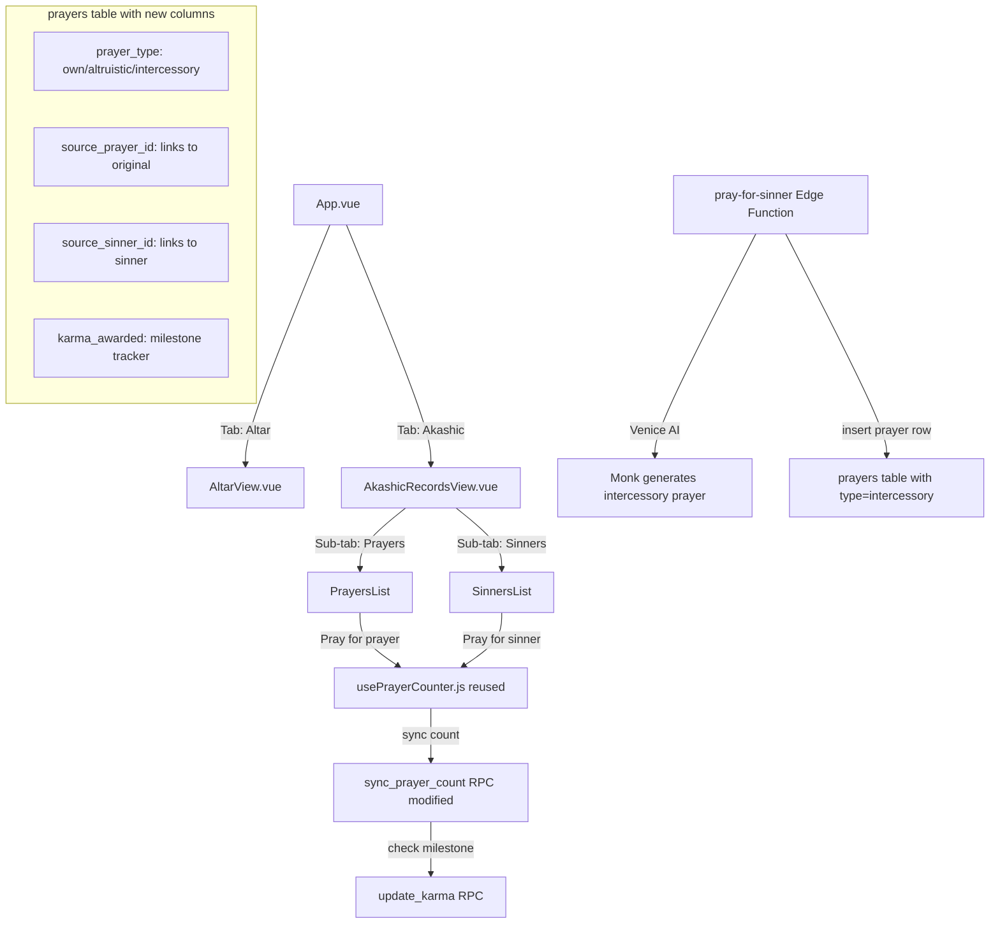

# Akashic Records — Feature Architecture Plan (Revised — Minimal Schema)

## Overview

The Akashic Records is a new tab that shows:
1. **Prayers** — all approved public prayers (newest first, sortable by most prays) with "load more" pagination
2. **Sinners** — users currently in purgatory with their reason, prayable by others

Users can **pray altruistically** for someone else's prayer (2 karma/100 prays) or **pray for sinners** (1 karma/100 prays). Own prayers earn 1 karma/100 prays at milestones.

---

## Karma Rules Summary

| Action | Karma Earned | Earned By | Frequency |
|--------|-------------|-----------|-----------|
| Own prayer reaches 100-pray milestone | +1 karma | Prayer owner | Every 100 prays |
| Altruistic praying reaches 100-pray milestone | +2 karma | Praying user | Every 100 prays |
| Intercessory prayer reaches 100-pray milestone | +1 karma | Praying user | Every 100 prays |
| Prayer submitted and approved | +1 karma | Prayer owner | Per prayer |
| Prayer rejected | -1 karma | Prayer owner | Per prayer |

---

## Architecture Diagram



---

## 1. Database Schema Changes — Minimal Approach

### 1a. Add 4 columns to existing `prayers` table

Instead of a new table, we add columns to the existing `prayers` table to support altruistic and intercessory prayers. These are just links — no duplicated data.

```sql
-- Track karma milestones already awarded on this prayer
ALTER TABLE prayers ADD COLUMN IF NOT EXISTS karma_awarded INT DEFAULT 0;

-- Link altruistic prayer back to the original prayer being prayed for
ALTER TABLE prayers ADD COLUMN IF NOT EXISTS source_prayer_id UUID REFERENCES prayers(id) ON DELETE SET NULL;

-- Link intercessory prayer to the sinner being prayed for
ALTER TABLE prayers ADD COLUMN IF NOT EXISTS source_sinner_id UUID REFERENCES profiles(id) ON DELETE SET NULL;

-- Distinguish prayer types: own, altruistic, intercessory
ALTER TABLE prayers ADD COLUMN IF NOT EXISTS prayer_type TEXT DEFAULT 'own' 
  CHECK (prayer_type IN ('own', 'altruistic', 'intercessory'));

-- Indexes for efficient Akashic Records queries
CREATE INDEX IF NOT EXISTS idx_prayers_public_feed 
  ON prayers(is_rejected, is_archived, created_at DESC) 
  WHERE is_rejected = false AND is_archived = false;

CREATE INDEX IF NOT EXISTS idx_prayers_type_active 
  ON prayers(user_id, prayer_type, is_praying) 
  WHERE is_praying = true;

CREATE INDEX IF NOT EXISTS idx_prayers_most_prayed 
  ON prayers(prayer_count DESC) 
  WHERE is_rejected = false AND is_archived = false AND prayer_type = 'own';
```

**Why this works**: An altruistic prayer is just a regular prayer row with `prayer_type = 'altruistic'` and `source_prayer_id` pointing to the original. It reuses ALL existing infrastructure — `usePrayerCounter`, `sync_prayer_count`, the whole counting system. No new table needed.

### 1b. New RLS Policies

```sql
-- Users can view approved, non-archived prayers from others (for Akashic Records feed)
-- Own prayers are already visible via existing policy; this adds visibility to others' prayers
CREATE POLICY "Users can view approved prayers" 
  ON prayers FOR SELECT 
  USING (
    is_rejected = false 
    AND is_archived = false 
    AND status = 'completed'
  );

-- Users can view purgatory users' basic info (for Sinners list)
CREATE POLICY "Users can view purgatory profiles" 
  ON profiles FOR SELECT 
  USING (
    ban_until IS NOT NULL AND ban_until > now()
  );
```

### 1c. New RPC Functions

**`get_public_prayers`** — Fetches the Akashic Records prayer feed with author usernames. Uses SECURITY DEFINER to bypass RLS and join with profiles:

```sql
CREATE OR REPLACE FUNCTION get_public_prayers(
  p_offset INT DEFAULT 0,
  p_limit INT DEFAULT 20,
  p_sort_by TEXT DEFAULT 'newest'
)
RETURNS JSONB AS $$
DECLARE
  v_result JSONB;
  v_order_by TEXT;
BEGIN
  IF p_sort_by = 'most_prayed' THEN
    v_order_by := 'prayer_count DESC, created_at DESC';
  ELSE
    v_order_by := 'created_at DESC';
  END IF;

  EXECUTE format(
    'SELECT jsonb_agg(row_to_json(t)) FROM (
      SELECT p.id, p.content, p.response_content, p.prayer_count, 
             p.created_at, p.prayer_type,
             pr.username, pr.faith,
             p.source_prayer_id, p.source_sinner_id
      FROM prayers p
      LEFT JOIN profiles pr ON p.user_id = pr.id
      WHERE p.is_rejected = false 
        AND p.is_archived = false 
        AND p.status = ''completed''
        AND p.prayer_type = ''own''
      ORDER BY %s
      LIMIT %s OFFSET %s
    ) t',
    v_order_by, p_limit, p_offset
  ) INTO v_result;

  RETURN COALESCE(v_result, '[]'::jsonb);
END;
$$ LANGUAGE plpgsql SECURITY DEFINER;
```

**`get_sinners`** — Fetches users currently in purgatory with their rejection reason:

```sql
CREATE OR REPLACE FUNCTION get_sinners()
RETURNS JSONB AS $$
DECLARE
  v_result JSONB;
BEGIN
  SELECT jsonb_agg(jsonb_build_object(
    'id', p.id,
    'username', p.username,
    'faith', p.faith,
    'ban_until', p.ban_until,
    'rejection_reason', pr.rejection_reason,
    'rejected_content', pr.content
  ))
  INTO v_result
  FROM profiles p
  LEFT JOIN LATERAL (
    SELECT content, rejection_reason 
    FROM prayers 
    WHERE prayers.user_id = p.id 
      AND prayers.is_rejected = true 
    ORDER BY created_at DESC 
    LIMIT 1
  ) pr ON true
  WHERE p.ban_until IS NOT NULL 
    AND p.ban_until > now()
  ORDER BY p.ban_until ASC;

  RETURN COALESCE(v_result, '[]'::jsonb);
END;
$$ LANGUAGE plpgsql SECURITY DEFINER;
```

**`start_altruistic_prayer`** — Creates or resumes an altruistic prayer session. Reuses the `prayers` table:

```sql
CREATE OR REPLACE FUNCTION start_altruistic_prayer(
  p_target_prayer_id UUID,
  p_response_content TEXT DEFAULT NULL
)
RETURNS JSONB AS $$
DECLARE
  v_user_id UUID := auth.uid();
  v_existing RECORD;
  v_new_id UUID;
  v_target RECORD;
BEGIN
  -- Get the target prayer's response_content if not provided
  IF p_response_content IS NULL THEN
    SELECT response_content, content INTO v_target
    FROM prayers WHERE id = p_target_prayer_id;
    
    IF NOT FOUND THEN RAISE EXCEPTION 'Target prayer not found'; END IF;
    
    -- Use the monk's response for cycle time calculation
    p_response_content := COALESCE(v_target.response_content, v_target.content);
  END IF;

  -- Deactivate any currently active prayer for this user (own or altruistic)
  UPDATE prayers SET is_praying = false, activated_at = NULL
  WHERE user_id = v_user_id AND is_praying = true;

  -- Check if an existing altruistic prayer for this target exists
  SELECT id, prayer_count, karma_awarded INTO v_existing
  FROM prayers
  WHERE user_id = v_user_id 
    AND source_prayer_id = p_target_prayer_id 
    AND prayer_type = 'altruistic'
    AND is_archived = false
  LIMIT 1;

  IF FOUND THEN
    -- Reactivate existing record
    UPDATE prayers
    SET is_praying = true, activated_at = now(), last_counted_at = now()
    WHERE id = v_existing.id
    RETURNING id INTO v_new_id;
  ELSE
    -- Create new altruistic prayer
    INSERT INTO prayers (user_id, content, response_content, prayer_type, source_prayer_id, is_praying, activated_at, last_counted_at, status)
    VALUES (
      v_user_id, 
      'Altruistic prayer for another', 
      p_response_content, 
      'altruistic', 
      p_target_prayer_id, 
      true, now(), now(), 'completed'
    )
    RETURNING id INTO v_new_id;
  END IF;

  RETURN jsonb_build_object(
    'id', v_new_id, 
    'type', 'altruistic',
    'target_prayer_id', p_target_prayer_id
  );
END;
$$ LANGUAGE plpgsql SECURITY DEFINER;
```

**`start_intercessory_prayer`** — Creates or resumes a prayer for a sinner:

```sql
CREATE OR REPLACE FUNCTION start_intercessory_prayer(
  p_target_sinner_id UUID,
  p_response_content TEXT
)
RETURNS JSONB AS $$
DECLARE
  v_user_id UUID := auth.uid();
  v_existing RECORD;
  v_new_id UUID;
BEGIN
  -- Deactivate any currently active prayer for this user
  UPDATE prayers SET is_praying = false, activated_at = NULL
  WHERE user_id = v_user_id AND is_praying = true;

  -- Check if an existing intercessory prayer for this sinner exists
  SELECT id, prayer_count, karma_awarded INTO v_existing
  FROM prayers
  WHERE user_id = v_user_id 
    AND source_sinner_id = p_target_sinner_id 
    AND prayer_type = 'intercessory'
    AND is_archived = false
  LIMIT 1;

  IF FOUND THEN
    -- Reactivate existing record
    UPDATE prayers
    SET is_praying = true, activated_at = now(), last_counted_at = now(),
        response_content = p_response_content
    WHERE id = v_existing.id
    RETURNING id INTO v_new_id;
  ELSE
    -- Create new intercessory prayer
    INSERT INTO prayers (user_id, content, response_content, prayer_type, source_sinner_id, is_praying, activated_at, last_counted_at, status)
    VALUES (
      v_user_id, 
      'Intercessory prayer for a sinner', 
      p_response_content, 
      'intercessory', 
      p_target_sinner_id, 
      true, now(), now(), 'completed'
    )
    RETURNING id INTO v_new_id;
  END IF;

  RETURN jsonb_build_object(
    'id', v_new_id, 
    'type', 'intercessory',
    'target_sinner_id', p_target_sinner_id
  );
END;
$$ LANGUAGE plpgsql SECURITY DEFINER;
```

### 1d. Modify `sync_prayer_count` — Add Karma Milestone Logic

Add karma milestone checking to the existing `sync_prayer_count` function:

```sql
-- Inside sync_prayer_count, after updating prayer_count:
-- Check if we've crossed a 100-pray milestone
DECLARE
  v_milestones INT;
  v_karma_change INT;
  v_prayer_type TEXT;
BEGIN
  -- ... existing sync logic ...
  
  -- Get prayer type and current counts
  SELECT prayer_count, karma_awarded, prayer_type, user_id 
  INTO v_record FROM prayers WHERE id = p_prayer_id;
  
  -- Calculate milestones
  v_milestones := floor(v_record.prayer_count / 100);
  
  IF v_milestones > v_record.karma_awarded THEN
    -- Determine karma rate based on prayer type
    IF v_record.prayer_type = 'altruistic' THEN
      v_karma_change := (v_milestones - v_record.karma_awarded) * 2;
    ELSE
      v_karma_change := (v_milestones - v_record.karma_awarded) * 1;
    END IF;
    
    -- Award karma to the praying user
    PERFORM update_karma(v_record.user_id, v_karma_change);
    
    -- Update karma_awarded tracker
    UPDATE prayers SET karma_awarded = v_milestones WHERE id = p_prayer_id;
  END IF;
  
  -- Include karma_change in response
  RETURN jsonb_build_object(
    'prayer_count', v_record.prayer_count,
    'last_counted_at', v_record.last_counted_at,
    'activated_at', v_record.activated_at,
    'karma_change', v_karma_change  -- NEW
  );
END;
```

### 1e. New Permissions

```sql
GRANT EXECUTE ON FUNCTION get_public_prayers(INT, INT, TEXT) TO authenticated;
GRANT EXECUTE ON FUNCTION get_sinners() TO authenticated;
GRANT EXECUTE ON FUNCTION start_altruistic_prayer(UUID, TEXT) TO authenticated;
GRANT EXECUTE ON FUNCTION start_intercessory_prayer(UUID, TEXT) TO authenticated;
```

---

## 2. Frontend Changes

### 2a. New Composable: `useAkashicRecords.js`

**Purpose**: Fetch public prayers with pagination/sorting and sinners list.

```javascript
export function useAkashicRecords() {
  const publicPrayers = ref([])
  const sinners = ref([])
  const loading = ref(false)
  const error = ref(null)
  const sortBy = ref('newest')    // 'newest' or 'most_prayed'
  const hasMorePrayers = ref(true)
  const currentPage = ref(0)
  const PAGE_SIZE = 20

  async function fetchPublicPrayers(loadMore = false) {
    // Calls get_public_prayers RPC
    // If loadMore, increment page; otherwise reset
  }

  async function fetchSinners() {
    // Calls get_sinners RPC
  }

  function setSortBy(sort) {
    sortBy.value = sort
    currentPage.value = 0
    fetchPublicPrayers(false)
  }

  async function loadMorePrayers() {
    return fetchPublicPrayers(true)
  }

  return reactive({
    publicPrayers, sinners, loading, error,
    sortBy, hasMorePrayers,
    fetchPublicPrayers, fetchSinners, loadMorePrayers, setSortBy
  })
}
```

### 2b. Reuse `usePrayerCounter.js` for Altruistic Prayers

The existing prayer counter can be **reused directly** for altruistic/intercessory prayers because:
- Altruistic prayers are just rows in the `prayers` table with `prayer_type = 'altruistic'`
- They have `response_content`, `prayer_count`, `activated_at`, `last_counted_at`, `is_praying` — all the same columns
- The counter syncs via `sync_prayer_count` which we're modifying to handle karma milestones
- No new composable needed!

The only change: after `syncToBackend()`, check for `karma_change` in the response and update local karma.

### 2c. New View: `AkashicRecordsView.vue`

**Structure**:
```
┌─────────────────────────────────────────┐
│  Header: Akashic Records + Karma display │
│  [Prayers Tab] [Sinners Tab]            │
├─────────────────────────────────────────┤
│                                         │
│  Prayers Tab:                           │
│  ┌─ Sort: [Newest] [Most Prayed] ─────┐ │
│  │                                     │ │
│  │  Prayer Card:                       │ │
│  │  ┌─────────────────────────────┐   │ │
│  │  │ Username · 2h ago            │   │ │
│  │  │ Monk's response text...      │   │ │
│  │  │ ✦ 1,234 prays               │   │ │
│  │  │ [Pray for this] or Counter   │   │ │
│  │  └─────────────────────────────┘   │ │
│  │                                     │ │
│  │  [Load More]                       │ │
│  └─────────────────────────────────────┘ │
│                                         │
│  Sinners Tab:                           │
│  ┌─────────────────────────────────────┐ │
│  │ 😈 Username                        │ │
│  │ Rejection reason...                 │ │
│  │ 1h 23m remaining                    │ │
│  │ [Pray for this sinner]              │ │
│  └─────────────────────────────────────┘ │
│                                         │
│  Active Altruistic Prayer (floating):   │
│  ┌─────────────────────────────────────┐ │
│  │ ✦ Praying for [user]'s prayer      │ │
│  │ Counter: 42  ████████░░             │ │
│  │ [Stop]                              │ │
│  └─────────────────────────────────────┘ │
└─────────────────────────────────────────┘
```

**Key behaviors**:
- When user clicks "Pray for this prayer" → calls `start_altruistic_prayer` RPC → gets back a prayer ID → starts `usePrayerCounter` on it
- When user clicks "Pray for sinner" → calls `pray-for-sinner` Edge Function to get monk's response → calls `start_intercessory_prayer` RPC → starts `usePrayerCounter`
- Only one active altruistic prayer at a time (starting a new one deactivates the old one)
- Karma milestone toast notifications appear when `karma_change > 0` in sync response

### 2d. Modify `App.vue` — Tab Navigation

Add tab navigation for authenticated, non-banned users between Altar and Akashic Records:

```vue
<template>
  <div class="min-h-screen bg-theme-wash flex flex-col">
    <!-- Tab bar -->
    <nav v-if="auth.isAuthenticated && !banTimer.isBanned" class="border-b border-theme-border bg-theme-panel/50">
      <div class="max-w-4xl mx-auto px-4 flex gap-2">
        <button @click="currentTab = 'altar'" 
                :class="currentTab === 'altar' ? 'tab-active' : 'tab-inactive'">
          ⚜️ Altar
        </button>
        <button @click="currentTab = 'akashic'" 
                :class="currentTab === 'akashic' ? 'tab-active' : 'tab-inactive'">
          📜 Akashic Records
        </button>
      </div>
    </nav>

    <div class="flex-1">
      <LoginView v-if="!auth.isAuthenticated" />
      <PurgatoryView v-else-if="banTimer.isBanned" />
      <AltarView v-else-if="currentTab === 'altar'" />
      <AkashicRecordsView v-else-if="currentTab === 'akashic'" />
    </div>

    <!-- Global Footer -->
    ...
  </div>
</template>
```

### 2e. Update `usePrayerCounter.js` — Karma Milestone Awareness

After each backend sync, check for `karma_change` in the response:

```javascript
// In syncToBackend(), after recalibrating:
if (data?.karma_change && data.karma_change > 0) {
  // Emit event or call callback so the view can show a toast
  karmaMilestoneEarned.value = data.karma_change
}
```

Add a new exported ref `karmaMilestoneEarned` that the view can watch for toast notifications.

### 2f. Update `usePrayers.js` — Karma from Milestones

When `syncPrayerCount` returns `karma_change`, update local karma:

```javascript
async function syncPrayerCount(prayerId, elapsedCounts) {
  // ... existing sync logic
  if (data?.karma_change) {
    karma.value += data.karma_change
  }
  return data
}
```

---

## 3. New Edge Function: `pray-for-sinner`

**Endpoint**: `supabase/functions/pray-for-sinner/index.ts`

**Flow**:
1. Receive `{ sinner_id, user_id }`
2. Fetch sinner's profile and most recent rejected prayer with rejection reason
3. Call Venice AI: "Generate a short intercessory prayer for [sinner username] who has been condemned for [rejection reason]. Offer redemption and spiritual guidance based on [faith]."
4. Return the generated prayer text

**Why an Edge Function?** The Venice API key must stay server-side. This mirrors the existing `process-prayer` pattern.

---

## 4. SQL Migration Script

All SQL changes in one script for the user to paste into Supabase SQL Editor:

```sql
-- ============================================
-- AKASHIC RECORDS - MIGRATION
-- ============================================

-- 1. Add new columns to prayers table
ALTER TABLE prayers ADD COLUMN IF NOT EXISTS karma_awarded INT DEFAULT 0;
ALTER TABLE prayers ADD COLUMN IF NOT EXISTS source_prayer_id UUID REFERENCES prayers(id) ON DELETE SET NULL;
ALTER TABLE prayers ADD COLUMN IF NOT EXISTS source_sinner_id UUID REFERENCES profiles(id) ON DELETE SET NULL;
ALTER TABLE prayers ADD COLUMN IF NOT EXISTS prayer_type TEXT DEFAULT 'own' 
  CHECK (prayer_type IN ('own', 'altruistic', 'intercessory'));

-- 2. Indexes for Akashic Records queries
CREATE INDEX IF NOT EXISTS idx_prayers_public_feed 
  ON prayers(is_rejected, is_archived, created_at DESC) 
  WHERE is_rejected = false AND is_archived = false;

CREATE INDEX IF NOT EXISTS idx_prayers_type_active 
  ON prayers(user_id, prayer_type, is_praying) 
  WHERE is_praying = true;

CREATE INDEX IF NOT EXISTS idx_prayers_most_prayed 
  ON prayers(prayer_count DESC) 
  WHERE is_rejected = false AND is_archived = false AND prayer_type = 'own';

-- 3. RLS Policies
CREATE POLICY "Users can view approved prayers" 
  ON prayers FOR SELECT 
  USING (is_rejected = false AND is_archived = false AND status = 'completed');

CREATE POLICY "Users can view purgatory profiles" 
  ON profiles FOR SELECT 
  USING ((ban_until IS NOT NULL AND ban_until > now()) OR auth.uid() = id);

-- 4. RPC Functions (see sections 1c and 1d above)
-- ... (get_public_prayers, get_sinners, start_altruistic_prayer, 
--      start_intercessory_prayer, modified sync_prayer_count)

-- 5. Permissions
GRANT EXECUTE ON FUNCTION get_public_prayers(INT, INT, TEXT) TO authenticated;
GRANT EXECUTE ON FUNCTION get_sinners() TO authenticated;
GRANT EXECUTE ON FUNCTION start_altruistic_prayer(UUID, TEXT) TO authenticated;
GRANT EXECUTE ON FUNCTION start_intercessory_prayer(UUID, TEXT) TO authenticated;
```

---

## 5. File Changes Summary

### New Files (6)
| File | Purpose |
|------|---------|
| `src/composables/useAkashicRecords.js` | Fetch public prayers with pagination, fetch sinners |
| `src/views/AkashicRecordsView.vue` | Main Akashic Records view with Prayers/Sinners tabs |
| `src/components/organisms/AkashicPrayerCard.vue` | Card component for public prayer display |
| `src/components/organisms/SinnerCard.vue` | Card component for purgatory user display |
| `src/components/molecules/KarmaToast.vue` | Toast notification for karma milestone awards |
| `supabase/functions/pray-for-sinner/index.ts` | Edge Function for monk-generated sinner prayers |

### Modified Files (4)
| File | Change |
|------|--------|
| `src/App.vue` | Add tab navigation between Altar and Akashic Records |
| `src/composables/usePrayers.js` | Update karma on milestone response from sync |
| `src/composables/usePrayerCounter.js` | Add `karmaMilestoneEarned` ref for toast notifications |
| `docs/schema.md` | Document all new columns, functions, RLS policies |

### No New Tables
The `prayers` table is extended with 4 columns (`karma_awarded`, `source_prayer_id`, `source_sinner_id`, `prayer_type`) to support altruistic and intercessory prayers. All counting infrastructure is reused.

---

## 6. Implementation Order

1. **Database migration** — Add 4 columns, indexes, RLS policies, RPC functions (paste into Supabase SQL Editor)
2. **`useAkashicRecords.js` composable** — Public prayers + sinners fetching with pagination
3. **`pray-for-sinner` Edge Function** — AI-generated intercessory prayers
4. **`AkashicPrayerCard.vue`** — Prayer card component
5. **`SinnerCard.vue`** — Sinner card component
6. **`KarmaToast.vue`** — Karma notification component
7. **`AkashicRecordsView.vue`** — Main view assembling all components
8. **`App.vue`** — Tab navigation integration
9. **`usePrayerCounter.js`** — Add karma milestone awareness
10. **`usePrayers.js`** — Update karma on milestone response
11. **`schema.md`** — Document all changes
12. **Testing** — End-to-end testing of all flows