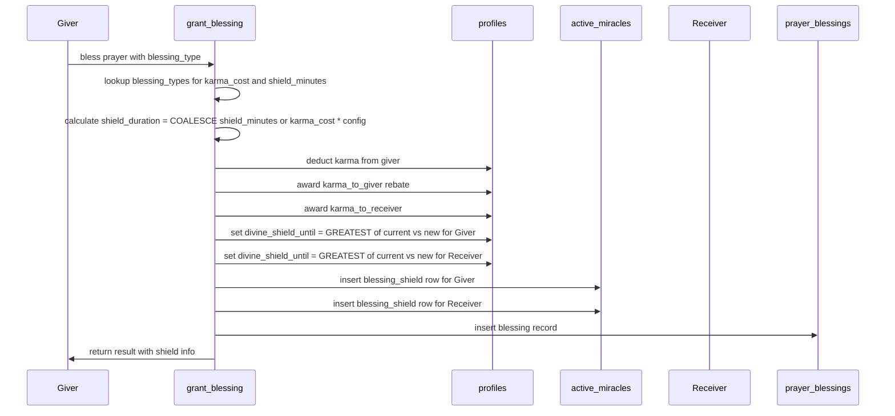
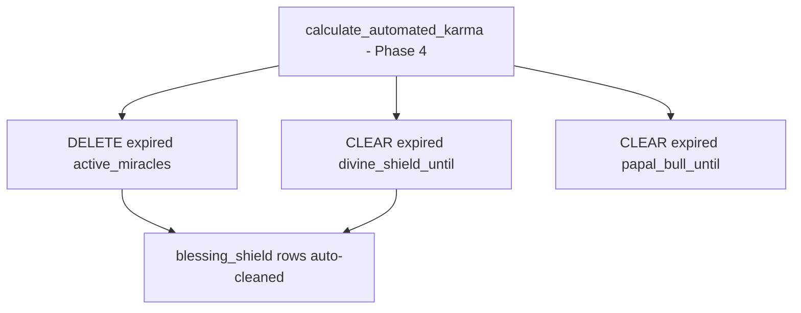

# Blessing Shield Buff System — Genesis 7 Migration Plan

## Problem Statement

The prayer blessing system is currently pointless — it only shuffles karma between players with no meaningful gameplay impact. Blessing another player's prayer should grant **both parties** a Divine Shield timer, making blessings a core protective mechanic.

## Design Overview

When a player blesses a prayer:
- **Giver** (the person spending karma) gets a shield timer
- **Receiver** (the prayer owner) gets a shield timer
- Shield duration = `blessing.karma_cost × config.shield_minutes_per_karma` (default 10 min/karma)
- Per-blessing override available via `blessing_types.shield_minutes` column
- Shields protect against Crusades and Inquisitions (existing `divine_shield_until` check)
- Cron Phase 4 cleanup handles expiry automatically — **no cron changes needed**

### Shield Duration Table (default: 10 min/karma)

| Blessing | Karma Cost | Shield Duration |
|----------|-----------|-----------------|
| Golden Light | 10 | 100 min (~1h 40m) |
| Holy Flame | 25 | 250 min (~4h 10m) |
| Dove of Peace | 50 | 500 min (~8h 20m) |
| Divine Crown | 100 | 1000 min (~16h 40m) |

### Shield Stacking Behavior

Shields stack **additively** — each blessing adds its full duration to the remaining shield time. Multiple cheap blessings can stack up to compete with one expensive blessing. A player with 30 min left who receives a 100 min blessing will have 130 min total.

```sql
-- Additive: extends existing shield by the full blessing duration
divine_shield_until = COALESCE(divine_shield_until, now()) + v_shield_interval
```

### Data Flow Diagram



### Cron Integration



No new cron phases needed. Existing Phase 4 handles everything.

---

## Migration: genesis_7.sql

### Phase 1: Schema Changes — blessing_types table

Add a nullable `shield_minutes` column to `blessing_types` for per-blessing override of shield duration. When NULL, the formula `karma_cost × shield_minutes_per_karma` is used.

```sql
ALTER TABLE public.blessing_types
  ADD COLUMN IF NOT EXISTS shield_minutes INT DEFAULT NULL;

COMMENT ON COLUMN public.blessing_types.shield_minutes IS
  'Override shield duration in minutes. NULL means use karma_cost * blessing.shield_minutes_per_karma from game_config.';
```

### Phase 2: Game Config — shield_minutes_per_karma

Add the global multiplier config key. This is the single knob for balance tuning.

```sql
INSERT INTO game_config (key, value, description, category)
VALUES ('blessing.shield_minutes_per_karma', 10, 'Minutes of Divine Shield per karma point spent on a blessing', 'blessing')
ON CONFLICT (key) DO UPDATE SET
  value = EXCLUDED.value,
  description = EXCLUDED.description,
  category = EXCLUDED.category,
  updated_at = now();
```

### Phase 3: Update blessing_types seed data

Set `shield_minutes = NULL` for all existing blessings so they use the formula. This is already the default, but explicit is better.

No changes needed — existing rows already have NULL for the new column.

### Phase 4: Rewrite grant_blessing() function

The core change. Modified `grant_blessing()` now:

1. Looks up `blessing_types.shield_minutes` and `game_config.blessing.shield_minutes_per_karma`
2. Calculates shield duration: `COALESCE(bt.shield_minutes, bt.karma_cost × v_shield_minutes_per_karma)`
3. Updates `divine_shield_until` on BOTH giver and receiver using `GREATEST`
4. Inserts `active_miracles` rows for both parties with `miracle_type = 'blessing_shield'`
5. Returns shield info in the JSON response

Key SQL logic:

```sql
-- Calculate shield duration
v_shield_minutes_per_karma := COALESCE(
  (SELECT value FROM game_config WHERE key = 'blessing.shield_minutes_per_karma'),
  10
);
v_shield_duration := COALESCE(v_bt.shield_minutes, v_bt.karma_cost * v_shield_minutes_per_karma);
v_shield_interval := v_shield_duration * interval '1 minute';

-- Extend giver shield (additive: adds duration to any existing shield)
UPDATE profiles
SET divine_shield_until = COALESCE(divine_shield_until, now()) + v_shield_interval,
    updated_at = now()
WHERE id = v_user_id;

-- Extend receiver shield (additive: adds duration to any existing shield)
UPDATE profiles
SET divine_shield_until = COALESCE(divine_shield_until, now()) + v_shield_interval,
    updated_at = now()
WHERE id = v_prayer_owner;

-- Insert miracle records for both
INSERT INTO active_miracles (user_id, miracle_type, effect_data, expires_at) VALUES
  (v_user_id, 'blessing_shield', jsonb_build_object(
    'blessing_type_id', p_blessing_type_id,
    'source', 'given',
    'prayer_id', p_prayer_id,
    'shield_minutes', v_shield_duration
  ), now() + v_shield_interval),
  (v_prayer_owner, 'blessing_shield', jsonb_build_object(
    'blessing_type_id', p_blessing_type_id,
    'source', 'received',
    'prayer_id', p_prayer_id,
    'shield_minutes', v_shield_duration
  ), now() + v_shield_interval);
```

### Phase 5: Update get_player_economy() — add active_miracles

The frontend needs to know about active buffs to display shield timers and buff icons. Add `active_miracles` to the economy response.

```sql
-- Add to the RETURN jsonb_build_object:
'active_miracles', v_active_miracles
```

Where `v_active_miracles` is fetched as:

```sql
SELECT COALESCE(jsonb_agg(jsonb_build_object(
  'id', am.id,
  'miracle_type', am.miracle_type,
  'effect_data', am.effect_data,
  'expires_at', am.expires_at
)), '[]'::jsonb) INTO v_active_miracles
FROM active_miracles am
WHERE am.user_id = v_user_id AND am.expires_at > now();
```

### Phase 6: Update blessings.json config

Add `shield_minutes` field to each blessing entry (set to `null` to use formula):

```json
{
  "id": "golden-light",
  "shield_minutes": null,
  ...
}
```

### Phase 7: GRANT permissions

The `active_miracles` table already has SELECT grants for authenticated users. The `grant_blessing` function already has EXECUTE grants. No new grants needed, but verify:

```sql
-- Verify existing grants cover the new usage
-- grant_blessing() runs as SECURITY DEFINER, so it can INSERT into active_miracles
-- No new GRANT statements needed
```

### Phase 8: Update akashic_logs action_type constraint

The `akashic_logs` table has a CHECK constraint on `action_type` that only allows `'crusade', 'schism', 'plague', 'inquisition'`. We don't need to log blessing shields there — they're tracked in `prayer_blessings` and `active_miracles`. **No change needed.**

---

## Frontend Changes Required

### 1. useKarmaShop.js — Handle shield response

The `purchaseBlessing()` function should extract and surface shield info from the `grant_blessing` response:

```js
// After purchaseBlessing succeeds, the response now includes:
// shield_giver_until, shield_receiver_until, shield_duration_minutes
```

### 2. useEconomy.js or equivalent — Display active miracles

The `get_player_economy()` response now includes `active_miracles`. The frontend should:
- Show a shield timer when `divine_shield_until > now()`
- Show blessing buff indicators from `active_miracles` where `miracle_type = 'blessing_shield'`
- Show Papal Bull indicator from `active_miracles` where `miracle_type = 'papal_bull'`

### 3. BlessingPicker / BlessingBadgeBar — Show shield info

- Display "Grants X min shield" next to each blessing
- After blessing, show a toast/feedback indicating the shield was granted

### 4. Shield Timer Component

Create or update a component to display the remaining time on `divine_shield_until` in the UI, similar to how Papal Bull is likely displayed.

---

## Balance Tuning Guide

| Config Key | Default | Effect |
|-----------|---------|--------|
| `blessing.shield_minutes_per_karma` | 10 | Global multiplier for shield duration |
| `blessing_types.shield_minutes` | NULL | Per-blessing override (NULL = use formula) |

To adjust:
- **Longer shields globally**: Increase `blessing.shield_minutes_per_karma` in `game_config`
- **Specific blessing stronger**: Set `shield_minutes` on that `blessing_types` row
- **Disable shield for a blessing**: Set `shield_minutes = 0` on that row