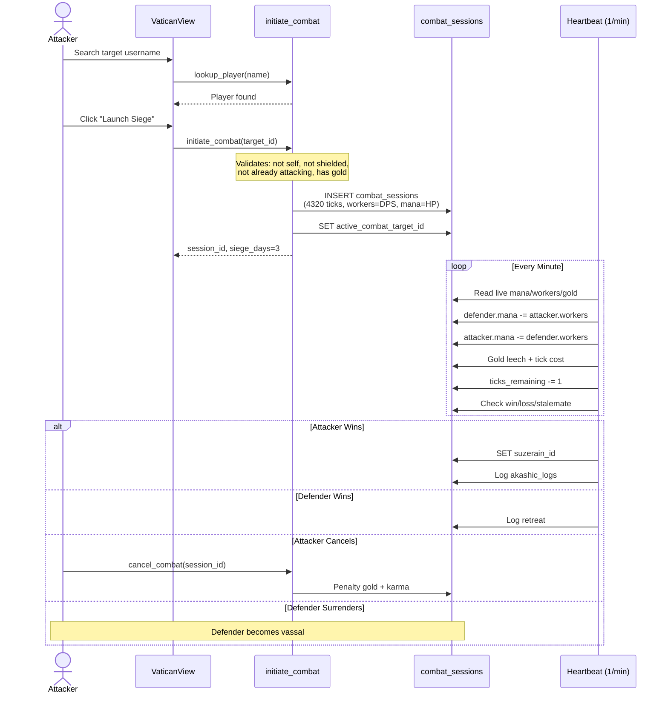

# Exodus 5 — Combat Unification & Siege Rebalance

**Migration file:** `supabase/migrations/exodus_5.sql` (NEW — do not edit exodus_1-4)  
**Date:** 2026-05-18  
**Status:** PLANNING  
**Prerequisite:** [`combat-audit-report.md`](plans/combat-audit-report.md)

---

## 0. SQL Structure Assessment

**Verdict: The `combat_sessions` table is well-designed.** It is not "actually bad."

| Aspect | Assessment |
|---|---|
| **Schema** | Single table for both PvP and Holy War (`combat_type` discriminator). Clean, normalized. Tracks mana pools, worker counts, gold leeched/spent, tick counts. |
| **Tick engine** | Per-minute heartbeat processes all active sessions. Live re-reads of mana/workers/gold each tick — no stale state. |
| **RLS** | Correct: participants can view their own; synod members can view holy wars. |
| **Indexes** | Proper partial index on `is_active`, indexes on `attacker_id` and `defender_id`. |
| **Subjugation** | Separate `subjugation_timers` table with UNIQUE(liege_id, vassal_id) — prevents duplicates. |

**The real problems are NOT structural:**

1. **Duplicate combat systems** — old `launch_crusade` (genesis-era, instant dice-roll) coexists with new `initiate_combat` (exodus-era, tick-based siege). Both are wired to different Vue paths.
2. **No cancel/withdraw mechanics** — once a siege starts, it runs until resolution or you go broke. No surrender option for defenders.
3. **Config key typos** — `tithe.percentage` read but `vassalage.tithe_pct` inserted. Fallback always used.
4. **Sect name rot** — `doomsday_preppers` referenced in genesis_2 `launch_crusade` but renamed to `final_watch` in genesis_6. genesis_9 fixed this for `launch_crusade`.
5. **Orphaned UI** — subjugation system fully built in SQL + composable but zero Vue renders it.
6. **Tick costs not scaled for long sieges** — 10 gold/tick is fine for 30-tick combat but absurd for 4320-tick (43,200 gold).
7. **Heartbeat duplicated** — exodus_2 and exodus_4 both contain full `calculate_automated_karma()` bodies. exodus_4 is the live version, overriding exodus_2. This is normal migration behavior but means reading exodus_2's heartbeat is misleading.

---

## 1. Siege Duration Rebalance

```mermaid
gantt
    title Combat Siege Durations
    dateFormat X
    axisFormat %s
    
    section PvP (1v1)
    3-Day Siege (4320 ticks) :0, 4320
    
    section Holy War (Synod)
    7-Day Siege (10080 ticks) :0, 10080
```



### New game_config values (UPDATE in exodus_5)

| Key | Old | New | Rationale |
|---|---|---|---|
| `combat.pvp_max_ticks` | 30 | **4320** | 3 days × 1440 min/day |
| `combat.holy_war_max_ticks` | 60 | **10080** | 7 days × 1440 min/day |
| `combat.pvp_gold_per_tick` | 10 | **2** | 8640 gold over 3 days (significant but achievable) |
| `combat.holy_war_gold_per_tick` | 100 | **10** | 100,800 over 7 days (synod leader needs treasury) |
| `combat.pvp_leech_pct` | 0.02 | **0.005** | 0.5% per tick leech (balanced for longer duration) |
| `combat.holy_war_leech_pct` | 0.01 | **0.002** | 0.2% per tick leech |

### Initiation costs (unchanged)

| Key | Value |
|---|---|
| `combat.pvp_initiation_gold` | 50 |
| `combat.holy_war_initiation_gold` | 200 |

---

## 2. Cancel & Withdraw Mechanics

```mermaid
flowchart TD
    A[Active Siege] --> B{Who acts?}
    
    B -->|Attacker| C[Withdraw / Cancel]
    B -->|Defender| D[Surrender]
    
    C --> E[Pay 50% of remaining tick gold]
    E --> F[Combat ends: defender_win]
    F --> G[-5 Karma penalty]
    
    D --> H[Immediate vassaldom]
    H --> I[Combat ends: attacker_win]
    I --> J[Attacker pays no further gold]
    
    C --> K{Cannot afford?}
    K -->|Yes| L[All remaining gold drained]
    L --> F
    
    style A fill:#3b3b5c,stroke:#7b7bff
    style C fill:#5c3b3b,stroke:#ff7b7b
    style D fill:#3b5c3b,stroke:#7bff7b
```



### New RPCs in exodus_5.sql

#### `cancel_combat(p_session_id UUID)` — Attacker withdraws
```sql
-- Only callable by session.attacker_id
-- Cost: 50% of (ticks_remaining × gold_per_tick)
-- If can't afford: drains all remaining gold
-- Result: 'defender_win'
-- Penalty: -5 karma
-- Clears active_combat_target_id (PvP) or active_war_id (Holy War)
-- Returns: jsonb with { success, gold_penalty, karma_penalty }
```

#### `surrender_combat(p_session_id UUID)` — Defender gives up
```sql
-- Only callable by session.defender_id
-- Result: 'attacker_win' immediately
-- Sets suzerain_id (PvP) or triggers vanquish_synod (Holy War)
-- Attacker pays no further gold
-- Returns: jsonb with { success, vassaldom }
```

---

## 3. Bug Fixes (data patches only)

### 3.1 `tithe.percentage` key mismatch

**Root cause:** exodus_1 inserts `vassalage.tithe_pct = 0.10` but the heartbeat (exodus_2, exodus_4) and `get_vassalage_info` read `tithe.percentage` which doesn't exist.

**Fix (in exodus_5.sql):**
```sql
-- Insert the missing key so reads resolve correctly
INSERT INTO game_config (key, value, description, category)
VALUES ('tithe.percentage', 0.10, 'Fraction of production paid as tithe', 'vassalage')
ON CONFLICT (key) DO NOTHING;
```
This is the minimal fix — insert the key that's actually being read. Non-destructive to existing `vassalage.tithe_pct`.

### 3.2 `combat.pvp_max_ticks` fallback

**In [`exodus_2.sql:240`](supabase/migrations/exodus_2.sql:240):**
```sql
IF v_max_ticks IS NULL THEN v_max_ticks := 10080; END IF;  -- BUG: 7 days
```

**Cannot fix** since we're not editing exodus_2. The game_config key is being updated to 4320 anyway, so the fallback is never hit. Documented as a known issue, not worth a new migration just for this.

### 3.3 `doomsday_preppers` in genesis_2 `launch_crusade`

Genesis_9 already fixed this to `final_watch`. Since migrations run in order, the genesis_9 version is the live one. No action needed.

---

## 4. Combat Flow (Unified)



---

## 5. exodus_5.sql — Contents

```
exodus_5.sql
├── STEP 0: Fix tithe.percentage key (INSERT missing config)
├── STEP 1: Update siege duration config keys
│   ├── combat.pvp_max_ticks: 30 → 4320
│   ├── combat.holy_war_max_ticks: 60 → 10080
│   ├── combat.pvp_gold_per_tick: 10 → 2
│   ├── combat.holy_war_gold_per_tick: 100 → 10
│   ├── combat.pvp_leech_pct: 0.02 → 0.005
│   └── combat.holy_war_leech_pct: 0.01 → 0.002
├── STEP 2: CREATE cancel_combat(p_session_id UUID)
│   └── Returns JSONB { success, gold_penalty, karma_penalty, result }
├── STEP 3: CREATE surrender_combat(p_session_id UUID)
│   └── Returns JSONB { success, vassaldom, suzerain_id }
├── STEP 4: CREATE OR REPLACE initiate_combat (incorporate cancel check)
│   └── Add `cancelled` to result CHECK constraint
├── STEP 5: GRANT EXECUTE on new RPCs
└── STEP 6: Add `cancelled` value to combat_sessions.result CHECK
```

---

## 6. Frontend Changes Required

### 6.1 VaticanView — Primary PvP Combat Hub

| Change | Details |
|---|---|
| **Replace `launch_crusade`** | Wire "Launch Siege" button to `useCombat.initiateCombat()` instead of `useVassalage.launchCrusade()` |
| **Update UI text** | "Spend 50 Gold to begin a 3-day siege. Workers deal damage per minute. Mana is your HP pool." |
| **Attack power display** | Show worker count (DPS per tick) and mana (HP), not the old `crusadeAttackPower` |
| **Active siege cards** | Move from PurgatoryView to VaticanView — show mana bars, worker counts, tick progress, gold stolen |
| **Cancel button** | "Withdraw (Cost: X gold, -5 Karma)" — calls `cancel_combat` |
| **Surrender button** (defender) | "Surrender (Become their Vassal)" — calls `surrender_combat` |
| **Subjugation timers** | Show `subjugationAsLiege` and `subjugationAsVassal` with hours remaining |
| **Resist/Rebel buttons** | "Resist (1000 Gold → -24h)" and "Rebel (if 3+ days idle)" |

### 6.2 useCombat.js — Add Cancel/Surrender

```js
// Two new methods:
async function cancelCombat(sessionId) { ... }    // calls cancel_combat RPC
async function surrenderCombat(sessionId) { ... }  // calls surrender_combat RPC
```

### 6.3 useVassalage.js — Already Has Subjugation Methods

`startSubjugation()`, `resistSubjugation()`, `attemptRebellion()` all exist but are never called from any Vue template. Just need UI buttons wired to them.

### 6.4 PurgatoryView — Remove Combat Section

The "Direct Combat" section (lines 79-160) should move to VaticanView. PurgatoryView should only show *active* combat status cards if the player has ongoing sieges they need to monitor while banned.

### 6.5 HolyWarView — Add Cancel

Add withdraw button for synod leader, surrender button for defender synod members (or leader).

---

## 6.6 UI Clarity — Every Combat State, Explained

**Principle:** The player must understand *what is happening*, *why it's happening*, and *what they can do about it* at every moment. No "999 attack power" mystery numbers. No hidden mechanics.

---

### 6.6.1 Pre-Combat: Choosing a Target

**Where:** VaticanView "Launch Siege" section

```
┌─────────────────────────────────────────────────┐
│ ⚔ Launch Siege                                   │
│                                                   │
│ Sieges last 3 days. Every minute:                  │
│ • Your Workers deal damage to their Mana pool      │
│ • Their Workers counter-attack your Mana           │
│ • You steal 0.5% of their Gold per tick            │
│ • Costs you 2 Gold per tick                        │
│                                                   │
│ Your Forces:  12 Workers (12 DPS/tick)             │
│ Your Mana:    847 HP                               │
│                                                   │
│ ┌─ Target Username ──────────────────────────┐    │
│ │ [________________]  [Search]                │    │
│ └─────────────────────────────────────────────┘    │
└─────────────────────────────────────────────────┘
```

**Key information displayed:**
- Duration: "3 days (4,320 ticks)"
- Your combat stats: worker count (DPS) + mana pool (HP)
- Cost: "50 Gold to initiate, 2 Gold per minute"
- What workers count toward DPS: listed inline — "Novices, Monks, Clerics, Bishops, Cardinals, Cultists"

---

### 6.6.2 Post-Initiation: Siege Launched

**Where:** VaticanView, immediately after `initiate_combat` returns

```
┌─────────────────────────────────────────────────┐
│ ⚔ Siege Launched!                                │
│                                                   │
│ Attacking: DarkProphet (Black Tribunal)            │
│                                                   │
│ ┌─ Your Forces ───────────────────────────────┐   │
│ │ Mana:  ████████████████░░░░  847 / 847       │   │
│ │ DPS:   12 Workers (12 damage/min)            │   │
│ └──────────────────────────────────────────────┘   │
│                                                   │
│ ┌─ Enemy Forces ──────────────────────────────┐   │
│ │ Mana:  ██████████░░░░░░░░░░  520 / 520       │   │
│ │ DPS:   8 Workers (8 damage/min)              │   │
│ └──────────────────────────────────────────────┘   │
│                                                   │
│ Progress:  ░░░░░░░░░░░░░░░░░░░░  0 / 4320 ticks   │
│ Gold Stolen This Tick: +2 ⚜                       │
│                                                   │
│ [Withdraw (Cost: 4,320 Gold, -5 Karma)]            │
└─────────────────────────────────────────────────┘
```

---

### 6.6.3 Mid-Siege: Ongoing Combat Card

**Where:** VaticanView, polled every 5 seconds. Replaces the "Launch Siege" section while active.

```
┌─────────────────────────────────────────────────┐
│ ⚔ Active Siege — Day 2 of 3                      │
│                                                   │
│ Attacking: DarkProphet (Black Tribunal)            │
│                                                   │
│ Your Mana                                           │
│ ██████████████░░░░░░░░  587 / 847  (-8/min)       │
│                                                   │
│ Enemy Mana                                          │
│ ████████░░░░░░░░░░░░░░  284 / 520  (-12/min)      │
│                                                   │
│ ┌─────── Stats ───────┐  ┌──── Economy ──────┐    │
│ │ Tick: 2,847 / 4,320 │  │ Gold stolen: 142 ⚜ │    │
│ │ Elapsed: 1d 23h     │  │ Gold spent: 5,694 ⚜ │    │
│ │ Remaining: 1d 1h    │  │ Leech rate: 0.5%   │    │
│ └─────────────────────┘  └───────────────────┘    │
│                                                   │
│ [Withdraw (2,946 Gold penalty, -5 Karma)]          │
└─────────────────────────────────────────────────┘
```

**Key clarity elements:**
- Mana bars show *current* value and *delta per minute* (-8/min) so the player sees exactly how fast they're losing HP
- Tick count rendered as elapsed/remaining with human-readable time
- Gold economy broken out: stolen vs spent
- Withdraw cost dynamically calculated from remaining ticks

---

### 6.6.4 Defender's View: Under Attack

**Where:** VaticanView (or a notification banner site-wide)

```
┌─────────────────────────────────────────────────┐
│ 🛡 You Are Under Siege!                           │
│                                                   │
│ Attacker: LightBearer (Holy Way)                   │
│                                                   │
│ Enemy Mana ██████████████░░  612 / 700             │
│ Your Mana  ██████████░░░░░░  423 / 580 (-12/min)  │
│                                                   │
│ Your Workers (8) are dealing 8 damage/min back.    │
│ They are stealing 0.5% of your Gold per tick.      │
│                                                   │
│ ┌─────── Stats ───────┐                            │
│ │ Tick: 1,892 / 4,320 │                            │
│ │ Elapsed: 1d 7h      │                            │
│ │ Gold lost: 94 ⚜      │                            │
│ └─────────────────────┘                            │
│                                                   │
│ [Surrender (Become their Vassal)]                  │
└─────────────────────────────────────────────────┘
```

---

### 6.6.5 Holy War: Synod Leader's View

**Where:** HolyWarView

```
┌─────────────────────────────────────────────────┐
│ ✠ Holy War — Day 4 of 7                          │
│                                                   │
│ Your Synod: Crusaders of Dawn (Gilded Path)        │
│ Enemy Synod: Shadow Covenant (Black Tribunal)      │
│                                                   │
│ Synod Mana Pool                                     │
│ ██████████████████░░  18,472 / 24,100              │
│ (Sum of all 12 members' mana, -5% exertion/min)    │
│                                                   │
│ Enemy Synod Mana Pool                               │
│ ██████████░░░░░░░░░░  11,830 / 19,400              │
│ (Damage: 47 workers × distributed across members)  │
│                                                   │
│ ┌─────── Forces ──────┐  ┌──── Economy ──────┐    │
│ │ Your Workers: 47    │  │ Gold stolen: 2,410 ⚜ │   │
│ │ Attrition: -4/min   │  │ Gold spent: 57,640 ⚜ │   │
│ │ Tick: 5,847/10,080  │  │ Victory: 20% loot   │    │
│ │ Remaining: 2d 22h   │  │ Vanquish: destroy   │    │
│ └─────────────────────┘  └───────────────────┘    │
│                                                   │
│ [Withdraw (21,165 Gold penalty, -5 Karma)]         │
│ (Cost split from Synod Vault if available)         │
└─────────────────────────────────────────────────┘
```

**Key clarity for Holy Wars:**
- "Synod Mana Pool" explicitly labeled as sum of members
- Attrition and exertion explained
- Vanquish consequences spelled out: "Victory destroys enemy Synod, scatters members, transfers relics, loots 20% of their gold"
- Withdraw cost shown with vault subsidy note

---

### 6.6.6 Resolution States

**Attacker Victory (PvP):**
```
┌─────────────────────────────────────────────────┐
│ ⚔ Siege Victorious!                              │
│                                                   │
│ DarkProphet's mana has been depleted.              │
│ They are now your Vassal — 10% tithe flows upward. │
│                                                   │
│ +5 Karma (enemy faction kill)                      │
│ +284 Gold leeched total                            │
│                                                   │
│ [View Vassals]                                     │
└─────────────────────────────────────────────────┘
```

**Defender Victory (PvP):**
```
┌─────────────────────────────────────────────────┐
│ 🛡 Siege Repelled!                                │
│                                                   │
│ LightBearer ran out of mana and could not continue.│
│ You remain free.                                   │
│                                                   │
│ Gold lost to leeching: 94 ⚜                       │
└─────────────────────────────────────────────────┘
```

**Stalemate (PvP):**
```
┌─────────────────────────────────────────────────┐
│ ⏳ Siege Stalemate                                 │
│                                                   │
│ 3 days elapsed without either side collapsing.     │
│ No vassaldom. No penalty. Resources remain.        │
│                                                   │
│ Gold leeched: 142 ⚜ | Gold spent: 8,640 ⚜         │
└─────────────────────────────────────────────────┘
```

**Holy War Victory — Vanquish:**
```
┌─────────────────────────────────────────────────┐
│ ✠ SYNOD VANQUISHED!                              │
│                                                   │
│ Shadow Covenant has been destroyed.                │
│ • All 8 members scattered (no Synod)              │
│ • All relics transferred to your Synod leader     │
│ • 20% of their collective gold looted             │
│ • Your share: 1,204 Gold (weighted by workers)    │
│ • Enemy members banned 5 minutes                  │
└─────────────────────────────────────────────────┘
```

---

### 6.6.7 Subjugation System (Currently Orphaned)

**Where:** VaticanView, new "Subjugation" section below Vassals

```
┌─────────────────────────────────────────────────┐
│ ⛓ Subjugation Progress                           │
│                                                   │
│ ┌─ Targeting ─────────────────────────────────┐  │
│ │ HereticKing — 94.2 / 168 hours (56%)         │  │
│ │ ████████████░░░░░░░░░░  [Resist (1000g)]     │  │
│ │                                               │  │
│ │ At 168 hours they become your Vassal.         │  │
│ │ Each minute of active siege = 1/60th hour.    │  │
│ └──────────────────────────────────────────────┘  │
│                                                   │
│ ┌─ Under Threat ───────────────────────────────┐  │
│ │ DarkProphet is trying to subjugate YOU.       │  │
│ │ Progress: 23.7 / 168 hours (14%)              │  │
│ │ ███░░░░░░░░░░░░░░░░░░░                        │  │
│ │                                               │  │
│ │ [Resist (1000 Gold → -24 hours)]              │  │
│ │ [Rebel (Available if idle 3+ days)]           │  │
│ └──────────────────────────────────────────────┘  │
└─────────────────────────────────────────────────┘
```

**Key clarity elements:**
- Bar showing accumulated hours vs 168 target
- Explanation: "Each minute of active siege = 1/60th hour toward subjugation"
- Resist button with clear cost and effect
- Rebel button only visible when conditions met, grayed out otherwise with reason

---

### 6.6.8 Cancel / Surrender Cost Transparency

| Action | Who | Cost | Consequence |
|---|---|---|---|
| **Withdraw** | Attacker | 50% of remaining tick gold | Combat ends. -5 Karma. Defender wins. |
| **Surrender** | Defender | None (immediate vassaldom) | Combat ends. Become attacker's vassal. 10% tithe. |
| **Resist** | Subjugation target | 1000 Gold | -24 hours from subjugation timer |
| **Rebel** | Vassal | None | Free if liege hasn't attacked in 3+ days |
| **Declare Schism** | Vassal | Escalating heresy (100 × 2^n) | Break free + 24h Divine Shield |

The Withdraw button must show the **exact gold cost** before confirmation:
```
[Withdraw (4,320 Gold, -5 Karma)]
        └─ Calculated: ticks_remaining × gold_per_tick × 0.5
```

---

### 6.6.9 Polling & Freshness Indicator

All combat cards should show when data was last updated:

```
Active Siege — updated 3s ago ●
```

The dot is green when polled <10s ago, yellow 10-30s, red >30s (polling may have stopped).

---

### 6.6.10 Glossary / Tooltips

Every numeric value should have a `title` tooltip explaining the formula:

| Display | Tooltip |
|---|---|
| "12 Workers (12 DPS)" | "Count of Novices, Monks, Clerics, Bishops, Cardinals, and Cultists. Each deals 1 damage per tick." |
| "Mana: 847 HP" | "Your total mana from all buildings. When this reaches 0, you lose the siege." |
| "Gold stolen: 142 ⚜" | "0.5% of defender's gold taken each tick. Total accumulated." |
| "Attrition: -4/min" | "10% of workers lost per tick to battlefield attrition." |
| "Exertion: -5%/min" | "5% of mana pool drained per tick from sustaining the siege." |
| "Tick: 2,847/4,320" | "Each tick = 1 minute. 4,320 ticks = 3 days. Ticks remaining until stalemate." |
---

## 7. What Happens to the Old `launch_crusade`?

**Strategy: Soft-deprecate, don't delete.**

- [`launch_crusade`](supabase/migrations/genesis_9.sql:728) stays in the database (deleting it could break things).
- VaticanView stops calling it — switches to `initiate_combat`.
- The old RPC remains available if any edge-case code paths reference it.
- Can be removed in a future cleanup migration once confirmed dead.

---

## 8. Implementation Order


---

## 9. Risks & Mitigations

| Risk | Mitigation |
|---|---|
| 3-day/7-day sieges feel too slow | Per-minute ticks show constant progress. Mana bars update visibly. Gold leech provides dopamine per tick. |
| Players go broke mid-siege | Lowered per-tick costs (2g PvP, 10g Holy War). Cancel option at 50% penalty. |
| Old `launch_crusade` still called somewhere | Grep all Vue files for `launchCrusade` / `launch_crusade` before deprecation. |
| Synod war gold cost (100,800) bankrupts leader | Leader can cancel. Synod vault should subsidize. Maybe add "war chest" donation mechanic later. |
| `active_combat_target_id` column race conditions | Already handled — the column is set in `initiate_combat` and cleared in tick resolution OR cancel. One-at-a-time enforced at SQL level. |