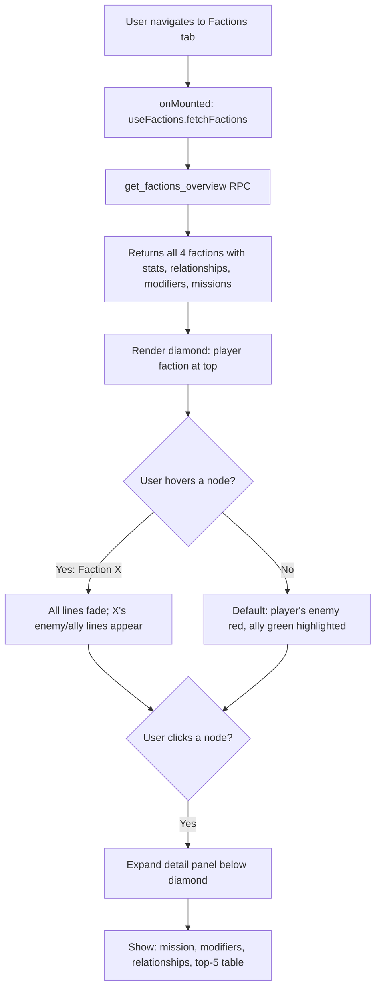

# Factions View — Architecture Plan v3 (Exodus, DB-Backed, Mission Statements)

## Overview

Add a **Factions** tab showing all four theological factions in a **diamond layout** (45° rotated square). The player's faction anchors the top vertex; enemy at bottom, ally on right, neutral on left — with colored SVG relationship lines. Hovering any faction node reveals that faction's relationship perspective.

**All data** (relationships, member stats, economic modifiers, mission statements) is **stored in PostgreSQL** and fetched via a single RPC. No static lore hardcoded in Vue — future-proof for mechanical impacts.

Nav order: `altar → records → factions → vatican → synod → scriptorium → shop → rankings`

---

## Database: `supabase/migrations/exodus_0.sql`

### New Table: `faction_relationships`

```sql
CREATE TABLE IF NOT EXISTS faction_relationships (
  id UUID DEFAULT gen_random_uuid() PRIMARY KEY,
  sect_key TEXT NOT NULL UNIQUE
    CHECK (sect_key IN ('gilded_path', 'holy_way', 'final_watch', 'black_tribunal')),
  enemy_sect TEXT NOT NULL
    CHECK (enemy_sect IN ('gilded_path', 'holy_way', 'final_watch', 'black_tribunal')),
  ally_sect TEXT NOT NULL
    CHECK (ally_sect IN ('gilded_path', 'holy_way', 'final_watch', 'black_tribunal')),
  neutral_sect TEXT NOT NULL
    CHECK (neutral_sect IN ('gilded_path', 'holy_way', 'final_watch', 'black_tribunal')),
  rationale_enemy TEXT,
  rationale_ally TEXT,
  rationale_neutral TEXT,
  CHECK (sect_key != enemy_sect),
  CHECK (sect_key != ally_sect),
  CHECK (sect_key != neutral_sect)
);
```

### Seed Data

```sql
INSERT INTO faction_relationships (sect_key, enemy_sect, ally_sect, neutral_sect, rationale_enemy, rationale_ally, rationale_neutral) VALUES

('gilded_path', 'black_tribunal', 'holy_way', 'final_watch',
 'Needs Mana to fuel defenses; The Tribunal steals Gold.',
 'Mutual economic dependency — Gilded provides Gold, Holy provides Mana.',
 'Neither ally nor foe; pragmatic coexistence.'),

('holy_way', 'final_watch', 'gilded_path', 'black_tribunal',
 'The Watch blocks their ascension; physical stability clashes with pure Mana worship.',
 'Gilded Path funds their ascetic lifestyle with Gold.',
 'The Tribunal ignores pure monks; no economic overlap.'),

('final_watch', 'holy_way', 'black_tribunal', 'gilded_path',
 'Physical stability clashes with pure Mana worship; The Watch sees asceticism as weakness.',
 'The Tribunal serves as an aggressive police force the Watch respects.',
 'Pragmatic coexistence; no direct conflict or benefit.'),

('black_tribunal', 'gilded_path', 'final_watch', 'holy_way',
 'High Heresy attracts Gold hoarders; natural enemies.',
 'The Tribunal serves as an aggressive police force; the Watch is their enforcer.',
 'Pure monks are beneath the Tribunal''s notice.')
ON CONFLICT (sect_key) DO UPDATE SET
  enemy_sect = EXCLUDED.enemy_sect,
  ally_sect = EXCLUDED.ally_sect,
  neutral_sect = EXCLUDED.neutral_sect,
  rationale_enemy = EXCLUDED.rationale_enemy,
  rationale_ally = EXCLUDED.rationale_ally,
  rationale_neutral = EXCLUDED.rationale_neutral;
```

### RLS & Permissions

```sql
ALTER TABLE faction_relationships ENABLE ROW LEVEL SECURITY;

CREATE POLICY "Anyone can view faction relationships"
  ON faction_relationships FOR SELECT
  USING (true);

GRANT SELECT ON TABLE faction_relationships TO authenticated;
GRANT SELECT ON TABLE faction_relationships TO anon;
GRANT SELECT ON TABLE faction_relationships TO service_role;
```

### New RPC: `get_factions_overview()`

Returns all faction data in one call — **member counts, top 5 per faction, relationships, economic modifiers, and mission statements**.

```sql
CREATE OR REPLACE FUNCTION get_factions_overview()
RETURNS JSONB
LANGUAGE plpgsql SECURITY DEFINER
AS $$
DECLARE
    v_result JSONB;
BEGIN
    SELECT jsonb_object_agg(f.sect_key, f.payload)
    INTO v_result
    FROM (
        SELECT
            p.sect_type AS sect_key,
            jsonb_build_object(
                'member_count', COUNT(*)::INT,
                'top_members', (
                    SELECT jsonb_agg(
                        jsonb_build_object(
                            'id', m.id,
                            'username', m.username,
                            'karma', COALESCE(m.karma, 0),
                            'faith', m.faith
                        )
                        ORDER BY COALESCE(m.karma, 0) DESC
                    )
                    FROM profiles m
                    WHERE m.sect_type = p.sect_type
                    LIMIT 5
                ),
                'enemy', fr.enemy_sect,
                'ally', fr.ally_sect,
                'neutral', fr.neutral_sect,
                'rationale_enemy', fr.rationale_enemy,
                'rationale_ally', fr.rationale_ally,
                'rationale_neutral', fr.rationale_neutral,
                'modifiers', (
                    SELECT jsonb_object_agg(
                        replace(gc.key, 'sect.' || p.sect_type || '.', ''),
                        gc.value
                    )
                    FROM game_config gc
                    WHERE gc.key LIKE 'sect.' || p.sect_type || '.%'
                ),
                'mission', CASE p.sect_type
                    WHEN 'gilded_path' THEN 'Prosperity through ambition. Wealth is the highest blessing, and grandeur is the proof of divine favor.'
                    WHEN 'holy_way' THEN 'Grace through selflessness. Compassion and devotion are the only true currencies.'
                    WHEN 'final_watch' THEN 'Strength through vigilance. The faithful must be defended at all costs — endure, protect, endure again.'
                    WHEN 'black_tribunal' THEN 'Power through conquest. Heresy must be eradicated; the weak exist only to serve the strong.'
                END
            ) AS payload
        FROM profiles p
        LEFT JOIN faction_relationships fr ON fr.sect_key = p.sect_type
        WHERE p.sect_type IS NOT NULL
        GROUP BY p.sect_type, fr.enemy_sect, fr.ally_sect, fr.neutral_sect,
                 fr.rationale_enemy, fr.rationale_ally, fr.rationale_neutral
    ) f;

    RETURN COALESCE(v_result, '{}'::jsonb);
END;
$$;

GRANT EXECUTE ON FUNCTION get_factions_overview() TO authenticated;
GRANT EXECUTE ON FUNCTION get_factions_overview() TO service_role;
```

**Return shape:**

```json
{
  "gilded_path": {
    "member_count": 42,
    "top_members": [
      { "id": "uuid", "username": "GoldGuy", "karma": 1234, "faith": "The Gilded Path" }
    ],
    "enemy": "black_tribunal",
    "ally": "holy_way",
    "neutral": "final_watch",
    "rationale_enemy": "Needs Mana to fuel defenses; The Tribunal steals Gold.",
    "rationale_ally": "Mutual economic dependency...",
    "rationale_neutral": "Neither ally nor foe...",
    "modifiers": {
      "mana_multiplier": "0.8",
      "gold_multiplier": "1.5",
      "cathedral_upkeep_multiplier": "2.0"
    },
    "mission": "Prosperity through ambition. Wealth is the highest blessing..."
  },
  "...": {}
}
```

---

## Frontend: `src/composables/useFactions.js`

Thin composable — single responsibility: call the RPC and expose reactive state.

```js
import { ref, reactive } from 'vue'
import { supabase } from '@/lib/supabase'

let sharedState = null

function createFactionsState() {
  const factionData = ref({})       // keyed by sect_key from RPC
  const loading = ref(false)
  const error = ref(null)

  async function fetchFactions() {
    loading.value = true
    error.value = null
    try {
      const { data, error: rpcError } = await supabase.rpc('get_factions_overview')
      if (rpcError) throw rpcError
      factionData.value = data || {}
    } catch (err) {
      error.value = err.message
      console.error('[useFactions]', err)
    } finally {
      loading.value = false
    }
  }

  return reactive({ factionData, loading, error, fetchFactions })
}

export function useFactions() {
  if (!sharedState) sharedState = createFactionsState()
  return sharedState
}
```

**Display helpers** (pure functions, not reactive):
- `getModifierLabel(key)` — converts `mana_multiplier` → `Mana Rate`, `gold_multiplier` → `Gold Rate`, `cathedral_upkeep_multiplier` → `Upkeep`, etc.
- `formatModifier(value)` — `"1.5"` → `+50%`, `"0.8"` → `-20%`
- `isFactionColor(sectKey)` — returns Tailwind color classes

---

## Frontend: `src/views/FactionsView.vue`

### Layout

```
┌──────────────────────────────────────────────┐
│  🏛️ The Four Factions                        │
│  Know thy allies. Fear thy enemies.          │
├──────────────────────────────────────────────┤
│                                              │
│              [Player's Faction]              │
│              icon · name · count             │
│                    ╱  ╲                      │
│          green ╱        ╲ no line            │
│              ╱            ╲                  │
│   [Neutral]                  [Ally]          │
│   icon·name·count     icon·name·count        │
│              ╲            ╱                  │
│               ╲          ╱ red               │
│                 ╲      ╱                     │
│              [Enemy]                         │
│              icon · name · count             │
│                                              │
├──────────────────────────────────────────────┤
│  [Player's Faction] — expanded detail        │
│  Mission: "Prosperity through ambition..."   │
│  Modifiers:  Gold +50%  Mana -20%  Upkeep +100% │
│  Top 5 Members:  [mini leaderboard table]    │
│  Relationships: 🟢 Ally: Holy Way | 🔴 Enemy: Black Tribunal | 🟡 Neutral: Final Watch │
└──────────────────────────────────────────────┘
```

### Diamond Implementation

```html
<div class="faction-diamond">
  <!-- SVG Relationship Lines -->
  <svg class="relationship-svg" viewBox="0 0 400 400" preserveAspectRatio="xMidYMid meet">
    <!-- Top → Bottom: enemy line (red) -->
    <line x1="200" y1="30" x2="200" y2="370"
      :stroke="lineColors.topBottom" stroke-width="2.5"
      :opacity="lineOpacities.topBottom" />
    <!-- Top → Right: ally line (green) -->
    <line x1="200" y1="30" x2="370" y2="200"
      :stroke="lineColors.topRight" stroke-width="2.5"
      :opacity="lineOpacities.topRight" />
    <!-- Top → Left: neutral line (faded) -->
    <line x1="200" y1="30" x2="30" y2="200"
      stroke="#a9b6c4" stroke-width="1.5"
      :opacity="lineOpacities.topLeft" />
    <!-- Cross lines -->
    <line x1="200" y1="370" x2="370" y2="200" stroke="#4a4a5a" stroke-width="1" :opacity="lineOpacities.cross" />
    <line x1="200" y1="370" x2="30" y2="200"  stroke="#4a4a5a" stroke-width="1" :opacity="lineOpacities.cross" />
    <line x1="30" y1="200" x2="370" y2="200"   stroke="#4a4a5a" stroke-width="1" :opacity="lineOpacities.cross" />
  </svg>

  <!-- Four faction nodes -->
  <div v-for="pos in diamondPositions" :key="pos.key"
    class="faction-node"
    :class="`faction-node--${pos.slot}`"
    @mouseenter="hoveredFaction = pos.key"
    @mouseleave="hoveredFaction = null"
    @click="selectedFaction = pos.key"
  >
    <div class="faction-node-card glass-panel glass-panel-soft"
      :class="[ factionColor(pos.key), { 'ring-2 ring-theme-accent/40': pos.key === playerSect } ]">
      <span class="text-2xl">{{ factionIcon(pos.key) }}</span>
      <h3 class="font-bold text-sm">{{ factionName(pos.key) }}</h3>
      <span class="chip text-xs">{{ pos.data?.member_count || 0 }} members</span>
    </div>
  </div>
</div>
```

### Diamond Positioning (CSS)

```css
.faction-diamond {
  position: relative;
  width: 100%;
  max-width: 520px;
  aspect-ratio: 1;
  margin: 0 auto;
}

.relationship-svg {
  position: absolute;
  inset: 0;
  width: 100%;
  height: 100%;
  pointer-events: none;
}

.faction-node {
  position: absolute;
  width: 38%;
  transform: translate(-50%, -50%);
  cursor: pointer;
  transition: transform 280ms var(--ease-ritual-lift);
  z-index: 1;
}

.faction-node:hover { transform: translate(-50%, -50%) scale(1.06); }

.faction-node--top    { top: 6%;  left: 50%; }
.faction-node--right  { top: 50%; left: 94%; }
.faction-node--bottom { top: 94%; left: 50%; }
.faction-node--left   { top: 50%; left: 6%;  }
```

### Line Opacity Logic (reactive)

```js
const hoveredFaction = ref(null)   // null = default (player's view)
const selectedFaction = ref(null)  // which faction detail panel is open

const activeViewpoint = computed(() => hoveredFaction.value || playerSect.value)

const lineOpacities = computed(() => {
  const vp = activeViewpoint.value
  if (!vp || !factionData.value[vp]) return { topBottom: 0.9, topRight: 0.9, topLeft: 0.3, cross: 0.08 }

  const data = factionData.value[vp]
  return {
    topBottom: vp === data.enemy ? 0.0 : 0.9,   // hide if same sect
    topRight:  vp === data.ally  ? 0.0 : 0.9,
    topLeft:   0.3,
    cross:     0.06,
  }
})

const lineColors = computed(() => {
  const vp = activeViewpoint.value
  if (!vp || !factionData.value[vp]) return { topBottom: '#ef4444', topRight: '#22c55e' }
  const data = factionData.value[vp]

  // Top→Bottom: red if it's the enemy, else muted
  // Top→Right: green if it's the ally, else muted
  return {
    topBottom: (data.enemy && diamondPos.value.bottom?.key === data.enemy) ? '#ef4444' : '#6b7280',
    topRight:  (data.ally  && diamondPos.value.right?.key === data.ally)  ? '#22c55e' : '#6b7280',
  }
})
```

### Diamond Position Ordering

```js
const diamondPositions = computed(() => {
  const ps = playerSect.value
  const data = factionData.value

  if (!ps || !data[ps]) {
    // No player faction — show all four equally
    const keys = ['gilded_path', 'holy_way', 'final_watch', 'black_tribunal']
    return [
      { slot: 'top',    key: keys[0], data: data[keys[0]] },
      { slot: 'right',  key: keys[1], data: data[keys[1]] },
      { slot: 'bottom', key: keys[2], data: data[keys[2]] },
      { slot: 'left',   key: keys[3], data: data[keys[3]] },
    ]
  }

  const player = data[ps]
  return [
    { slot: 'top',    key: ps,                data: player },
    { slot: 'right',  key: player.ally,       data: data[player.ally] },
    { slot: 'bottom', key: player.enemy,      data: data[player.enemy] },
    { slot: 'left',   key: player.neutral,    data: data[player.neutral] },
  ]
})
```

### Expanded Detail Panel (below diamond)

When `selectedFaction` is set, a panel appears below:

```html
<div v-if="selectedFaction && factionData[selectedFaction]" class="faction-detail glass-panel glass-panel-strong glass-gloss p-6 mt-8">
  <div class="flex items-center gap-3 mb-4">
    <span class="text-3xl">{{ factionIcon(selectedFaction) }}</span>
    <h2 :class="factionColorClass(selectedFaction)" class="ritual-heading text-2xl font-bold">
      {{ factionName(selectedFaction) }}
    </h2>
  </div>

  <!-- Mission Statement -->
  <p class="text-sm text-theme-text-muted italic mb-4">
    "{{ factionData[selectedFaction].mission }}"
  </p>

  <!-- Economic Modifiers -->
  <div class="grid grid-cols-2 sm:grid-cols-4 gap-3 mb-6">
    <div v-for="(value, key) in factionData[selectedFaction].modifiers" :key="key"
      class="rounded-[14px] border border-theme-border/50 bg-theme-panel/30 p-3 text-center">
      <div class="text-xs text-theme-text-muted">{{ getModifierLabel(key) }}</div>
      <div class="text-sm font-semibold" :class="value > 1 ? 'text-green-600' : 'text-red-400'">
        {{ formatModifier(value) }}
      </div>
    </div>
  </div>

  <!-- Relationships -->
  <div class="flex flex-wrap gap-2 mb-6">
    <span class="chip bg-green-500/10 border-green-500/30 text-green-600 text-xs">
      🟢 Ally: {{ factionName(factionData[selectedFaction].ally) }}
      <span class="text-theme-text-muted ml-1">— {{ factionData[selectedFaction].rationale_ally }}</span>
    </span>
    <span class="chip bg-red-500/10 border-red-500/30 text-red-400 text-xs">
      🔴 Enemy: {{ factionName(factionData[selectedFaction].enemy) }}
      <span class="text-theme-text-muted ml-1">— {{ factionData[selectedFaction].rationale_enemy }}</span>
    </span>
    <span class="chip bg-yellow-500/10 border-yellow-500/30 text-yellow-500 text-xs">
      🟡 Neutral: {{ factionName(factionData[selectedFaction].neutral) }}
      <span class="text-theme-text-muted ml-1">— {{ factionData[selectedFaction].rationale_neutral }}</span>
    </span>
  </div>

  <!-- Top 5 Members -->
  <h3 class="ritual-heading text-lg font-bold text-theme-text mb-3">Top Members</h3>
  <div v-if="(factionData[selectedFaction].top_members || []).length === 0"
    class="text-center py-4 text-theme-text-muted text-sm">No members yet.</div>
  <div v-else class="space-y-1">
    <div v-for="(member, i) in factionData[selectedFaction].top_members" :key="member.id"
      class="flex items-center justify-between p-2 rounded-[12px] border border-theme-border/30 bg-theme-panel/20">
      <div class="flex items-center gap-3">
        <span class="text-xs text-theme-text-muted w-6 text-right">{{ i + 1 }}</span>
        <span class="font-medium text-sm text-theme-text">{{ member.username }}</span>
      </div>
      <span class="chip text-xs">{{ member.karma }} ⚡</span>
    </div>
  </div>
</div>
```

---

## Icon, Color & Modifier Mappings

```js
const FACTION_ICONS = {
  gilded_path: '💰',
  holy_way: '🕊️',
  final_watch: '🛡️',
  black_tribunal: '⚖️',
}

const FACTION_NAMES = {
  gilded_path: 'The Gilded Path',
  holy_way: 'The Holy Way',
  final_watch: 'The Final Watch',
  black_tribunal: 'The Black Tribunal',
}

const FACTION_COLORS = {
  gilded_path: 'text-yellow-500 border-yellow-500/30 bg-yellow-500/10',
  holy_way: 'text-blue-400 border-blue-500/30 bg-blue-500/10',
  final_watch: 'text-green-500 border-green-500/30 bg-green-500/10',
  black_tribunal: 'text-red-400 border-red-500/30 bg-red-500/10',
}

const MODIFIER_LABELS = {
  mana_multiplier: 'Mana Rate',
  gold_multiplier: 'Gold Rate',
  food_multiplier: 'Food Rate',
  heresy_multiplier: 'Heresy Rate',
  cathedral_upkeep_multiplier: 'Upkeep',
  food_consumption_multiplier: 'Food Consumed',
  crusade_defense_bonus: 'Defense',
  inquisition_gold_cost_multiplier: 'Inquisition Cost',
}

function formatModifier(value) {
  const num = parseFloat(value)
  if (isNaN(num)) return value
  const pct = Math.round((num - 1) * 100)
  return pct >= 0 ? `+${pct}%` : `${pct}%`
}
```

---

## Navigation: `src/App.vue` Changes

### Import
```js
import FactionsView from './views/FactionsView.vue'
```

### Nav Reorder (new button + reordered tabs)
```html
<button @click="currentTab = 'altar'"        :class="currentTab === 'altar' ? 'nav-tab-active' : 'nav-tab-inactive'">⚜️ Altar</button>
<button @click="currentTab = 'akashic'"       :class="currentTab === 'akashic' ? 'nav-tab-active' : 'nav-tab-inactive'">📜 Records</button>
<button @click="currentTab = 'factions'"      :class="currentTab === 'factions' ? 'nav-tab-active' : 'nav-tab-inactive'">🏛️ Factions</button>
<button @click="currentTab = 'vatican'"       :class="currentTab === 'vatican' ? 'nav-tab-active' : 'nav-tab-inactive'">🏰 Vatican</button>
<button @click="currentTab = 'synod'"         :class="currentTab === 'synod' ? 'nav-tab-active' : 'nav-tab-inactive'">⚔️ Synod</button>
<button @click="currentTab = 'scriptorium'"   :class="currentTab === 'scriptorium' ? 'nav-tab-active' : 'nav-tab-inactive'">📑 Scriptorium</button>
<button @click="currentTab = 'shop'"          :class="currentTab === 'shop' ? 'nav-tab-active' : 'nav-tab-inactive'">🛒 Shop</button>
<button @click="currentTab = 'rankings'"      :class="currentTab === 'rankings' ? 'nav-tab-active' : 'nav-tab-inactive'">🏛️ Rankings</button>
```

### Conditional Render
```html
<FactionsView v-else-if="currentView === 'factions'" />
```

### Theme Logic
Factions view stays light theme (not toggleable):
- Not added to `toggleableViews` Set
- Not added to `evilViews`
- The existing `watch(currentTab)` already resets `forceEvilTheme = false` for untracked tabs

---

## File Manifest

| File | Action |
|---|---|
| `supabase/migrations/exodus_0.sql` | **CREATE** — `faction_relationships` table + seed + RLS + `get_factions_overview()` RPC |
| `src/composables/useFactions.js` | **CREATE** — Thin composable: fetch RPC, expose reactive `factionData` |
| `src/views/FactionsView.vue` | **CREATE** — Diamond layout, SVG lines, hover, detail panel |
| `src/App.vue` | **MODIFY** — Reorder nav, add Factions import + button + render |

---

## Interaction Flow



---

## Edge Cases

| Case | Handling |
|---|---|
| Player has no faction yet | All four nodes equal; no highlight ring; no "player faction" bias |
| Faction has 0 members | `member_count: 0`, `top_members: []`, show "No members yet" |
| Missing `game_config` keys | `modifiers` object may be sparse — only show keys that exist |
| RPC fails | Show error panel with retry button |
| Mobile / touch | Click to toggle `selectedFaction`; hover ignored (only works on pointer devices) |