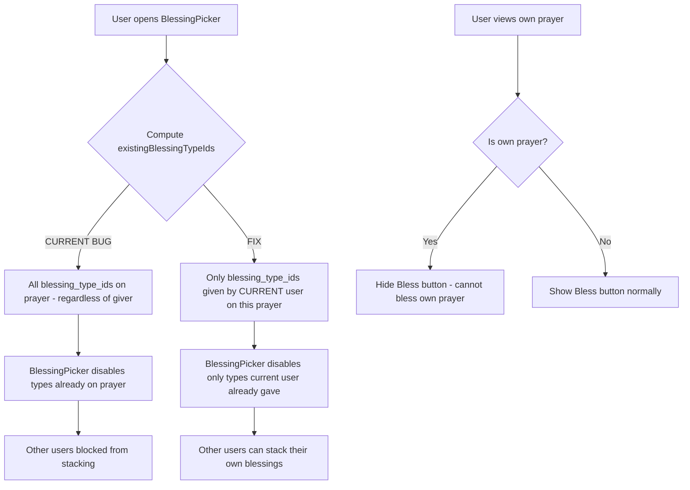

# Fix: Blessing Stacking + Karma Milestone Rebalance

## Part A: Automated Karma v4.1 Sync

Update local SQL files to match the Supabase production schema. Key changes from v4.0 → v4.1:

1. **Milestone threshold**: `/ 10` → `/ 50` (requires 50 prays per milestone instead of 10)
2. **Karma payout multiplier**: Added `* 5` so each milestone drops 5× more karma (net effect: 50 prays = 5 karma instead of 10 prays = 1 karma)
3. **Added `updated_at` column**: `ALTER TABLE public.prayers ADD COLUMN IF NOT EXISTS updated_at TIMESTAMPTZ DEFAULT timezone('utc', now())`
4. **Version bump**: 4.0 → 4.1

Files to update:
- `supabase/migrations/automated-karma.sql` — replace with v4.1 content
- `src/lib/supabase-schema.sql` — update the `calculate_automated_karma` function and add `updated_at` column to prayers table definition

---

## Part B: Blessing Stacking — Allow Multiple Users to Bless the Same Prayer

## Problem

The blessing system currently appears to have "only one slot per blessing type" on each prayer. If User A gives a "Golden Light" ✨ blessing to a prayer, User B sees "Golden Light" marked as "Granted" and disabled in the BlessingPicker, preventing them from also blessing that prayer with Golden Light.

**The root cause is in the frontend**, not the database. The database schema already supports stacking — the `UNIQUE(prayer_id, blessing_type_id, giver_id)` constraint allows different users to give the same blessing type to the same prayer. The SQL RPCs already return aggregated counts.

The bug: `existingBlessingTypeIds` in `AkashicRecordsView.vue` collects **all** blessing type IDs on a prayer regardless of who gave them, then passes them to `BlessingPicker` which disables those types. This means if *any* user gave Golden Light, *no other user* can give Golden Light.

## Architecture Diagram



## Required Changes

### 1. `src/composables/useBlessings.js` — Add user-specific blessing query

Add two new methods:

- **`fetchMyBlessingsForPrayers(prayerIds)`** — Queries `prayer_blessings` table directly where `giver_id = current user ID` for the given prayer IDs. Stores result as `{ prayerId: [blessing_type_id, ...] }` in a new `myBlessings` ref.

- **`getMyBlessingTypeIdsForPrayer(prayerId)`** — Returns the array of blessing type IDs the current user has given to a specific prayer from the cached `myBlessings` data.

- **`clearMyBlessings()`** — Resets the `myBlessings` cache (called alongside `clearPrayerBlessings`).

These need the current user ID, which can be obtained from `supabase.auth.getUser()`.

### 2. `src/views/AkashicRecordsView.vue` — Fix `existingBlessingTypeIds`

Change the computed property from:
```javascript
const existingBlessingTypeIds = computed(() => {
  if (!blessingTargetPrayer.value) return []
  const prayerBlessings = blessings.getBlessingsForPrayer(blessingTargetPrayer.value.id)
  return prayerBlessings.map(b => b.blessing_type_id)
})
```

To:
```javascript
const existingBlessingTypeIds = computed(() => {
  if (!blessingTargetPrayer.value) return []
  return blessings.getMyBlessingTypeIdsForPrayer(blessingTargetPrayer.value.id)
})
```

Also update `refreshBlessingData()` to call both `fetchPrayerBlessings` and `fetchMyBlessingsForPrayers` so user-specific data stays fresh after granting a blessing.

### 3. `src/views/AkashicRecordsView.vue` — Pass `isOwnPrayer` flag to cards

Add a computed or method to determine if the current user owns a prayer. The `get_public_prayers` RPC currently does not expose `user_id`. We need to either:

- **Option A**: Add `p.user_id` to the `get_public_prayers` RPC SELECT clause (small SQL migration change)
- **Option B**: Compare `prayer.username` against the current user's username

**Option A is recommended** because user IDs are more reliable than usernames. This requires a tiny SQL update.

### 4. `supabase/migrations/karma-shop-blessings.sql` — Expose `user_id` in `get_public_prayers`

In the `get_public_prayers` function, add `p.user_id` to the SELECT so the frontend can determine prayer ownership:

```sql
SELECT p.id, p.user_id, p.response_content, ...
```

This is a one-line addition to the existing RPC function.

### 5. `src/components/organisms/AkashicPrayerCard.vue` — Hide Bless button on own prayers

Add an `isOwnPrayer` prop. When true, hide the "✨ Bless" button since the user cannot bless their own prayer. This prevents the UX frustration of opening the BlessingPicker only to get a server-side error.

### 6. No changes needed to display components

`BlessingBadgeBar.vue` and `BlessingDetailModal.vue` already render `×count` notation for stacked blessings. The `get_prayer_blessings` RPC already returns aggregated counts. **No display changes required.**

### 7. No changes needed to SQL schema or `grant_blessing` RPC

The database layer is already correct:
- `UNIQUE(prayer_id, blessing_type_id, giver_id)` allows different users to stack
- `grant_blessing` already prevents self-blessing
- `grant_blessing` already prevents same-user duplicate blessings
- `get_prayer_blessings` already returns aggregated counts

## Files to Modify

| File | Change |
|------|--------|
| `src/composables/useBlessings.js` | Add `myBlessings` ref, `fetchMyBlessingsForPrayers()`, `getMyBlessingTypeIdsForPrayer()`, `clearMyBlessings()` |
| `src/views/AkashicRecordsView.vue` | Fix `existingBlessingTypeIds` to use user-specific data; update `refreshBlessingData()`; pass `isOwnPrayer` to cards |
| `src/components/organisms/AkashicPrayerCard.vue` | Add `isOwnPrayer` prop; conditionally hide Bless button |
| `supabase/migrations/karma-shop-blessings.sql` | Add `p.user_id` to `get_public_prayers` SELECT |

## What Stays the Same

- **SQL schema** (`prayer_blessings` table, `grant_blessing` RPC, `get_prayer_blessings` RPC) — already correct
- **`BlessingBadgeBar.vue`** — already renders `×count` for stacks
- **`BlessingDetailModal.vue`** — already shows `×count` per blessing type
- **`BlessingPicker.vue`** — already has `isAlreadyGranted` / `isDisabled` logic; just needs correct input data
- **`useKarmaShop.js`** — no changes needed
- **`blessings.json`** — no changes needed