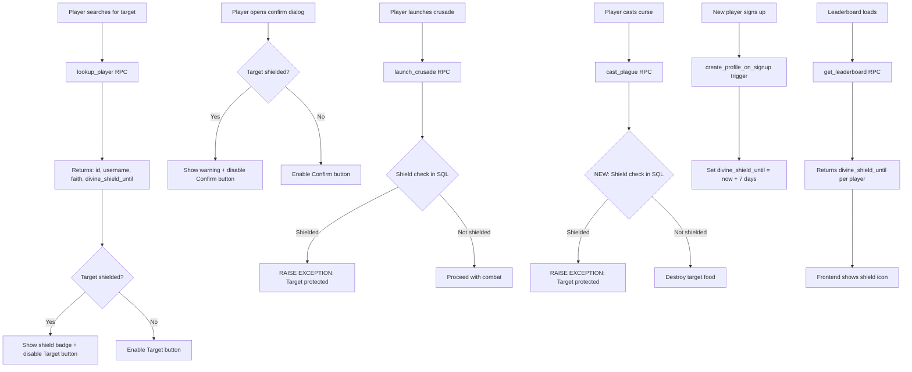

# Fix Crusade/Plague Search, Shield System & Curse Rename

## Root Cause Analysis

### Bug #1: Player Search Returns Empty Results
The `lookupPlayer()` function in [`useVassalage.js`](src/composables/useVassalage.js:248) queries the `profiles` table directly:

```js
const { data, error: queryError } = await supabase
  .from('profiles')
  .select('id, username, faith')
  .ilike('username', username)
  .limit(5)
```

However, the **RLS policy** on `profiles` (defined in genesis_2.sql) only allows:
- Seeing your own profile (`auth.uid() = id`)
- Seeing purgatory users (`ban_until IS NOT NULL AND ban_until > now()`)

Normal players are invisible to each other. This is why the search returns nothing — the query silently returns an empty array because RLS blocks all results. No browser error is thrown because Supabase treats RLS filtering as "no matching rows" rather than an error.

### Bug #2: No Shield Check on Plague
The [`launch_crusade()`](supabase/migrations/genesis_6.sql:394) SQL function checks for Divine Shield:

```sql
IF v_target_shield IS NOT NULL AND v_target_shield > now() THEN
    RAISE EXCEPTION 'Target is protected by Divine Shield until %.', v_target_shield;
END IF;
```

But [`cast_plague()`](supabase/migrations/genesis_2.sql:1100) has **no shield check at all**. It only verifies the target exists and has food to destroy.

### Bug #3: Leaderboard Missing Shield Data
The [`get_leaderboard()`](supabase/migrations/genesis_2.sql:1315) SQL function does not return `divine_shield_until`, so the frontend has no way to know who has an active shield.

### Issue #4: Redundant Shield Display on Altar
The [`MiracleBuffBar`](src/components/molecules/MiracleBuffBar.vue) shows `blessing_shield` miracles labeled "Given"/"Received", but the [`ShieldTimer`](src/components/molecules/ShieldTimer.vue) component already displays the active shield timer. This creates a redundant display.

### Issue #5: No Newbie Shield
The [`create_profile_on_signup()`](supabase/migrations/genesis_4.sql:18) trigger only creates a profile and grants starting buildings — it does **not** set `divine_shield_until`, so new players are immediately vulnerable to crusades and plagues.

---

## Implementation Plan

### 1. Create `genesis_8.sql` Migration

**File**: `supabase/migrations/genesis_8.sql`

This migration addresses all database-side changes:

#### 1a. New `lookup_player()` RPC Function
Creates a SECURITY DEFINER function that bypasses RLS and returns public player info for targeting:

```sql
CREATE OR REPLACE FUNCTION lookup_player(p_search TEXT)
RETURNS JSONB AS $$
  -- Returns: array of {id, username, faith, divine_shield_until}
  -- Uses ILIKE for partial username matching
  -- Filters out the requesting user's own profile
  -- SECURITY DEFINER bypasses RLS
$$
```

This is the same pattern used by `get_leaderboard()`, `get_vassalage_info()`, etc. — all SECURITY DEFINER functions that need to read other users' data.

#### 1b. Update `cast_plague()` — Add Shield Check
Add the same Divine Shield and Papal Bull checks that `launch_crusade()` already has:

```sql
-- Check target is not shielded (Divine Shield)
IF v_target_shield IS NOT NULL AND v_target_shield > now() THEN
    RAISE EXCEPTION 'Target is protected by Divine Shield until %.', v_target_shield;
END IF;

-- Check target is not protected by Papal Bull
IF v_target_papal_bull IS NOT NULL AND v_target_papal_bull > now() THEN
    RAISE EXCEPTION 'Target is protected by Papal Bull until %.', v_target_papal_bull;
END IF;
```

Also update the variable declarations to fetch `divine_shield_until` and `papal_bull_until` from the target profile.

#### 1c. Update `get_leaderboard()` — Add Shield Column
Add `divine_shield_until` to the SELECT so the frontend can display shield icons:

```sql
SELECT
    p.id,
    p.username,
    p.faith,
    p.karma,
    p.mana,
    p.gold,
    p.food,
    p.divine_shield_until,  -- NEW
    ROW_NUMBER() OVER (ORDER BY p.karma DESC, p.mana DESC, p.created_at ASC) AS rank
FROM profiles p
WHERE p.username IS NOT NULL
ORDER BY p.karma DESC, p.mana DESC, p.created_at ASC
LIMIT p_limit OFFSET p_offset
```

#### 1d. Update `create_profile_on_signup()` — Newbie Shield
Set `divine_shield_until` to 7 days from signup:

```sql
INSERT INTO public.profiles (id, email, divine_shield_until)
VALUES (NEW.id, NEW.email, now() + interval '7 days')
ON CONFLICT (id) DO NOTHING;
```

#### 1e. Grant Permissions
```sql
GRANT EXECUTE ON FUNCTION lookup_player(TEXT) TO authenticated;
GRANT EXECUTE ON FUNCTION lookup_player(TEXT) TO service_role;
```

---

### 2. Update `useVassalage.js` — Use `lookup_player` RPC

**File**: `src/composables/useVassalage.js`

Replace the direct `supabase.from('profiles')` query with the new RPC:

```js
// BEFORE (broken — RLS blocks this):
const { data, error: queryError } = await supabase
  .from('profiles')
  .select('id, username, faith')
  .ilike('username', username)
  .limit(5)

// AFTER (uses SECURITY DEFINER RPC that bypasses RLS):
const { data, error: rpcError } = await supabase.rpc('lookup_player', {
  p_search: username
})
```

The RPC returns objects with `{id, username, faith, divine_shield_until}`, which gives us the shield info we need for the UI.

---

### 3. Update `VaticanView.vue` — Curse Rename + Shield Indicators + Confirmation Dialogs

**File**: `src/views/VaticanView.vue`

#### 3a. Rename "Plague" to "Curse" on all frontend displays
- Section heading: "Cast Plague" → "Cast Curse"
- Description text: "Cast plague on" → "Cast a curse on"
- Confirmation modal: "Confirm Plague" → "Confirm Curse", "Cast Plague" → "Cast Curse"
- Result display: "Plague Cast Successfully!" → "Curse Cast Successfully!"
- Akashic log label: `plague: 'Plague'` → `plague: 'Curse'`
- Akashic log emoji: `☠` stays (thematically appropriate for curse)
- Akashic log detail text: "Anonymous plague struck" → "Anonymous curse struck"

#### 3b. Show Shield Indicator in Search Results
When a player search result has an active `divine_shield_until`, display a shield icon/badge and disable the "Target" button:

```html
<div v-if="player.divine_shield_until && new Date(player.divine_shield_until) > new Date()"
     class="text-xs text-amber-500">🛡 Shielded</div>
```

Disable the Target button for shielded players:
```html
<button
  @click="selectTarget(player)"
  :disabled="isPlayerShielded(player) || vassalage.crusadeLoading"
  class="btn-danger px-4 py-2 text-xs"
>
  <span v-if="isPlayerShielded(player)" class="relative z-10 font-medium">🛡 Shielded</span>
  <span v-else class="relative z-10 font-medium">Target</span>
</button>
```

Same for curse Target button.

#### 3c. Show Shield Status in Confirmation Dialogs
The "Confirm Crusade" and "Confirm Curse" modals must also display shield status. If a shielded player somehow reaches the confirmation dialog (e.g., shield activated between search and confirm), show a warning and disable the confirm button:

**Crusade confirm dialog:**
```html
<div v-if="selectedTarget && isPlayerShielded(selectedTarget)" 
     class="rounded-[20px] border border-amber-500/25 bg-amber-500/10 p-3 mb-3">
  <p class="text-xs text-amber-600">🛡 This player is protected by Divine Shield and cannot be crusaded.</p>
</div>
<button
  @click="executeCrusade"
  :disabled="vassalage.crusadeLoading || (selectedTarget && isPlayerShielded(selectedTarget))"
  class="btn-danger flex-1 px-4 py-2 text-sm"
>
  ...
</button>
```

**Curse confirm dialog** — same pattern:
```html
<div v-if="selectedPlagueTarget && isPlayerShielded(selectedPlagueTarget)"
     class="rounded-[20px] border border-amber-500/25 bg-amber-500/10 p-3 mb-3">
  <p class="text-xs text-amber-600">🛡 This player is protected by Divine Shield and cannot be cursed.</p>
</div>
<button
  @click="executePlague"
  :disabled="vassalage.plagueLoading || (selectedPlagueTarget && isPlayerShielded(selectedPlagueTarget))"
  class="btn-primary flex-1 px-4 py-2 text-sm"
>
  ...
</button>
```

Add a helper function:
```js
function isPlayerShielded(player) {
  if (!player.divine_shield_until) return false
  return new Date(player.divine_shield_until) > new Date()
}
```

---

### 4. Update `LeaderboardView.vue` — Shield Column

**File**: `src/views/LeaderboardView.vue`

Add a shield icon column to the leaderboard table. After the "Name" column, show a shield icon for players with active shields:

```html
<th class="pb-3 pr-4 w-10">🛡</th>
...
<td class="py-3 pr-4">
  <span v-if="player.divine_shield_until && new Date(player.divine_shield_until) > new Date()"
        class="text-amber-500" title="Divine Shield active">🛡</span>
</td>
```

---

### 5. Update `AltarView.vue` — Remove Redundant Blessing Shield from Buff Bar

**File**: `src/views/AltarView.vue`

Filter out `blessing_shield` miracles before passing them to `MiracleBuffBar`, since `ShieldTimer` already displays the shield:

```html
<MiracleBuffBar :miracles="nonShieldMiracles" />
```

Add a computed:
```js
const nonShieldMiracles = computed(() =>
  economy.activeMiracles.filter(m => m.miracle_type !== 'blessing_shield')
)
```

This way the `ShieldTimer` component remains the canonical display for shields, and the buff bar only shows non-shield miracles (like Papal Bull, etc.).

---

## Architecture Diagram



---

## Files to Modify

| File | Change |
|------|--------|
| `supabase/migrations/genesis_8.sql` | NEW: lookup_player RPC, cast_plague shield check, get_leaderboard shield column, create_profile_on_signup newbie shield |
| `src/composables/useVassalage.js` | Replace direct profiles query with lookup_player RPC |
| `src/views/VaticanView.vue` | Rename Plague to Curse, add shield indicators to search results AND confirmation dialogs, disable targeting shielded players |
| `src/views/LeaderboardView.vue` | Add shield column to leaderboard table |
| `src/views/AltarView.vue` | Filter blessing_shield from MiracleBuffBar |
| `src/components/molecules/MiracleBuffBar.vue` | No changes needed — filtering happens at the view level |