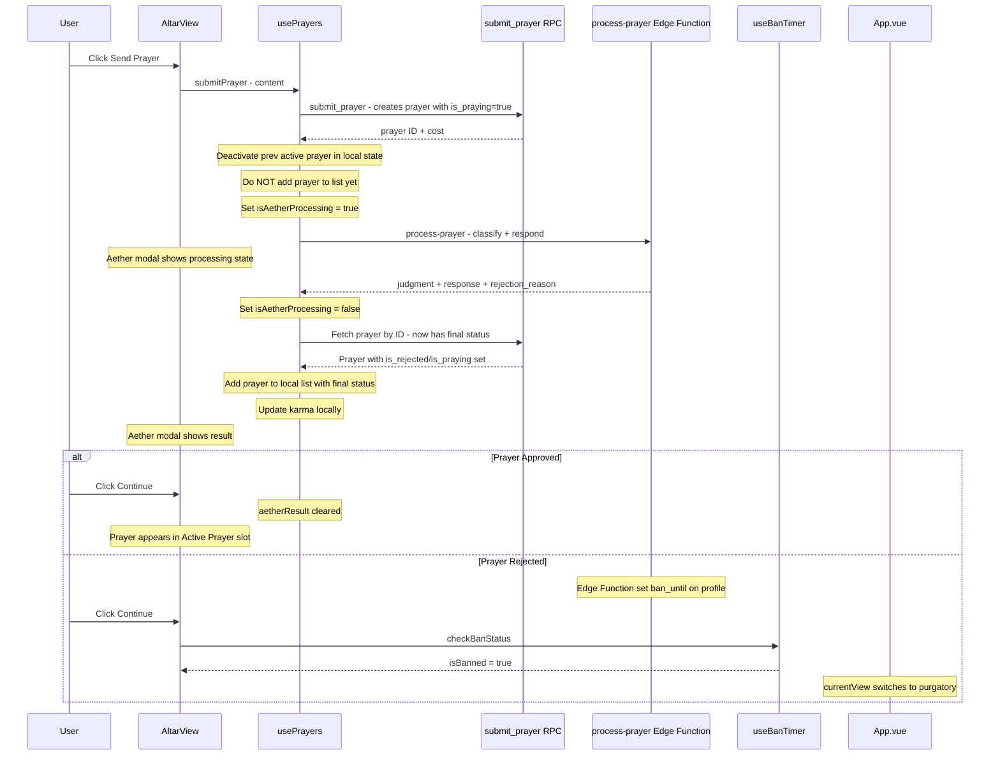

# Fix Plan: Four Major Issues

## Issue 1: Profile Modal Doesn't Close + No Settings Button

### Root Cause
Two problems:
1. **Modal doesn't close on submit**: In [`ProfileCompletionModal.vue`](src/components/organisms/ProfileCompletionModal.vue:124), `handleSubmit()` emits `'submitted'` synchronously and the parent's `handleProfileSubmit` in [`AltarView.vue`](src/views/AltarView.vue:479) calls `await prayers.updateProfile()` then sets `showProfileModal.value = false`. If `updateProfile()` throws (e.g., Supabase RLS issue), the catch block silently swallows the error and the modal never closes. The modal also sets `loading = true` then `false` immediately since `emit()` is synchronous — the button never shows "Saving...".
2. **No way to re-open modal**: The header in [`AltarView.vue`](src/views/AltarView.vue:4) only has Karma, Slots, Mana, and Logout — no settings/profile button.

### Fix
1. **`ProfileCompletionModal.vue`**: Change `handleSubmit` to emit `update:modelValue` with `false` after successful submission, so the modal closes itself. Add a `@submit` event that the parent can await. Move loading/error state management so the button actually shows "Saving..." while the parent's async handler runs.
   
2. **`AltarView.vue`**: Add a gear/settings icon button in the header that sets `showProfileModal = true` when clicked, visible only when profile IS complete (the "Complete Your Identity" button already shows when incomplete).

3. **Error propagation**: If `updateProfile` fails, display the error in the modal instead of silently failing.

---

## Issue 2: Prayers Added to Queue Before Classifier Judges Them

### Root Cause
In [`usePrayers.js`](src/composables/usePrayers.js:218), `submitPrayer()` does this sequence:
1. Calls `submit_prayer` RPC → creates prayer with `is_praying = true` in DB
2. Fetches the new prayer from DB
3. **Immediately adds it to `prayers.value`** (line 246) — it appears as "Being Prayed" in the UI
4. Calls Edge Function for classification (line 254)
5. Only AFTER the Edge Function returns does it update `is_rejected`/`is_praying`

This means the prayer shows as active for potentially seconds before the classifier determines it should be rejected. The prayer counter (`usePrayerCounter`) may also start counting for a prayer that will be rejected.

### Fix
**`usePrayers.js` — `submitPrayer()`**:
1. After the `submit_prayer` RPC call, **do NOT fetch or add the prayer to `prayers.value` yet**
2. Instead, update local state to deactivate the previous active prayer (since the RPC already did this server-side):
   ```js
   const prevActive = prayers.value.find(p => p.is_praying && !p.is_archived)
   if (prevActive) {
     prevActive.is_praying = false
     prevActive.activated_at = null
   }
   ```
3. Show the Aether modal (`isAetherProcessing = true`) immediately
4. Call the Edge Function
5. **After** the Edge Function returns, fetch the prayer from the server (which now has the final status: approved or rejected) and add it to `prayers.value`
6. Update karma locally based on the result
7. If the Edge Function fails, still fetch the prayer (it exists but may not have AI response) and add it with a processing error flag

**`AltarView.vue`**: The Aether modal already covers the screen during processing, so the user won't see a blank altar. The key change is that no prayer card appears until judgment is rendered.

---

## Issue 3: Purgatory Should Be Inline View, Not URL Navigation

### Root Cause
In [`AltarView.vue`](src/views/AltarView.vue:544), the `handleAetherContinue` function does:
```js
if (latestPrayer.is_rejected) {
  window.location.href = '/purgatory'  // Full page reload!
}
```
This causes a full page navigation to a URL that doesn't exist in the SPA (no Vue Router). Meanwhile, [`App.vue`](src/App.vue:18) already has reactive view switching:
```js
const currentView = computed(() => {
  if (!auth.isAuthenticated) return 'login'
  if (banTimer.isBanned) return 'purgatory'
  return 'altar'
})
```
But the view never switches to Purgatory because **the Edge Function never sets `ban_until`** on the profile when a prayer is rejected. The `isBanned` computed in `useBanTimer` checks `ban_until`, which remains null.

### Fix
1. **`supabase/functions/process-prayer/index.ts`**: Add ban logic after a rejection. When `isRejected` is true, update the user's profile with `ban_until = now() + 2 hours`:
   ```typescript
   if (isRejected) {
     const banUntil = new Date(Date.now() + 2 * 60 * 60 * 1000).toISOString()
     await supabase
       .from('profiles')
       .update({ ban_until: banUntil })
       .eq('id', user_id)
   }
   ```

2. **`src/composables/usePrayers.js`**: In `submitPrayer()`, after the Edge Function returns a rejection, call `banTimer.checkBanStatus()` to refresh the ban state. This requires importing `useBanTimer` or passing it as a parameter. Alternatively, the `AltarView` component can handle this in the `handleAetherContinue` callback.

3. **`src/views/AltarView.vue`**: Remove `window.location.href = '/purgatory'`. Instead, after a rejection:
   ```js
   async function handleAetherContinue() {
     prayers.aetherResult = null
     if (prayers.prayers.length > 0) {
       const latestPrayer = prayers.prayers[0]
       if (latestPrayer.is_rejected) {
         await banTimer.checkBanStatus()  // Refresh ban state from server
         // App.vue's computed will auto-switch to purgatory view
       }
     }
   }
   ```

4. **`src/views/PurgatoryView.vue`**: This already works as a view component. It shows the timer, the rejection reason, and the indulgence section. No URL navigation needed — `App.vue` switches to it reactively when `banTimer.isBanned` is true.

---

## Issue 4: Karma Values Don't Update on Positive Wishes

### Root Cause
The Edge Function calls `update_karma` RPC which updates `profiles.karma` in the database. But the client's local `karma` ref in [`usePrayers.js`](src/composables/usePrayers.js:28) is never refreshed after submission. It's only set during `fetchProfile()` which runs on mount. The `aetherResult` object includes `karmaChange` but it's only used for display in the Aether modal — never applied to `karma.value`.

### Fix
**`usePrayers.js` — `submitPrayer()`**: After the Edge Function returns, update `karma.value` locally:
```js
if (aiResult) {
  // ... existing code ...
  const karmaChange = aiResult.judgment === 'approved' ? 1 : -1
  karma.value += karmaChange  // Update local karma immediately
  aetherResult.value = {
    success: true,
    judgment: aiResult.judgment,
    response: aiResult.response,
    rejection_reason: aiResult.rejection_reason,
    karmaChange: karmaChange,
  }
}
```

Also, for robustness, call `fetchProfile()` after the Aether modal closes to sync with the server:
```js
async function handleAetherContinue() {
  prayers.aetherResult = null
  await prayers.fetchProfile()  // Refresh karma and other profile data from server
  // ... ban check for rejections ...
}
```

This ensures the karma display in the header updates immediately (local update) and stays accurate (server refresh).

---

## Flow Diagram: Prayer Submission (After Fix)



---

## Files to Modify

| File | Changes |
|------|---------|
| `src/components/organisms/ProfileCompletionModal.vue` | Fix modal close logic, add `@close` emit, improve loading state |
| `src/views/AltarView.vue` | Add settings button in header, remove `window.location.href`, refresh profile/ban on Aether continue, update `handleProfileSubmit` |
| `src/composables/usePrayers.js` | Restructure `submitPrayer` to defer adding prayer to list until after classification, update karma locally, handle previous active prayer deactivation |
| `supabase/functions/process-prayer/index.ts` | Add `ban_until` update when prayer is rejected |

## Files NOT Modified

| File | Reason |
|------|--------|
| `src/App.vue` | Already works correctly with reactive view switching — no changes needed |
| `src/views/PurgatoryView.vue` | Already displays timer, rebuke, and indulgence section — works once `isBanned` is properly set |
| `src/composables/useBanTimer.js` | Already has `checkBanStatus()` — just needs to be called at the right time |
| `src/composables/useAuth.js` | No changes needed |
| `src/composables/usePrayerCounter.js` | No changes needed — it watches `is_praying` which will be correct after fix |
| Database schema | `ban_until` column already exists on `profiles` table |