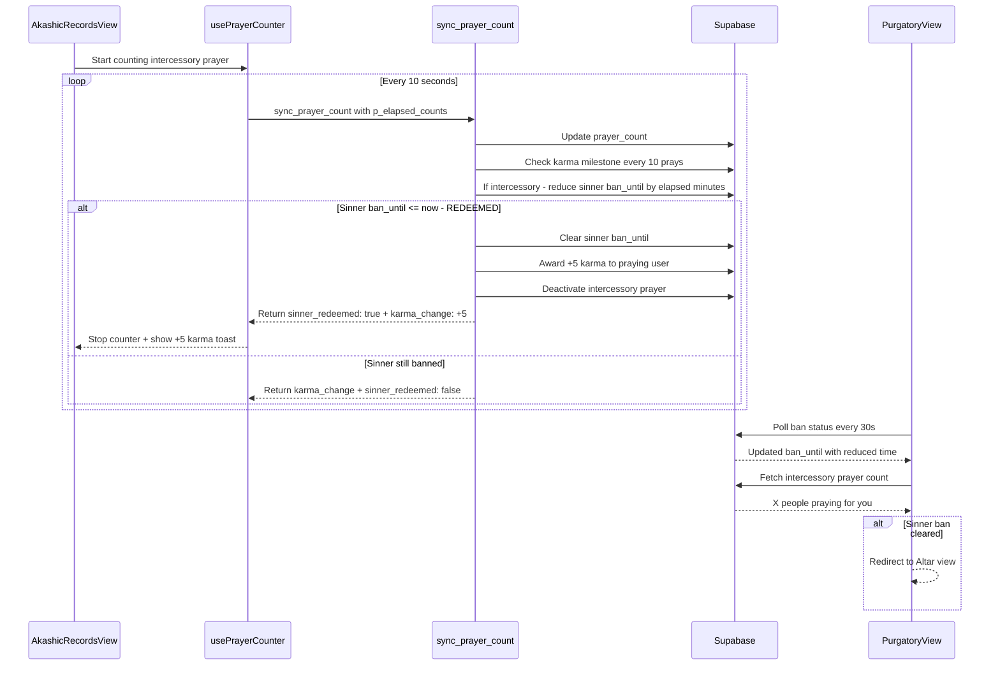

# Plan: Karma Toast, Footer, Purgatory, Icons

## Overview

Six categories of changes:
1. **Icon placement** — Move icon.png, add to AltarView, LoginView, and App.vue navbar
2. **KarmaToast readability** — Darker font for positive toast
3. **Karma display reactivity** — Fix stale karma across views (singleton pattern)
4. **Universal footer + logout in purgatory** — Footer confirmed universal; add logout button
5. **Intercessory prayer features** — Prayer count display, ban reduction (1 min/cycle), +5 karma redemption bonus
6. **SQL migration** — Copy-paste SQL for manual Supabase execution

---

## 1. Icon Placement

**Source:** `icon.png` (project root) → move to `src/assets/icons/icon.png`

### 1a. App.vue Navbar — "The Electric Monk - Prayers As A Service" + 25x25 icon

**File:** [`src/App.vue`](src/App.vue:32)

Current navbar only has tab buttons. Change to include branding text + icon on the left:

```html
<nav v-if="auth.isAuthenticated && !banTimer.isBanned" class="border-b border-theme-border bg-theme-panel/50 backdrop-blur-sm">
  <div class="max-w-4xl mx-auto px-4 flex items-center justify-between">
    <div class="flex items-center gap-2">
      
      <span class="text-sm font-semibold text-theme-text">The Electric Monk - Prayers As A Service</span>
    </div>
    <div class="flex items-center gap-1">
      <!-- existing tab buttons -->
    </div>
  </div>
</nav>
```

### 1b. AltarView — 50x50 icon above Submit Your Prayer

**File:** [`src/views/AltarView.vue`](src/views/AltarView.vue:60)

Add icon above the "Submit Your Prayer" heading:

```html
<div class="glass-panel glass-gloss p-6 mb-8">
  <div class="flex flex-col items-center mb-4">
    
  </div>
  <h2 class="text-xl font-semibold text-theme-text mb-4">Submit Your Prayer</h2>
  <!-- rest of form -->
```

### 1c. LoginView — 75x75 icon below login panel

**File:** [`src/views/LoginView.vue`](src/views/LoginView.vue:110)

Add icon below the form container, inside the outer flex div:

```html
<!-- After the closing </div> of the glass-panel form, before the outer </div> -->
<div class="mt-6 flex flex-col items-center">
  
</div>
```

---

## 2. KarmaToast Font Color Fix

**File:** [`src/components/molecules/KarmaToast.vue`](src/components/molecules/KarmaToast.vue:60)

Change `.karma-toast.positive` color from `#f5e6a3` (light gold, unreadable on translucent gold bg) to `#2d2d2d` (dark grey-black).

```css
.karma-toast.positive {
  background: linear-gradient(135deg, rgba(201, 168, 76, 0.2), rgba(245, 230, 163, 0.15));
  border: 1px solid rgba(201, 168, 76, 0.5);
  color: #2d2d2d;  /* was #f5e6a3 */
}
```

---

## 3. Karma Display Not Updating (Singleton Pattern)

**File:** [`src/composables/usePrayers.js`](src/composables/usePrayers.js:25)

**Problem:** `usePrayers()` creates new `ref()` values on every call. Each view gets independent state. When AltarView updates karma, AkashicRecordsView doesn't see it.

**Fix:** Convert to singleton pattern (same as [`useAuth`](src/composables/useAuth.js:15) and [`useBanTimer`](src/composables/useBanTimer.js:16)):

```js
let sharedState = null

function createPrayersState() {
  // ... all existing ref() and function declarations (unchanged) ...
  return reactive({ ... })
}

export function usePrayers() {
  if (!sharedState) {
    sharedState = createPrayersState()
  }
  return sharedState
}
```

This ensures all views share the same reactive `karma` ref.

---

## 4. Purgatory Logout Button

**File:** [`src/views/PurgatoryView.vue`](src/views/PurgatoryView.vue)

Add logout button below the indulgence section:

```html
<!-- Logout -->
<div class="mt-6">
  <button
    @click="handleLogout"
    class="px-4 py-2 text-sm text-theme-text-dim hover:text-theme-text transition-colors"
  >
    Logout
  </button>
</div>
```

```js
import { useAuth } from '@/composables/useAuth'
const auth = useAuth()

async function handleLogout() {
  await auth.signOut()
}
```

---

## 5. Intercessory Prayer Features

### 5a. PurgatoryView — Prayer Count Display

**File:** [`src/views/PurgatoryView.vue`](src/views/PurgatoryView.vue)

Add a reactive `intercessoryCount` ref. Fetch on mount and poll every 30 seconds:

```js
const intercessoryCount = ref(0)

async function fetchIntercessoryCount() {
  const { data: { user } } = await supabase.auth.getUser()
  if (!user) return
  const { data } = await supabase.rpc('get_intercessory_prayer_count', { p_sinner_id: user.id })
  intercessoryCount.value = data || 0
}
```

Display in template:

```html
<div v-if="intercessoryCount > 0" class="mt-4 p-3 bg-theme-accent/10 border border-theme-accent/30 rounded-lg">
  <p class="text-theme-accent text-sm font-medium">
    🕯️ {{ intercessoryCount }} {{ intercessoryCount === 1 ? 'person is' : 'people are' }} praying for your redemption
  </p>
</div>
```

### 5b. useBanTimer — 30s Polling

**File:** [`src/composables/useBanTimer.js`](src/composables/useBanTimer.js:72)

Add a 30-second poll interval in `startCountdown()` so purgatory users see real-time ban reductions:

```js
let banPollInterval = null

// Inside startCountdown():
banPollInterval = setInterval(() => {
  checkBanStatus()
}, 30000)

// In cleanup:
if (banPollInterval) clearInterval(banPollInterval)
```

### 5c. sync_prayer_count RPC — Ban Reduction + Redemption

**Key change:** When `sync_prayer_count` is called for an intercessory prayer, reduce the target sinner's `ban_until` by 1 minute per completed pray cycle (i.e., per `p_elapsed_counts`). If `ban_until` reaches `now()` or earlier, the sinner is redeemed — clear ban, deactivate prayer, award +5 karma.

The modified `sync_prayer_count` returns a new `sinner_redeemed` boolean field.

### 5d. usePrayerCounter — Handle sinner_redeemed

**File:** [`src/composables/usePrayerCounter.js`](src/composables/usePrayerCounter.js:193)

In the periodic sync callback and `finalSync`, check for `sinner_redeemed` in the response. If true:
- Stop the counter
- Set a reactive flag `sinnerRedeemed`
- Parent view handles the rest (toast, refresh)

### 5e. AkashicRecordsView — Handle Sinner Redemption

**File:** [`src/views/AkashicRecordsView.vue`](src/views/AkashicRecordsView.vue:320)

In `handleStopPraying` and the sync watcher, check for `sinner_redeemed`:

```js
if (finalResult?.sinner_redeemed) {
  karmaToastAmount.value = 5
  karmaToastType.value = 'positive'
  karmaToastLabel.value = 'Sinner redeemed! +5 bonus karma!'
  await akashic.fetchSinners()  // Refresh sinners list
}
```

Also add a watcher for `counter.sinnerRedeemed` during periodic syncs that auto-stops the prayer.

---

## 6. SQL Migration (Copy-Paste for Supabase SQL Editor)

This must be run manually in the Supabase SQL Editor. The file will be created at `supabase/migrations/intercessory-features.sql` for reference, but you'll copy-paste the content.

```sql
-- ============================================
-- Intercessory Prayer Features Migration
-- Date: 2026-05-16
--
-- CHANGES:
-- 1. get_intercessory_prayer_count() RPC - Count active prayers for a sinner
-- 2. Modified sync_prayer_count() - Ban reduction for intercessory prayers
--    - 1 minute reduction per completed pray cycle
--    - +5 karma bonus when sinner is redeemed
--    - Auto-deactivate intercessory prayer on redemption
-- ============================================

-- 1. RPC to count active intercessory prayers for a sinner
CREATE OR REPLACE FUNCTION get_intercessory_prayer_count(p_sinner_id UUID)
RETURNS INT AS $$
  SELECT COUNT(*)::INT FROM prayers
  WHERE source_sinner_id = p_sinner_id
    AND is_praying = true
    AND prayer_type = 'intercessory';
$$ LANGUAGE sql SECURITY DEFINER;

-- Grant execute to authenticated users
GRANT EXECUTE ON FUNCTION get_intercessory_prayer_count(UUID) TO authenticated;
GRANT EXECUTE ON FUNCTION get_intercessory_prayer_count(UUID) TO service_role;

-- 2. Modified sync_prayer_count with intercessory ban reduction
CREATE OR REPLACE FUNCTION sync_prayer_count(
  p_prayer_id UUID,
  p_elapsed_counts INT
)
RETURNS JSONB AS $$
DECLARE
  v_user_id UUID;
  v_prayer RECORD;
  v_milestones INT;
  v_karma_change INT := 0;
  v_ban_check TIMESTAMPTZ;
  v_sinner_redeemed BOOLEAN := false;
  v_ban_reduction INTERVAL;
BEGIN
  SELECT user_id, is_praying, prayer_type, source_sinner_id, karma_awarded
  INTO v_prayer
  FROM prayers WHERE id = p_prayer_id;

  IF NOT FOUND THEN
    RAISE EXCEPTION 'Prayer not found';
  END IF;

  IF v_prayer.user_id != auth.uid() THEN
    RAISE EXCEPTION 'Not authorized';
  END IF;

  IF NOT v_prayer.is_praying THEN
    RAISE EXCEPTION 'Prayer is not active';
  END IF;

  -- Update prayer count
  UPDATE prayers
  SET prayer_count = prayer_count + p_elapsed_counts,
      last_counted_at = now()
  WHERE id = p_prayer_id
  RETURNING id, prayer_count, last_counted_at, activated_at, prayer_type, karma_awarded, user_id, source_sinner_id
  INTO v_prayer;

  -- Check karma milestones (every 10 prays)
  v_milestones := floor(v_prayer.prayer_count / 10);

  IF v_milestones > v_prayer.karma_awarded THEN
    -- Determine karma rate based on prayer type
    IF v_prayer.prayer_type = 'altruistic' THEN
      v_karma_change := (v_milestones - v_prayer.karma_awarded) * 2;
    ELSE
      v_karma_change := (v_milestones - v_prayer.karma_awarded) * 1;
    END IF;

    -- Award karma to the praying user
    PERFORM update_karma(v_prayer.user_id, v_karma_change);

    -- Update karma_awarded tracker
    UPDATE prayers SET karma_awarded = v_milestones WHERE id = p_prayer_id;
  END IF;

  -- INTERCESSORY PRAYER: Reduce sinner ban time
  -- 1 minute per completed pray cycle (p_elapsed_counts)
  IF v_prayer.prayer_type = 'intercessory' AND v_prayer.source_sinner_id IS NOT NULL THEN
    -- Calculate ban reduction
    v_ban_reduction := p_elapsed_counts * INTERVAL '1 minute';

    -- Reduce sinner's ban time, but not below now()
    UPDATE profiles
    SET ban_until = GREATEST(now(), ban_until - v_ban_reduction)
    WHERE id = v_prayer.source_sinner_id
      AND ban_until IS NOT NULL
      AND ban_until > now();

    -- Check if sinner is now redeemed (ban_until <= now or NULL)
    SELECT ban_until INTO v_ban_check
    FROM profiles WHERE id = v_prayer.source_sinner_id;

    IF v_ban_check IS NULL OR v_ban_check <= now() THEN
      -- Sinner redeemed! Clear their ban completely
      UPDATE profiles SET ban_until = NULL, updated_at = now()
      WHERE id = v_prayer.source_sinner_id;

      -- Award +5 karma bonus to the praying user for redeeming a sinner
      PERFORM update_karma(v_prayer.user_id, 5);
      v_karma_change := v_karma_change + 5;

      -- Deactivate the intercessory prayer
      UPDATE prayers
      SET is_praying = false, activated_at = NULL
      WHERE id = p_prayer_id;

      v_sinner_redeemed := true;
    END IF;
  END IF;

  RETURN jsonb_build_object(
    'prayer_count', v_prayer.prayer_count,
    'last_counted_at', v_prayer.last_counted_at,
    'activated_at', v_prayer.activated_at,
    'karma_change', v_karma_change,
    'sinner_redeemed', v_sinner_redeemed
  );
END;
$$ LANGUAGE plpgsql SECURITY DEFINER;

-- Ensure execute permissions are set
GRANT EXECUTE ON FUNCTION sync_prayer_count(UUID, INT) TO authenticated;
GRANT EXECUTE ON FUNCTION sync_prayer_count(UUID, INT) TO service_role;
```

---

## Files to Modify

| # | File | Change |
|---|------|--------|
| 1 | `icon.png` → `src/assets/icons/icon.png` | Move icon to proper assets folder |
| 2 | `src/components/molecules/KarmaToast.vue` | Change positive toast `color` to `#2d2d2d` |
| 3 | `src/composables/usePrayers.js` | Convert to singleton pattern |
| 4 | `src/views/PurgatoryView.vue` | Add logout button + intercessory prayer count display + polling |
| 5 | `src/composables/useBanTimer.js` | Add 30s polling for ban status |
| 6 | `src/composables/usePrayerCounter.js` | Handle `sinner_redeemed` flag, add `sinnerRedeemed` reactive ref |
| 7 | `src/views/AkashicRecordsView.vue` | Handle sinner redemption during active prayer |
| 8 | `src/views/AltarView.vue` | Add 50x50 icon above Submit Your Prayer |
| 9 | `src/views/LoginView.vue` | Add 75x75 icon below login panel |
| 10 | `src/App.vue` | Add branding text + 25x25 icon to navbar |
| 11 | `supabase/migrations/intercessory-features.sql` | New migration SQL (copy-paste into Supabase SQL Editor) |

---

## Architecture: Intercessory Prayer Flow



---

## Implementation Order

1. **Move icon** — `icon.png` → `src/assets/icons/icon.png`
2. **KarmaToast color fix** — simple CSS change
3. **usePrayers singleton** — refactor to shared state pattern
4. **Purgatory logout button** — add useAuth + logout button
5. **Icon in AltarView** — 50x50 above Submit Your Prayer
6. **Icon in LoginView** — 75x75 below login panel
7. **Navbar branding** — App.vue navbar text + 25x25 icon
8. **SQL migration** — provide copy-paste SQL for manual execution
9. **useBanTimer polling** — 30s interval re-fetch
10. **PurgatoryView prayer count** — display intercessory count
11. **usePrayerCounter sinner_redeemed** — handle new response flag
12. **AkashicRecordsView redemption handling** — end prayer + toast on redemption