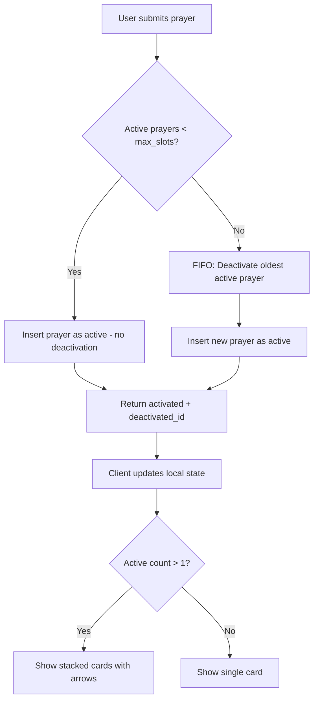
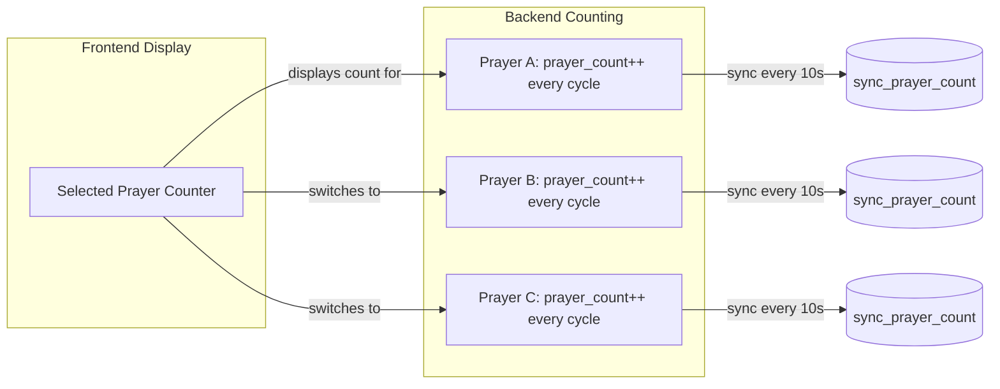

# Fix Multi-Slot Prayer System — Architecture Plan

## Problem Statement

The prayer slot system allows purchasing multiple slots (`max_prayer_slots`), but only **one prayer can be active at a time**. Activating a new prayer deactivates the current one. The system needs to support up to `max_prayer_slots` simultaneous active prayers with FIFO rotation when all slots are occupied.

## Root Causes

Every layer of the stack enforces single-active-prayer:

| Layer | File | Issue |
|-------|------|-------|
| SQL RPC | `submit_prayer()` | Deactivates ALL `is_praying = true` prayers before inserting |
| SQL RPC | `activate_prayer()` | Deactivates ALL active prayers before activating target |
| SQL RPC | `start_altruistic_prayer()` / `start_intercessory_prayer()` | Same blanket deactivation |
| Edge Function | `process-prayer/index.ts` | `.eq('is_praying', true)` deactivates all on approval |
| Composable | `usePrayers.js` L249 | Client-side deactivation of previous active prayer |
| Computed | `usePrayers.js` L501 | `currentActivePrayer` returns `.find()` — single prayer |
| Counter | `usePrayerCounter.js` | Manages a single prayer's counting cycle |
| View | `AltarView.vue` | Single card display, no stacking/carousel |

---

## Solution Architecture

### Flow Diagram



### Counter Strategy — Single Counter, Selected Prayer

Instead of creating a complex multi-counter composable, we reuse the existing `usePrayerCounter` and make it follow the **currently selected** prayer:

- All active prayers count on the **backend** (each has its own `prayer_count`, `activated_at`, `last_counted_at`)
- The **frontend counter** only tracks whichever prayer the user is currently viewing
- When the user switches to a different active prayer card:
  1. Final-sync the current prayer's counts
  2. Switch the counter to the new prayer
  3. The counter picks up from `prayer_count` + elapsed cycles since `last_counted_at`
- When the user is NOT viewing a prayer (e.g., scrolled away), backend sync still happens via `sync_prayer_count` for whichever prayer was last synced



---

## Detailed Changes

### 1. SQL Migration: `supabase/migrations/multi-slot-prayers.sql`

**Rewrite `submit_prayer()`** — Check slot count instead of blanket deactivation:

```sql
CREATE OR REPLACE FUNCTION submit_prayer(prayer_content TEXT)
RETURNS JSONB AS $$
DECLARE
    v_user_id UUID := auth.uid();
    v_char_limit INT := 1500;
    v_token_ratio INT := 5;
    v_cost INT;
    v_spent INT;
    v_limit INT;
    v_new_prayer_id UUID;
    v_max_slots INT;
    v_active_count INT;
    v_deactivated_id UUID;
BEGIN
    -- Get current stats + slot limit
    SELECT tokens_spent_today, daily_token_limit, max_prayer_slots
    INTO v_spent, v_limit, v_max_slots
    FROM profiles WHERE id = v_user_id;

    -- Validate character count
    IF length(prayer_content) > v_char_limit THEN
        RAISE EXCEPTION 'Prayer exceeds maximum length of % characters.', v_char_limit;
    END IF;

    -- Calculate cost
    v_cost := ceil(length(prayer_content)::float / v_token_ratio);

    -- Check budget
    IF (v_spent + v_cost) > v_limit THEN
        RAISE EXCEPTION 'Insufficient Mana.';
    END IF;

    -- Count currently active prayers
    SELECT COUNT(*) INTO v_active_count
    FROM prayers WHERE user_id = v_user_id AND is_praying = true;

    -- FIFO rotation: if all slots occupied, deactivate the OLDEST active prayer
    IF v_active_count >= v_max_slots THEN
        SELECT id INTO v_deactivated_id
        FROM prayers
        WHERE user_id = v_user_id AND is_praying = true
        ORDER BY activated_at ASC NULLS LAST
        LIMIT 1;

        IF v_deactivated_id IS NOT NULL THEN
            UPDATE prayers
            SET is_praying = false, activated_at = NULL
            WHERE id = v_deactivated_id;
        END IF;
    END IF;

    -- Insert new prayer as active
    INSERT INTO prayers (user_id, content, is_praying, activated_at, last_counted_at)
    VALUES (v_user_id, prayer_content, true, now(), now())
    RETURNING id INTO v_new_prayer_id;

    -- Deduct mana
    UPDATE profiles
    SET tokens_spent_today = tokens_spent_today + v_cost,
        last_prayer_date = CURRENT_DATE
    WHERE id = v_user_id;

    RETURN jsonb_build_object(
        'id', v_new_prayer_id,
        'cost', v_cost,
        'deactivated_id', v_deactivated_id
    );
END;
$$ LANGUAGE plpgsql SECURITY DEFINER;
```

**Rewrite `activate_prayer()`** — Slot-aware activation with FIFO:

```sql
CREATE OR REPLACE FUNCTION activate_prayer(p_prayer_id UUID)
RETURNS JSONB AS $$
DECLARE
    v_user_id UUID := auth.uid();
    v_max_slots INT;
    v_active_count INT;
    v_deactivated_id UUID;
    v_deactivated RECORD;
    v_new_activated RECORD;
    v_elapsed_counts INT;
    v_cycle_time_ms INT;
BEGIN
    -- Get user's max slots
    SELECT max_prayer_slots INTO v_max_slots
    FROM profiles WHERE id = v_user_id;

    -- Count active prayers (excluding the one we're about to activate)
    SELECT COUNT(*) INTO v_active_count
    FROM prayers
    WHERE user_id = v_user_id AND is_praying = true AND id != p_prayer_id;

    -- FIFO: if all slots are occupied, deactivate the OLDEST
    IF v_active_count >= v_max_slots THEN
        SELECT id, COALESCE(response_content, content) AS cycle_text,
               activated_at, last_counted_at, prayer_count
        INTO v_deactivated
        FROM prayers
        WHERE user_id = v_user_id AND is_praying = true AND id != p_prayer_id
        ORDER BY activated_at ASC NULLS LAST
        LIMIT 1;

        IF FOUND THEN
            v_deactivated_id := v_deactivated.id;

            -- Calculate elapsed counts before deactivating
            v_cycle_time_ms := GREATEST(15000, LEAST(length(v_deactivated.cycle_text) * 200, 180000));
            v_elapsed_counts := GREATEST(0, floor(
                EXTRACT(EPOCH FROM (now() - COALESCE(v_deactivated.last_counted_at, v_deactivated.activated_at)))
                * 1000.0 / v_cycle_time_ms
            ));

            UPDATE prayers
            SET prayer_count = prayer_count + v_elapsed_counts,
                last_counted_at = now(),
                is_praying = false,
                activated_at = NULL
            WHERE id = v_deactivated.id;
        END IF;
    END IF;

    -- Activate the target prayer
    UPDATE prayers
    SET is_praying = true, activated_at = now(), last_counted_at = now()
    WHERE id = p_prayer_id AND user_id = v_user_id
    RETURNING id, prayer_count, is_praying, activated_at, last_counted_at
    INTO v_new_activated;

    IF NOT FOUND THEN
        RAISE EXCEPTION 'Prayer not found or not authorized';
    END IF;

    RETURN jsonb_build_object(
        'activated', jsonb_build_object(
            'id', v_new_activated.id,
            'prayer_count', v_new_activated.prayer_count,
            'is_praying', v_new_activated.is_praying,
            'activated_at', v_new_activated.activated_at,
            'last_counted_at', v_new_activated.last_counted_at
        ),
        'deactivated_id', v_deactivated_id
    );
END;
$$ LANGUAGE plpgsql SECURITY DEFINER;
```

**Update `start_altruistic_prayer()` and `start_intercessory_prayer()`** — Same slot-aware logic: check active count against max_slots, FIFO rotate if full instead of blanket deactivation.

### 2. Edge Function: `supabase/functions/process-prayer/index.ts`

**Remove blanket deactivation** (lines ~288-299). Replace with slot-aware logic:

```typescript
// NEW: Only deactivate if user has exceeded their slot limit
if (isApproved) {
  const { data: profile } = await supabase
    .from('profiles')
    .select('max_prayer_slots')
    .eq('id', user_id)
    .single()

  const maxSlots = profile?.max_prayer_slots || 1

  const { count: activeCount } = await supabase
    .from('prayers')
    .select('*', { count: 'exact', head: true })
    .eq('user_id', user_id)
    .eq('is_praying', true)

  // FIFO rotation: deactivate oldest if exceeding slot limit
  if ((activeCount || 0) >= maxSlots) {
    const { data: oldestActive } = await supabase
      .from('prayers')
      .select('id')
      .eq('user_id', user_id)
      .eq('is_praying', true)
      .order('activated_at', { ascending: true, nullsFirst: true })
      .limit(1)

    if (oldestActive && oldestActive.length > 0) {
      await supabase
        .from('prayers')
        .update({ is_praying: false, activated_at: null })
        .eq('id', oldestActive[0].id)
    }
  }
}
```

### 3. Composable: `src/composables/usePrayers.js`

**Key changes:**

- **Add `activePrayersList`** computed — all prayers where `is_praying && !is_rejected && !is_archived`, sorted by `activated_at`
- **Keep `currentActivePrayer`** as backward-compat alias pointing to first item in `activePrayersList`
- **Add `canSubmitPrayer`** computed — `activePrayerCount < maxPrayerSlots`
- **Fix `submitPrayer()`** — Remove client-side deactivation of all active prayers. Use `deactivated_id` from RPC response to update only the FIFO-rotated prayer.
- **Fix `activatePrayer()`** — Already returns `deactivated_id` from RPC; local state update already handles this correctly.

```javascript
// NEW: Multi-prayer support
const activePrayersList = computed(() =>
  prayers.value.filter(p => p.is_praying && !p.is_rejected && !p.is_archived)
    .sort((a, b) => new Date(a.activated_at) - new Date(b.activated_at))
)

// Backward compat: first active prayer
const currentActivePrayer = computed(() => activePrayersList.value[0] || null)

// Can submit a new prayer (form enabled/disabled)
const canSubmitPrayer = computed(() => activePrayerCount.value < maxPrayerSlots.value)
```

**`submitPrayer()` fix:**

```javascript
// BEFORE: Deactivates ALL active prayers in local state
const prevActive = prayers.value.find(p => p.is_praying && !p.is_archived && !p.is_rejected)
if (prevActive) { prevActive.is_praying = false; prevActive.activated_at = null }

// AFTER: Only deactivate the specific prayer returned by RPC (FIFO rotation)
if (result.deactivated_id) {
  const deactivated = prayers.value.find(p => p.id === result.deactivated_id)
  if (deactivated) {
    deactivated.is_praying = false
    deactivated.activated_at = null
  }
}
```

### 4. Counter: `src/composables/usePrayerCounter.js`

**Minimal changes** — Make the counter reactive to prayer switching:

The existing `usePrayerCounter` already accepts a reactive `prayer` ref and watches `prayer.value?.is_praying`. The key change is in **AltarView.vue** — we'll pass a `selectedActivePrayer` computed ref that switches between active prayers based on user selection. The counter will automatically:

1. Stop counting the old prayer when selection changes
2. Start counting the new prayer via the `is_praying` watcher
3. The backend maintains each prayer's count independently

**No new composable needed.** The only adjustment is ensuring that when the user switches to a different active prayer, we do a final sync of the old prayer first. This can be handled in AltarView's `selectPrayer()` method:

```javascript
async function selectPrayer(prayerId) {
  // Final-sync the current prayer before switching
  if (counter.finalSync) {
    await counter.finalSync() // This calls deactivate_prayer RPC which just syncs + sets inactive
    // But we DON'T want to deactivate — just sync counts
    // So we use syncToBackend() instead
  }
  selectedPrayerId.value = prayerId
  // The watcher in usePrayerCounter will pick up the new prayer automatically
}
```

Actually — we need a small addition to `usePrayerCounter`: expose `syncToBackend()` so AltarView can trigger a sync before switching prayers. This method already exists internally but is not returned.

### 5. View: `src/views/AltarView.vue`

**Stacked Cards UI Design:**

When `activePrayersList.length > 1`:
- Show cards slightly offset (like a deck of cards) with the selected card on top
- Left/right arrow buttons to cycle through active prayers
- A small indicator showing `2/3 slots active`
- Each card shows pause/archive buttons for that specific prayer
- The counter/progress bar follows the selected prayer

When `activePrayersList.length === 1`:
- Show the current single-card layout (no arrows, no stacking)

When `activePrayersList.length === 0`:
- Show the empty altar state (existing behavior)

**Template structure:**

```html
<!-- Multi-prayer stacked cards (when > 1 active) -->
<div v-if="prayers.activePrayersList.length > 1" class="relative">
  <!-- Stack visual: offset background cards -->
  <div class="stack-container">
    <!-- Background cards (non-selected, peek behind) -->
    <div v-for="(prayer, index) in prayers.activePrayersList"
         :key="prayer.id"
         class="absolute transition-all duration-300"
         :class="{ 'ring-2 ring-theme-accent': prayer.id === selectedPrayerId }"
         :style="getStackStyle(prayer, index)"
         @click="selectedPrayerId = prayer.id">
    </div>
  </div>

  <!-- Selected prayer card (full detail) -->
  <div class="glass-panel glass-gloss p-5 relative border border-theme-accent/60 shadow-glow-accent">
    <!-- Same card content as single mode but using selectedPrayer -->
    <!-- Counter, progress bar, response content, pause/archive -->
  </div>

  <!-- Navigation arrows -->
  <div class="flex items-center justify-between mt-2">
    <button @click="prevPrayer" class="...">← Prev</button>
    <span class="text-xs text-theme-text-muted">
      {{ selectedIndex + 1 }} / {{ prayers.activePrayersList.length }} active
    </span>
    <button @click="nextPrayer" class="...">Next →</button>
  </div>
</div>

<!-- Single prayer card (when only 1 active) -->
<div v-else-if="prayers.activePrayersList.length === 1">
  <!-- Current single-card layout unchanged -->
</div>
```

**Stack offset styling:**

```css
.stack-card {
  position: absolute;
  transition: all 0.3s ease;
}
.stack-card:nth-child(1) { transform: translate(0, 0); z-index: 3; }
.stack-card:nth-child(2) { transform: translate(6px, 4px); z-index: 2; opacity: 0.7; }
.stack-card:nth-child(3) { transform: translate(12px, 8px); z-index: 1; opacity: 0.4; }
```

**Prayer submission form:**
- Disable the form textarea and submit button when `canSubmitPrayer === false` (all slots full)
- Show message: "All prayer slots occupied. Pause or archive a prayer to free a slot."
- This replaces the current `canAddPrayer` check (which can be repurposed or aliased)

**Selected prayer state:**

```javascript
const selectedPrayerId = ref(null) // Track which prayer card is selected

const selectedPrayer = computed(() => {
  if (!prayers.activePrayersList.length) return null
  // Auto-select first if no selection or selection became inactive
  if (!selectedPrayerId.value || !prayers.activePrayersList.find(p => p.id === selectedPrayerId.value)) {
    selectedPrayerId.value = prayers.activePrayersList[0].id
  }
  return prayers.activePrayersList.find(p => p.id === selectedPrayerId.value) || prayers.activePrayersList[0]
})

const selectedIndex = computed(() =>
  prayers.activePrayersList.findIndex(p => p.id === selectedPrayerId.value)
)

function prevPrayer() {
  const idx = selectedIndex.value
  selectedPrayerId.value = prayers.activePrayersList[(idx - 1 + prayers.activePrayersList.length) % prayers.activePrayersList.length].id
}
function nextPrayer() {
  const idx = selectedIndex.value
  selectedPrayerId.value = prayers.activePrayersList[(idx + 1) % prayers.activePrayersList.length].id
}
```

**Counter integration:**

```javascript
// Pass selectedPrayer to the counter instead of currentActivePrayer
const selectedPrayerRef = computed(() => selectedPrayer.value)
const counter = usePrayerCounter(selectedPrayerRef)
```

---

## Implementation Order

1. **SQL Migration** — Core enabler; must be deployed first
2. **Edge Function** — Must match SQL behavior
3. **usePrayers.js** — Frontend state management
4. **usePrayerCounter.js** — Expose `syncToBackend()`, minor adjustments
5. **AltarView.vue** — UI changes (stacked cards + form blocking)

---

## Edge Cases

1. **Race condition**: Two prayers submitted rapidly — SQL `submit_prayer` is atomic with slot counting
2. **Page refresh**: `fetchPrayers()` already loads all prayers with `is_praying = true`, so `activePrayersList` repopulates correctly
3. **Deactivating the selected prayer**: Auto-select the next active prayer, or show empty state if none left
4. **FIFO rotation deactivates a prayer the user is viewing**: Auto-select the next active prayer
5. **All slots full + submit**: Form is blocked, user must pause/archive first
6. **Counter switching**: When user selects a different active prayer, the counter picks up from that prayer's `prayer_count` + elapsed cycles since `last_counted_at`
7. **Backend counting continues**: All active prayers continue counting on the backend regardless of which one the user is viewing

---

## Files to Modify

| File | Action |
|------|--------|
| `supabase/migrations/multi-slot-prayers.sql` | **CREATE** — New migration with rewritten RPCs |
| `supabase/functions/process-prayer/index.ts` | **MODIFY** — Slot-aware deactivation |
| `src/composables/usePrayers.js` | **MODIFY** — Multi-slot state management |
| `src/composables/usePrayerCounter.js` | **MODIFY** — Expose `syncToBackend()`, make reactive to prayer switching |
| `src/views/AltarView.vue` | **MODIFY** — Stacked cards UI, selected prayer state, form blocking |
| `src/lib/supabase-schema.sql` | **UPDATE** — Reference schema for documentation |