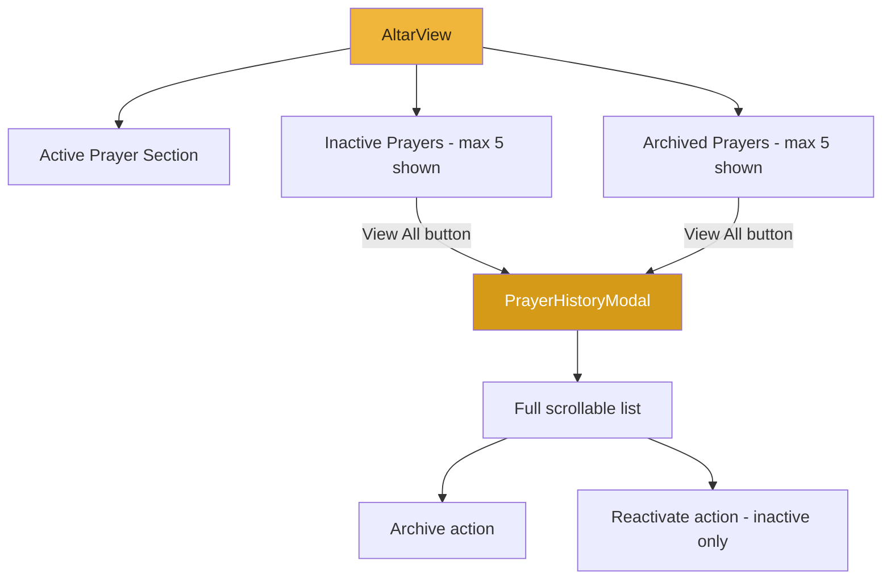

# Fix Vertical Scrolling & Prayer History Display

## Problem
1. **Vertical scrolling is completely broken** — `overflow-hidden` on `<body>` in `src/style.css` prevents any scrolling
2. **On mobile**, content extends beyond viewport with no way to scroll down
3. **Archived and inactive prayers** render all items with no limit, making the page very long
4. **No "View All" option** — users can't see a compact view and expand if needed

## Root Cause
In `src/style.css` line 49:
```css
body {
    @apply font-sans antialiased overflow-hidden;
}
```
The `overflow-hidden` class on `<body>` kills all vertical scrolling.

## Solution

### Step 1: Fix Body Scrolling
**File:** `src/style.css`

Change `overflow-hidden` to `overflow-x-hidden` — this keeps horizontal overflow hidden (preventing side-scroll) while allowing vertical scrolling:

```css
body {
    @apply font-sans antialiased overflow-x-hidden;
}
```

### Step 2: Add Computed Properties for Limited Prayer Lists
**File:** `src/views/AltarView.vue` — `<script setup>` section

Add two computed properties that cap the visible prayers at 5:

```js
const MAX_VISIBLE_PRAYERS = 5

const visibleInactivePrayers = computed(() =>
  prayers.inactivePrayers.slice(0, MAX_VISIBLE_PRAYERS)
)

const visibleArchivedPrayers = computed(() =>
  prayers.archivedPrayers.slice(0, MAX_VISIBLE_PRAYERS)
)

const hasMoreInactive = computed(() =>
  prayers.inactivePrayers.length > MAX_VISIBLE_PRAYERS
)

const hasMoreArchived = computed(() =>
  prayers.archivedPrayers.length > MAX_VISIBLE_PRAYERS
)
```

### Step 3: Update Inactive Prayers Template
**File:** `src/views/AltarView.vue` — Inactive Prayers section (around line 209)

Replace `v-for="prayer in prayers.inactivePrayers"` with `v-for="prayer in visibleInactivePrayers"` and add a "View All" button when there are more than 5:

```html
<div v-if="prayers.inactivePrayers.length > 0" class="space-y-4 mb-8">
  <h2 class="text-xl font-semibold text-theme-text-dim">Inactive Prayers</h2>
  
  <div class="space-y-3">
    <div v-for="prayer in visibleInactivePrayers" ...>
      <!-- existing prayer card -->
    </div>
  </div>

  <button
    v-if="hasMoreInactive"
    @click="showHistoryModal = 'inactive'"
    class="w-full py-2 text-sm text-theme-accent hover:text-theme-accent-dark transition-colors"
  >
    View All {{ prayers.inactivePrayers.length }} Inactive Prayers →
  </button>
</div>
```

### Step 4: Update Archived Prayers Template
**File:** `src/views/AltarView.vue` — Archived Prayers section (around line 264)

Replace `v-for="prayer in prayers.archivedPrayers"` with `v-for="prayer in visibleArchivedPrayers"` and add a "View All" button:

```html
<div v-if="prayers.archivedPrayers.length > 0" class="space-y-4">
  <h2 class="text-xl font-semibold text-theme-text-dim">Archived Prayers</h2>
  
  <div class="glass-panel glass-gloss p-4 space-y-3">
    <div v-for="prayer in visibleArchivedPrayers" ...>
      <!-- existing prayer card -->
    </div>
  </div>

  <button
    v-if="hasMoreArchived"
    @click="showHistoryModal = 'archived'"
    class="w-full py-2 text-sm text-theme-accent hover:text-theme-accent-dark transition-colors"
  >
    View All {{ prayers.archivedPrayers.length }} Archived Prayers →
  </button>
</div>
```

### Step 5: Create PrayerHistoryModal Component
**File:** `src/components/organisms/PrayerHistoryModal.vue`

A new modal component that displays the full list of prayers with mobile-friendly scrolling. It will use a `<Teleport to="body">` pattern like the existing Aether modal.

**Props:**
- `modelValue` (Boolean) — v-model for show/hide
- `prayers` (Array) — the full list of prayers to display
- `title` (String) — modal heading, e.g. "Inactive Prayers" or "Archived Prayers"
- `loading` (Boolean) — disable actions while loading

**Events:**
- `archive(prayerId)` — archive a prayer
- `reactivate(prayerId)` — reactivate a prayer (only for inactive prayers)

**Template structure:**
```
Fixed overlay (z-50, full screen, backdrop-blur)
  └─ Scrollable container (overflow-y-auto, max-h-screen)
       └─ Modal card (glass-panel, max-w-lg)
            ├─ Header: title + close button
            ├─ Prayer list (scrollable, overscroll-contain for mobile)
            │    └─ Prayer cards (reuse existing card patterns)
            └─ Footer: close button
```

Key mobile considerations:
- Use `-webkit-overflow-scrolling: touch` for smooth iOS scrolling
- Use `overscroll-behavior: contain` to prevent background scroll
- Modal takes near-full screen on mobile with safe area padding
- Cards are touch-friendly with adequate tap targets

### Step 6: Wire Up the Modal in AltarView.vue
**File:** `src/views/AltarView.vue`

Add to script:
```js
import PrayerHistoryModal from '@/components/organisms/PrayerHistoryModal.vue'

const showHistoryModal = ref(null) // null | 'inactive' | 'archived'

// Computed to determine which prayers to show in the modal
const historyModalPrayers = computed(() => {
  if (showHistoryModal.value === 'inactive') return prayers.inactivePrayers
  if (showHistoryModal.value === 'archived') return prayers.archivedPrayers
  return []
})

const historyModalTitle = computed(() => {
  if (showHistoryModal.value === 'inactive') return 'All Inactive Prayers'
  if (showHistoryModal.value === 'archived') return 'All Archived Prayers'
  return ''
})

const isInactiveModal = computed(() => showHistoryModal.value === 'inactive')
```

Add to template (before closing `</div>`):
```html
<PrayerHistoryModal
  v-model="showHistoryModal"
  :prayers="historyModalPrayers"
  :title="historyModalTitle"
  :loading="prayers.loading"
  :show-reactivate="isInactiveModal"
  @archive="handleArchive"
  @reactivate="handleReactivate"
/>
```

## Architecture Diagram



## Files Modified
1. `src/style.css` — Change `overflow-hidden` to `overflow-x-hidden`
2. `src/views/AltarView.vue` — Add computed props, update templates, add modal
3. `src/components/organisms/PrayerHistoryModal.vue` — New file

## Mobile Scrolling Fix Summary
- Remove `overflow-hidden` from body → allow natural vertical scroll
- Keep `overflow-x-hidden` to prevent horizontal scroll
- Remove `max-h-64 overflow-y-auto` from archived prayers container (no longer needed since we cap at 5 inline)
- Modal uses `overscroll-behavior: contain` for mobile-friendly scroll containment