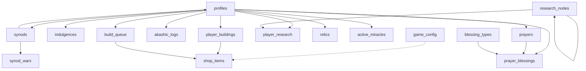

# Genesis Migration Plan

## Overview

Create `supabase/migrations/genesis.sql` — a single, standalone SQL migration that can rebuild the **entire** Electric Monk game database from scratch. If all tables were dropped, running this one file should produce a fully operational game.

The latest migration state is **Rapture Update (v8.0)** + the **hotfix-missing-grants** patch + the **karma-shop-blessings** feature. Genesis consolidates all prior migrations into one idempotent seed.

---

## Dependency Graph

---

## Source Migrations (chronological)

| # | File | Key Contributions |
|---|------|-------------------|
| 0 | `supabase-schema.sql` | Base tables: profiles, prayers, indulgences. Base functions: create_profile_on_signup, reset_daily_prayer_count, refill_tokens, reduce_ban_time, update_karma, submit_prayer, sync_prayer_count |
| 1 | `karma-and-slots-update.sql` | purchase_prayer_slot function, profiles.daily_token_limit default |
| 2 | `akashic_records.sql` | prayers: karma_awarded, source_prayer_id, source_sinner_id, prayer_type. Functions: get_public_prayers, get_sinners, start_altruistic_prayer, start_intercessory_prayer, sync_prayer_count v2, deactivate_prayer |
| 3 | `intercessory-features.sql` | sync_prayer_count(UUID,INT) with ban reduction, get_intercessory_prayer_count, update_karma |
| 4 | `automated-karma.sql` | pg_cron/pg_net extensions, calculate_automated_karma v4.1, sync_prayer_count(UUID) read-only, cron scheduling |
| 5 | `multi-slot-prayers.sql` | Slot-aware submit_prayer, activate_prayer, start_altruistic_prayer, start_intercessory_prayer (all with FIFO rotation) |
| 6 | `theological-pbbg-pivot.sql` | game_config table, shop_items table, player_buildings table, profiles.mana/gold/food, purchase_shop_item v1, get_leaderboard, get_player_economy v1, calculate_automated_karma v5, create_profile_on_signup v2 with starting buildings |
| 7 | `vassalage-and-heresy.sql` | profiles.suzerain_id/heresy/schism_count/divine_shield_until, shop_items.gold_cost/heresy_cost, akashic_logs table, cultist/coven shop items, launch_crusade v1, declare_schism, cast_plague, get_vassalage_info, get_akashic_logs, purchase_shop_item v2, get_player_economy v2, calculate_automated_karma v6 |
| 8 | `rapture-update.sql` | profiles.sect_type/sacred_acres/dogma/indulgences/synod_id/papal_bull_until/title/avatar_url, shop_items.acre_cost/sect_restriction/sect_exclusion, synods table, synod_wars table, research_nodes table, player_research table, relics table, active_miracles table, build_queue table, choose_sect, launch_inquisition, research_tech, create_synod, join_synod, leave_synod, declare_holy_war, attempt_relic_steal, consume_indulgence, get_synod_info, get_relics, get_research_tree, get_sect_info, launch_crusade v2, purchase_shop_item v3, get_player_economy v3, calculate_automated_karma v7 |
| 9 | `karma-shop-blessings.sql` | blessing_types table, prayer_blessings table, grant_blessing, get_prayer_blessings, get_public_prayers v2 with blessings |
| 10 | `hotfix-missing-grants.sql` | GRANT SELECT on active_miracles, player_research, synods, build_queue to authenticated/anon |

---

## Genesis File Structure

The file will be organized in this exact order to satisfy all FK dependencies:

### Phase 1: Extensions
- `CREATE EXTENSION IF NOT EXISTS pg_cron`
- `CREATE EXTENSION IF NOT EXISTS pg_net`

### Phase 2: Core Tables (CREATE TABLE with all final columns)

Order matters for FK dependencies:

1. **game_config** — no FK deps
2. **profiles** — self-ref suzerain_id, ref synods(id) added later via ALTER
3. **shop_items** — no FK deps  
4. **prayers** — ref profiles(id), self-ref source_prayer_id
5. **indulgences** — ref profiles(id)
6. **player_buildings** — ref profiles(id), shop_items(id) added later
7. **akashic_logs** — ref profiles(id) x2
8. **blessing_types** — no FK deps
9. **prayer_blessings** — ref prayers(id), blessing_types(id), profiles(id) x2
10. **synods** — ref profiles(id) as leader_id
11. **synod_wars** — ref synods(id) x2
12. **research_nodes** — self-ref requires_node
13. **player_research** — ref profiles(id), research_nodes(id)
14. **relics** — ref profiles(id)
15. **active_miracles** — ref profiles(id)
16. **build_queue** — ref profiles(id), shop_items(id)

**Critical**: profiles initially created WITHOUT the FK constraint for synod_id (circular dep with synods). Added via ALTER TABLE after synods is created.

### Phase 3: Add Deferred FK Constraints
- `ALTER TABLE profiles ADD CONSTRAINT profiles_synod_id_fkey FOREIGN KEY (synod_id) REFERENCES synods(id)`
- shop_items FK for build_queue

### Phase 4: Indexes (all from all migrations)

### Phase 5: RLS Enable + Policies (all tables)

### Phase 6: Seed Data (all INSERT ... ON CONFLICT DO UPDATE)

1. game_config — all config entries merged from all migrations
2. shop_items — all items including cultist, coven, scriptorium
3. research_nodes — light tree + dark tree
4. relics — 10 global relics
5. blessing_types — 4 blessings

### Phase 7: Functions (latest version of each only)

**Core Functions:**
- create_profile_on_signup() — v2 with starting buildings
- reset_daily_prayer_count(UUID)
- refill_tokens(INT)
- reduce_ban_time(UUID)
- update_karma(UUID, INT)

**Prayer Functions:**
- submit_prayer(TEXT) — slot-aware FIFO
- activate_prayer(UUID) — slot-aware FIFO
- deactivate_prayer(UUID, INT) — with karma milestones
- sync_prayer_count(UUID) — read-only
- sync_prayer_count(UUID, INT) — with ban reduction
- start_altruistic_prayer(UUID, TEXT) — slot-aware
- start_intercessory_prayer(UUID, TEXT) — slot-aware
- get_public_prayers(INT, INT, TEXT) — v2 with blessings
- get_sinners()
- get_intercessory_prayer_count(UUID)
- purchase_prayer_slot()

**Economy Functions:**
- purchase_shop_item(TEXT) — v3 with acre/sect
- get_player_economy() — v3 with sects/relics/synods/dogma
- get_leaderboard(INT, INT)

**Combat Functions:**
- launch_crusade(UUID) — v2 with acres/sects/relics/LIFO
- declare_schism()
- cast_plague(UUID)
- launch_inquisition(UUID)

**Vassalage Functions:**
- get_vassalage_info()
- get_akashic_logs(INT, INT)

**Sect Functions:**
- choose_sect(TEXT)

**Research Functions:**
- research_tech(TEXT)
- get_research_tree()

**Synod Functions:**
- create_synod(TEXT)
- join_synod(UUID)
- leave_synod()
- declare_holy_war(UUID)
- get_synod_info()

**Relic Functions:**
- attempt_relic_steal(UUID)
- get_relics()

**Indulgence Functions:**
- consume_indulgence(TEXT)

**Blessing Functions:**
- grant_blessing(UUID, TEXT)
- get_prayer_blessings(UUID[])
- get_sect_info()

**Cron Function:**
- calculate_automated_karma() — v7 with 8 phases (sects/synods/relics/dogma)

### Phase 8: Triggers
- on_auth_user_created trigger on auth.users

### Phase 9: GRANT Statements (consolidated from all migrations)

### Phase 10: Cron Job Scheduling
- Unschedules existing if present, then schedules prayer-heartbeat

---

## Key Decisions

1. **Idempotent**: All CREATE uses `IF NOT EXISTS`, all INSERT uses `ON CONFLICT DO UPDATE`, all functions use `CREATE OR REPLACE`
2. **No ALTER TABLE for new installs**: All columns are defined in CREATE TABLE statements directly
3. **FK circular dependency**: profiles.synod_id -> synods.id is added via ALTER TABLE after both tables exist
4. **Function versions**: Only the LATEST version of each function is included
5. **No data migration**: Genesis does NOT include TRUNCATE or backfill operations from theological-pbbg-pivot — those were one-time operations
6. **Shop item updates**: The rapture-update had UPDATE statements for existing shop items (acre costs). In Genesis, these are baked into the INSERT seed data directly
7. **Starting assets**: create_profile_on_signup includes starting buildings (altar, pot, novice)

---

## Estimated Size

~2500-3000 lines of SQL. This is a large file but must be self-contained.