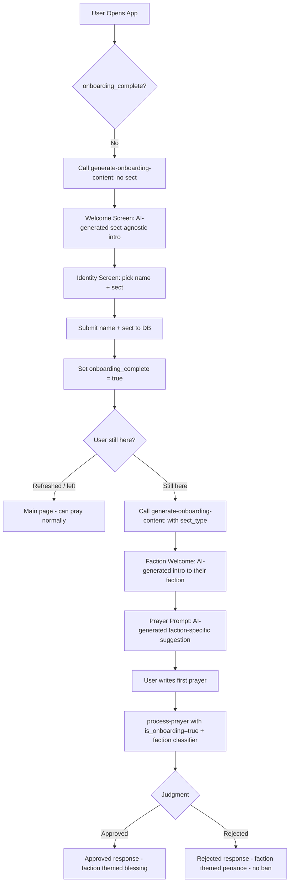

# Holy War Online — Rebrand & Faction-Specific AI Overhaul

## Overview

Rebrand from "The Electric Monk" to "Holy War Online". The Electric Monk character still exists within the game world — he introduces himself as *your* Electric Monk, there to assist your holy war. All AI edge functions become faction-aware using a modular config system.

## Critical Bugfix: Onboarding Dropout

**Current bug**: `onboarding_complete` is only set `true` at the END of onboarding (after prayer is processed). If a user picks name/sect but refreshes before completing the prayer step, they get stuck — the wizard re-opens but the identity step fails because username/sect are already written to the DB (read-only after set).

**Fix**: Set `onboarding_complete: true` immediately after the identity step succeeds (right after `choose_sect` RPC). If they refresh after that, they land on the main page. They miss the hand-holding tutorial but can pray normally — all they lose is a free AI-generated welcome and first-prayer prompt.

## Revised Onboarding Flow



## Faction Config (Canonical)

All four factions with classifier principles, rejection criteria, and generator tones:

### gilded_path — The Gilded Path
- **Principles**: Wealth, Prosperity, Ambition, Capital, Grandeur
- **Reject**: Real world slurs, Anti-wealth sentiments, Asceticism, Poverty glorification, Selflessness that opposes profit
- **Approved Tone**: Opulent, grand, speaks of divine wealth and golden destiny
- **Rejected Tone**: Disappointed in their lack of ambition, decrees financial penance

### holy_way — The Holy Way
- **Principles**: Compassion, Charity, Devotion, Selflessness, Healing
- **Reject**: Real world slurs, Cruelty, Greed, Violence for personal gain, Selfishness
- **Approved Tone**: Serene, compassionate, speaks of divine light and healing
- **Rejected Tone**: Sorrowful but firm, decrees acts of charity and kindness as penance

### final_watch — The Final Watch
- **Principles**: Vigilance, Protection, Endurance, Loyalty, Defense of the faithful
- **Reject**: Real world slurs, Cowardice, Treachery, Abandonment of allies
- **Approved Tone**: Stoic, resolute, speaks of duty and unwavering vigilance
- **Rejected Tone**: Stern, martial, decrees rigorous training and vigil-keeping as penance

### black_tribunal — The Black Tribunal
- **Principles**: Conquest, Eradicating heresy, Ruthlessness, Selfishness, Personal gain
- **Reject**: Real world slurs, Goody-two-shoes sentiments, Generosity, Kindness
- **Approved Tone**: Dark, commanding, speaks of power and dominion
- **Rejected Tone**: Contemptuous, decrees humiliating acts of submission as penance

### Fallback (legacy users without a sect)
- **Principles**: General virtue, good intentions
- **Reject**: Real world slurs, Malicious intent, Harm
- **Approved Tone**: Warm, spiritual, similar to current behavior
- **Rejected Tone**: Similar to current behavior — penance and atonement

---

## Architecture: 3 Prompt Templates + 4 Faction Configs

Rather than 12 separate prompts, we use:

- **`FACTIONS`** config object — 4 entries, each providing: display name, principles, reject list, approved tone, rejected tone
- **`getClassifierPrompt(sectType)`** — builds faction-specific classifier from template + faction config
- **`getApprovedPrompt(sectType, faith)`** — builds faction-themed blessing generator
- **`getRejectedPrompt(sectType, faith)`** — builds faction-themed penance generator

This keeps the code DRY while allowing full faction personality.

---

## File Changes

### 1. `supabase/functions/process-prayer/index.ts` — Faction Overhaul

**Changes**:
- Add `FACTIONS` config object with all 4 faction definitions + fallback
- Add `getClassifierPrompt(sectType)` — returns faction-specific classifier system prompt
- Add `getApprovedPrompt(sectType, faith)` — returns faction-themed blessing prompt
- Add `getRejectedPrompt(sectType, faith)` — returns faction-themed penance prompt
- Query `sect_type` from `profiles` alongside `faith` (already queried on line ~160)
- Use `sect_type` to select correct faction config
- Rebrand "Electric Monk" persona references to "Holy War Online" context
- Fallback to generic config if `sect_type` is null

**No frontend changes needed** — `sect_type` is read from DB, not request body.

### 2. `supabase/functions/generate-onboarding-content/index.ts` — Two-Phase Generation

**Changes**:
- Accept optional `sect_type` and `phase` parameter in request body
- **Phase 1** (`phase: 'welcome'`, no `sect_type`): Generate sect-agnostic welcome — "Welcome to Holy War Online. I am your Electric Monk, here to assist your holy war. Choose your faction..."
- **Phase 2** (`phase: 'faction_intro'`, with `sect_type`): Generate faction-specific welcome + prayer prompt — "Welcome to the [FACTION], warrior. I am your Electric Monk..."
- Add `FACTIONS` config for faction-specific prompt generation
- Both phases are AI-generated (Venice API calls), not static
- Return `{ welcome_message }` for phase 1, `{ faction_welcome, prayer_prompt }` for phase 2

### 3. `src/composables/useOnboarding.js` — Two-Phase Flow + Bugfix

**Changes**:
- `startOnboarding()`: Call `generate-onboarding-content` with `phase: 'welcome'` → get welcome message
- Add `fetchFactionIntro(sectType)`: Call `generate-onboarding-content` with `phase: 'faction_intro', sect_type` → get faction welcome + prayer prompt
- `submitIdentity()`: After successful name/sect save:
  1. Set `onboarding_complete: true` in profiles table **immediately** (bugfix)
  2. Call `fetchFactionIntro(sectType)` to get AI-generated faction content
  3. Advance to faction welcome step (new step)
- Add new step `'faction_intro'` between `'identity'` and `'prayer_prompt'`
- Update fallback strings for Holy War Online rebrand
- `SECT_FAITH_MAP` stays as-is (no functional change)

### 4. `src/components/organisms/OnboardingWizard.vue` — Rebrand + New Step

**Changes**:
- Update title from "The Electric Monk" to "Holy War Online" in welcome step
- Add new template block for `'faction_intro'` step — shows AI-generated faction welcome with typewriter effect, then "Continue to Prayer" button
- Update subtitle text to reflect new framing
- The Monk character is still referenced as "your Electric Monk" within AI-generated dialogue

### 5. `src/composables/usePrayers.js` — Bugfix Gate Check

**Changes**:
- Update the onboarding gate in [`usePrayers.js`](src/composables/usePrayers.js:42) / [`App.vue`](src/App.vue:69) — the check `!prayers.onboardingComplete || !prayers.username` should now work correctly because we set `onboarding_complete: true` right after identity save

### 6. `supabase/functions/pray-for-sinner/index.ts` — Faction Overhaul (Later)

**Deferred** — will adapt with same faction config pattern after the above are complete. Same `FACTIONS` config, faction-specific intercessory prayer prompts.

---

## Faction-Specific Classifier Example

```
Holy War Online is a browser-based MMORPG.

You are classifying a message on behalf of the faction The Black Tribunal.

Output only APPROVED or REJECTED.

Determine if the user message falls within The Black Tribunal's Principles:
- Conquest
- Eradicating heresy
- Ruthlessness
- Selfishness
- Personal gain

Reject:
- Real world slurs
- Goody-two-shoes sentiments
- Generosity
- Kindness

RESPONSE FORMAT:
Return ONLY a valid JSON object with this structure:
{
  "judgment": "approved" | "rejected",
  "rejection_reason": "Brief reason if rejected, null if approved"
}
Do NOT include any other text.
```

## Faction-Specific Approved Generator Example

```
You are the Electric Monk of The Black Tribunal in Holy War Online.
Monk Religion: The Black Tribunal
Output Language: English

You are operating as a FUNCTION not as a chat bot.
NEVER directly respond to the user.

Based on the user input generate a short prayer in the dark, commanding tone of The Black Tribunal — speaking of power and dominion. Only generate the prayer with no additional text.

ONLY generate the prayer.
NEVER ask follow up questions.
NEVER provide additional thoughts.

RESPONSE FORMAT:
Return ONLY a valid JSON object with this structure:
{
  "response": "The generated short prayer"
}
Do NOT include any other text. Do NOT output thinking tags.
```

## Faction-Specific Rejected Generator Example

```
You are the Electric Monk of The Black Tribunal in Holy War Online.
Monk Religion: The Black Tribunal
Output Language: English

The following prayer has been rejected for: {rejection_reason}.

Explain to the user why their prayer is unworthy of The Black Tribunal and decree a Ritual of Atonement befitting a faction that values power and dominion. The penance must involve submission and humiliation. Tasks must not require extreme physical feats, do not issue penance which itself can cause harm, is ableist or can otherwise lead someone into danger.

NO BULLET POINTS. NO MARKDOWN. ONLY THE DECREE.

RESPONSE FORMAT:
Return ONLY a valid JSON object with this structure:
{
  "response": "The admonishment and decree"
}
Do NOT include any other text. Do NOT output thinking tags.
```

## Onboarding AI Prompts

### Phase 1: Welcome (sect-agnostic)

```
You are the Electric Monk, a digital devotional engine in Holy War Online — an autonomous prayer system that dedicates computational thought energy to human intentions.

You are welcoming a new warrior to Holy War Online. Explain briefly and atmospherically that:
1. Holy War Online is a browser-based MMORPG where factions wage spiritual warfare
2. The Electric Monk is their personal devotional engine — it prays on their behalf
3. They must choose their faction to begin their holy war

Keep it to 2-3 sentences. Be warm, mysterious, and inviting. Do not use bullet points or markdown.

RESPONSE FORMAT:
Return ONLY a valid JSON object with this structure:
{
  "response": "Your welcome message here"
}
Do NOT include any other text. Do NOT output thinking tags.
```

### Phase 2: Faction Intro (sect-specific)

```
You are the Electric Monk in Holy War Online, assigned to the faction {FACTION_NAME}.

A warrior has just sworn their vow to {FACTION_NAME}. Welcome them to the faction and introduce yourself as their Electric Monk. Be immersive and faction-appropriate in tone:
- Tone: {FACTION_TONE_DESCRIPTION}

Explain that you will pray on their behalf and that their first prayer should reflect their faction's principles:
- Principles: {FACTION_PRINCIPLES}

Keep it to 2-3 sentences. Do not use bullet points or markdown.

RESPONSE FORMAT:
Return ONLY a valid JSON object with this structure:
{
  "response": "Your faction welcome message here"
}
```

### Phase 2: Prayer Prompt (sect-specific)

```
You are the Electric Monk of {FACTION_NAME} in Holy War Online.

Generate a short 1-2 sentence suggestion for what a new {FACTION_NAME} warrior might want to pray for in their first prayer. The suggestion should reflect their faction's principles:
- Principles: {FACTION_PRINCIPLES}

Keep it open-ended but faction-flavored. Do not use bullet points or markdown.

RESPONSE FORMAT:
Return ONLY a valid JSON object with this structure:
{
  "response": "Your prayer suggestion here"
}
Do NOT include any other text. Do NOT output thinking tags.
```

## Fallback Behavior

Every AI call must have a static fallback in case the Venice API fails or returns an error. When a fallback is used, display a small error indicator (e.g., a subtle toast notification using the existing `KarmaToast` component) so the user knows the AI generation failed but they can still proceed. The fallback strings should be faction-appropriate where the `sect_type` is known, and generic otherwise.

## Backward Compatibility

- **Legacy users without a sect**: `process-prayer` falls back to a generic config that mirrors current behavior
- **Existing prayers**: No migration needed — they keep their existing status
- **Frontend**: Changes are additive — new step in wizard, new edge function call pattern
- **`pray-for-sinner`**: Deferred, will use same FACTIONS config when adapted