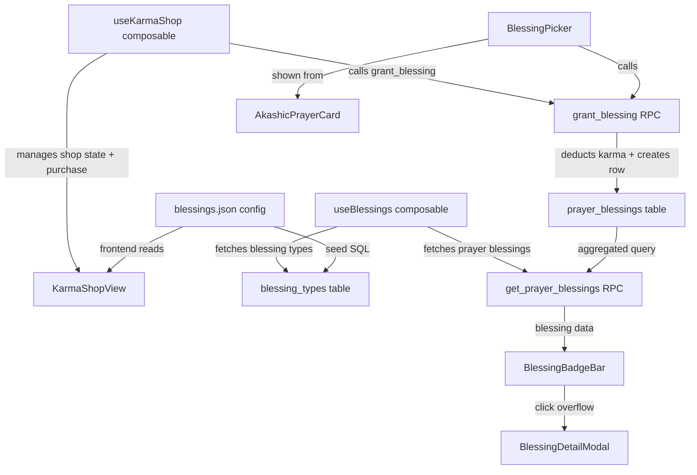
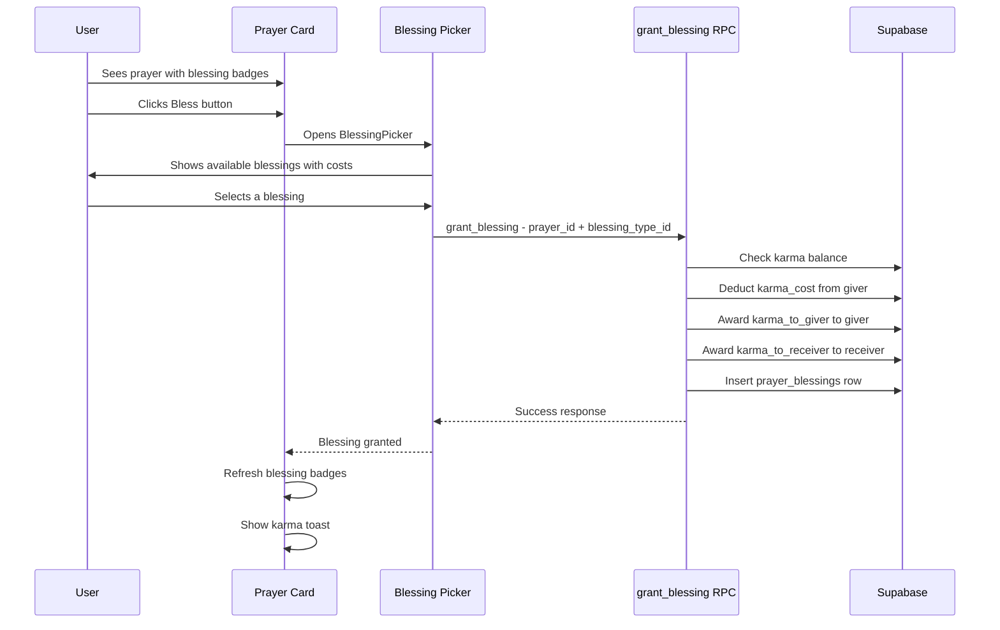

# Karma Shop — Blessings Feature Plan

## Overview

> **CRITICAL**: All new components MUST use the existing design system classes. Do NOT introduce new visual patterns. The existing styles were custom-designed and must be preserved exactly:
>
> - **Panels/Cards**: `glass-panel glass-panel-soft glass-gloss` + `border border-theme-border`
> - **Buttons**: `btn-primary`, `btn-secondary`, `btn-ghost`
> - **Chips/Badges**: `chip` class with `px-3 py-1 text-xs font-medium text-theme-accent`
> - **Segmented tabs**: `segmented-shell` container with `pill-tab pill-tab-active pill-tab-inactive`
> - **Colors**: `text-theme-accent`, `text-theme-text`, `text-theme-text-muted`, `text-theme-text-dim`
> - **Container**: `app-frame` for width-constrained layout
> - **Headings**: `ritual-heading` for section titles
> - **Shadows**: `shadow-[0_18px_32px_rgba(48,38,21,0.12)]` patterns
> - **Transitions**: `transition-all duration-300`, `hover:-translate-y-1`
> - **Modals/Overlays**: Follow the existing overlay pattern from `AkashicRecordsView.vue` active overlay
> - **Toasts**: Reuse `KarmaToast.vue` pattern for success/error feedback


Add a Karma Shop with a **Blessings** tab (first of multiple future tabs). Blessings are like Reddit Gold — emoji badges that users purchase with karma and grant onto prayers in the Akashic Records. Each prayer card displays its blessing badges at the bottom with overflow handling and a detailed popup.

---

## Data Model

### Blessing Definition Properties

Each blessing has:

| Field | Type | Description |
|---|---|---|
| `id` | string | Unique slug identifier, e.g. `golden-light` |
| `emoji` | string | The emoji displayed as the badge, e.g. `✨` |
| `name` | string | Human-readable name, e.g. `Golden Light` |
| `description` | string | Flavor text / description |
| `karma_cost` | int | Karma deducted from the giver when purchasing |
| `karma_to_giver` | int | Karma rebated to the giver upon granting |
| `karma_to_receiver` | int | Karma awarded to the prayer owner upon receiving |
| `sort_order` | int | Display order in the shop |
| `is_active` | bool | Whether the blessing is currently available |

### Economic Example

| Blessing | Cost | Giver Gets | Receiver Gets | Net Cost to Giver |
|---|---|---|---|---|
| ✨ Golden Light | 10 | 1 | 5 | 9 |
| 🔥 Holy Flame | 25 | 2 | 10 | 23 |
| 🕊️ Dove of Peace | 50 | 5 | 20 | 45 |
| 👑 Divine Crown | 100 | 10 | 50 | 90 |

---

## Architecture



---

## File Plan

### 1. Config File: `src/config/blessings.json`

Manual-editable source of truth for blessing definitions. Frontend reads this directly for display. Database mirrors it via seed SQL.

```json
{
  "blessings": [
    {
      "id": "golden-light",
      "emoji": "✨",
      "name": "Golden Light",
      "description": "A radiant blessing that illuminates the prayer with divine light.",
      "karma_cost": 10,
      "karma_to_giver": 1,
      "karma_to_receiver": 5,
      "sort_order": 1
    },
    {
      "id": "holy-flame",
      "emoji": "🔥",
      "name": "Holy Flame",
      "description": "The sacred fire that purifies and elevates the spirit.",
      "karma_cost": 25,
      "karma_to_giver": 2,
      "karma_to_receiver": 10,
      "sort_order": 2
    },
    {
      "id": "dove-of-peace",
      "emoji": "🕊️",
      "name": "Dove of Peace",
      "description": "A gentle blessing that brings tranquility and grace.",
      "karma_cost": 50,
      "karma_to_giver": 5,
      "karma_to_receiver": 20,
      "sort_order": 3
    },
    {
      "id": "divine-crown",
      "emoji": "👑",
      "name": "Divine Crown",
      "description": "The highest honor — a crown of divine recognition.",
      "karma_cost": 100,
      "karma_to_giver": 10,
      "karma_to_receiver": 50,
      "sort_order": 4
    }
  ]
}
```

### 2. SQL Migration: `supabase/migrations/karma-shop-blessings.sql`

#### Tables

**`blessing_types`** — mirrors the config file for referential integrity:

```sql
CREATE TABLE IF NOT EXISTS blessing_types (
  id TEXT PRIMARY KEY,
  emoji TEXT NOT NULL,
  name TEXT NOT NULL,
  description TEXT,
  karma_cost INT NOT NULL DEFAULT 0,
  karma_to_giver INT NOT NULL DEFAULT 0,
  karma_to_receiver INT NOT NULL DEFAULT 0,
  sort_order INT DEFAULT 0,
  is_active BOOLEAN DEFAULT true,
  created_at TIMESTAMPTZ DEFAULT now()
);
```

**`prayer_blessings`** — junction table tracking who blessed which prayer:

```sql
CREATE TABLE IF NOT EXISTS prayer_blessings (
  id UUID DEFAULT gen_random_uuid() PRIMARY KEY,
  prayer_id UUID REFERENCES prayers(id) ON DELETE CASCADE NOT NULL,
  blessing_type_id TEXT REFERENCES blessing_types(id) ON DELETE CASCADE NOT NULL,
  giver_id UUID REFERENCES profiles(id) ON DELETE CASCADE NOT NULL,
  receiver_id UUID REFERENCES profiles(id) ON DELETE CASCADE NOT NULL,
  created_at TIMESTAMPTZ DEFAULT now(),
  UNIQUE(prayer_id, blessing_type_id, giver_id)
  -- one user can only give each blessing type once per prayer
);
```

#### Indexes

```sql
CREATE INDEX IF NOT EXISTS idx_prayer_blessings_prayer ON prayer_blessings(prayer_id);
CREATE INDEX IF NOT EXISTS idx_prayer_blessings_giver ON prayer_blessings(giver_id);
CREATE INDEX IF NOT EXISTS idx_prayer_blessings_type ON prayer_blessings(blessing_type_id);
```

#### RPC: `grant_blessing`

Atomically deduct karma from giver, award karma to giver and receiver, insert blessing row. Prevents self-blessing and duplicate blessings.

```sql
CREATE OR REPLACE FUNCTION grant_blessing(
  p_prayer_id UUID,
  p_blessing_type_id TEXT
)
RETURNS JSONB AS $$
DECLARE
  v_user_id UUID := auth.uid();
  v_karma INT;
  v_cost INT;
  v_giver_karma INT;
  v_receiver_karma INT;
  v_prayer_owner UUID;
  v_blessing_id UUID;
BEGIN
  -- Get blessing type details
  SELECT karma_cost, karma_to_giver, karma_to_receiver
  INTO v_cost, v_giver_karma, v_receiver_karma
  FROM blessing_types
  WHERE id = p_blessing_type_id AND is_active = true;

  IF NOT FOUND THEN RAISE EXCEPTION 'Blessing type not found or inactive'; END IF;

  -- Get prayer owner
  SELECT user_id INTO v_prayer_owner FROM prayers WHERE id = p_prayer_id;
  IF NOT FOUND THEN RAISE EXCEPTION 'Prayer not found'; END IF;

  -- Prevent self-blessing
  IF v_prayer_owner = v_user_id THEN RAISE EXCEPTION 'Cannot bless your own prayer'; END IF;

  -- Prevent duplicate
  IF EXISTS (SELECT 1 FROM prayer_blessings WHERE prayer_id = p_prayer_id AND blessing_type_id = p_blessing_type_id AND giver_id = v_user_id) THEN
    RAISE EXCEPTION 'Already blessed this prayer with this blessing';
  END IF;

  -- Check karma balance
  SELECT karma INTO v_karma FROM profiles WHERE id = v_user_id;
  IF v_karma < v_cost THEN RAISE EXCEPTION 'Insufficient karma'; END IF;

  -- Deduct cost from giver
  PERFORM update_karma(v_user_id, -v_cost);

  -- Award rebate to giver
  IF v_giver_karma > 0 THEN PERFORM update_karma(v_user_id, v_giver_karma); END IF;

  -- Award karma to receiver
  IF v_receiver_karma > 0 THEN PERFORM update_karma(v_prayer_owner, v_receiver_karma); END IF;

  -- Insert blessing record
  INSERT INTO prayer_blessings (prayer_id, blessing_type_id, giver_id, receiver_id)
  VALUES (p_prayer_id, p_blessing_type_id, v_user_id, v_prayer_owner)
  RETURNING id INTO v_blessing_id;

  RETURN jsonb_build_object(
    'id', v_blessing_id,
    'blessing_type_id', p_blessing_type_id,
    'karma_spent', v_cost,
    'karma_to_giver', v_giver_karma,
    'karma_to_receiver', v_receiver_karma
  );
END;
$$ LANGUAGE plpgsql SECURITY DEFINER;
```

#### RPC: `get_prayer_blessings`

Fetches aggregated blessing counts for a batch of prayers. Returns one row per `(prayer_id, blessing_type_id)` with count and emoji.

```sql
CREATE OR REPLACE FUNCTION get_prayer_blessings(p_prayer_ids UUID[])
RETURNS JSONB AS $$
DECLARE
  v_result JSONB;
BEGIN
  SELECT jsonb_agg(jsonb_build_object(
    'prayer_id', agg.prayer_id,
    'blessing_type_id', agg.blessing_type_id,
    'emoji', bt.emoji,
    'name', bt.name,
    'count', agg.cnt
  )) INTO v_result
  FROM (
    SELECT prayer_id, blessing_type_id, COUNT(*) as cnt
    FROM prayer_blessings
    WHERE prayer_id = ANY(p_prayer_ids)
    GROUP BY prayer_id, blessing_type_id
  ) agg
  JOIN blessing_types bt ON agg.blessing_type_id = bt.id;

  RETURN COALESCE(v_result, '[]'::jsonb);
END;
$$ LANGUAGE plpgsql SECURITY DEFINER;
```

#### RLS Policies

```sql
-- Anyone authenticated can view blessing types
ALTER TABLE blessing_types ENABLE ROW LEVEL SECURITY;
CREATE POLICY "Blessing types are publicly readable" ON blessing_types
  FOR SELECT USING (true);

-- Anyone authenticated can view prayer blessings
ALTER TABLE prayer_blessings ENABLE ROW LEVEL SECURITY;
CREATE POLICY "Prayer blessings are publicly readable" ON prayer_blessings
  FOR SELECT USING (true);

-- Users can only insert blessings via the grant_blessing RPC (which runs as SECURITY DEFINER)
-- No direct INSERT policy needed — grant_blessing handles auth
```

#### Seed Data — generated from config

```sql
INSERT INTO blessing_types (id, emoji, name, description, karma_cost, karma_to_giver, karma_to_receiver, sort_order)
VALUES
  ('golden-light', '✨', 'Golden Light', 'A radiant blessing that illuminates the prayer with divine light.', 10, 1, 5, 1),
  ('holy-flame', '🔥', 'Holy Flame', 'The sacred fire that purifies and elevates the spirit.', 25, 2, 10, 2),
  ('dove-of-peace', '🕊️', 'Dove of Peace', 'A gentle blessing that brings tranquility and grace.', 50, 5, 20, 3),
  ('divine-crown', '👑', 'Divine Crown', 'The highest honor — a crown of divine recognition.', 100, 10, 50, 4)
ON CONFLICT (id) DO UPDATE SET
  emoji = EXCLUDED.emoji,
  name = EXCLUDED.name,
  description = EXCLUDED.description,
  karma_cost = EXCLUDED.karma_cost,
  karma_to_giver = EXCLUDED.karma_to_giver,
  karma_to_receiver = EXCLUDED.karma_to_receiver,
  sort_order = EXCLUDED.sort_order,
  is_active = true;
```

#### Permissions

```sql
GRANT EXECUTE ON FUNCTION grant_blessing(UUID, TEXT) TO authenticated;
GRANT EXECUTE ON FUNCTION get_prayer_blessings(UUID[]) TO authenticated;
```

---

### 3. Composable: `src/composables/useBlessings.js`

- Imports `blessings.json` config for local display data
- `fetchBlessingTypes()` — fetches from `blessing_types` table for server-side active check
- `fetchPrayerBlessings(prayerIds)` — calls `get_prayer_blessings` RPC for aggregated data
- Returns reactive state: `blessingTypes`, `prayerBlessings`, `loading`, `error`

### 4. Composable: `src/composables/useKarmaShop.js`

- Manages active shop tab state
- `purchaseBlessing(prayerId, blessingTypeId)` — calls `grant_blessing` RPC
- Handles loading, error, and success states
- On success: refreshes user karma via `usePrayers().fetchProfile()`
- Returns: `activeTab`, `purchasing`, `purchaseError`, `purchaseBlessing()`

### 5. View: `src/views/KarmaShopView.vue`

- Tab navigation header: Blessings tab active by default, placeholder for future tabs
- Blessings tab: grid of blessing cards from config
- Each card shows: emoji, name, description, karma cost, karma rebates
- Clicking a blessing card could show more detail or navigate to Akashic Records to apply it

### 6. Component: `src/components/organisms/BlessingPicker.vue`

- Compact modal/popup showing available blessings in a grid
- Each blessing shows emoji + name + cost
- Greyed out if user karma is insufficient
- Already-granted blessings shown as disabled with checkmark
- Emits `select(blessingTypeId)` on click
- Props: `prayerId`, `userKarma`, `existingBlessingTypeIds`

### 7. Component: `src/components/molecules/BlessingBadgeBar.vue`

- Displays blessing badges as emoji chips with counts on a prayer card
- **Overflow handling**: shows up to `maxVisible` blessing types, then a `+N more` chip
- `maxVisible` prop defaults to 5
- Clicking the bar or `+N more` chip emits `showDetail` event
- Props: `blessings` (array of `{emoji, name, count}`), `maxVisible`
- Emits: `showDetail`

Example rendering:
```
✨ ×3  🔥 ×1  🕊️ ×2  +2 more
```

### 8. Component: `src/components/organisms/BlessingDetailModal.vue`

- Full modal showing all blessings on a prayer
- Each blessing row: emoji, name, count, list of givers (if available)
- Scrollable if many blessings
- Close button

### 9. Update: `src/components/organisms/AkashicPrayerCard.vue`

- Add `BlessingBadgeBar` at the bottom of the card, below the faith badge and pray button area
- Add a "Bless ✨" button next to the "Pray" button area (or as a separate action)
- When "Bless" is clicked, emit `bless` event with the prayer
- Props: add `blessings` array for badge data

### 10. Update: `src/views/AkashicRecordsView.vue`

- Import `useBlessings` composable
- After fetching public prayers, call `fetchPrayerBlessings(prayerIds)` to get blessing data
- Map blessing data to each prayer for display
- Handle `bless` event from `AkashicPrayerCard` → open `BlessingPicker`
- Handle `showDetail` event from `BlessingBadgeBar` → open `BlessingDetailModal`
- On successful blessing: refresh prayer blessings and user karma

### 11. Update: `src/App.vue`

- Add a third tab button in the nav: `🛒 Karma Shop`
- Add `currentTab === 'shop'` routing to `KarmaShopView`

### 12. Update: `docs/schema.md`

- Document `blessing_types` and `prayer_blessings` tables
- Document `grant_blessing` and `get_prayer_blessings` RPCs

---

## Supabase SQL Queries to Paste

These need to be run in order in the Supabase SQL Editor:

1. **Create tables** — `blessing_types` and `prayer_blessings` with indexes and RLS
2. **Create RPCs** — `grant_blessing` and `get_prayer_blessings`
3. **Seed data** — INSERT the blessing types from the config
4. **Grant permissions** — EXECUTE on RPCs to `authenticated` role

All of this will be in the single migration file `supabase/migrations/karma-shop-blessings.sql`.

---

## User Flow



---

## Blessing Badge Overflow Strategy

The `BlessingBadgeBar` uses a simple threshold approach:

1. Render blessing badges as small chips: `[emoji] ×count`
2. If `uniqueBlessingTypes.length > maxVisible` (default 5), show first `maxVisible` + a `+N more` chip
3. Clicking anywhere on the bar opens `BlessingDetailModal` with full breakdown
4. On mobile (narrow screens), `maxVisible` reduces to 3

No DOM measurement needed — just count-based logic against the `maxVisible` prop.

---

## Key Design Decisions

1. **Config file is source of truth** — `blessings.json` drives frontend display. DB mirrors it. When adding a new blessing, update the config AND run the seed SQL.

2. **No inventory system** — Blessings are applied directly to prayers at time of purchase, like Reddit Gold. No basket or wallet.

3. **One blessing per type per user per prayer** — The UNIQUE constraint prevents spamming the same blessing. Users can give different blessing types to the same prayer.

4. **Self-blessing prevented** — You cannot bless your own prayers.

5. **Atomic karma transactions** — The `grant_blessing` RPC handles all karma changes in a single transaction: deduct cost, rebate giver, award receiver.

6. **Aggregated display** — Blessings are shown as counts per type per prayer, not individual rows. `get_prayer_blessings` returns aggregated data.

7. **Shop is browse-only for now** — The Karma Shop Blessings tab shows the catalog. Actual blessing happens from the prayer card. This may evolve in future tabs.