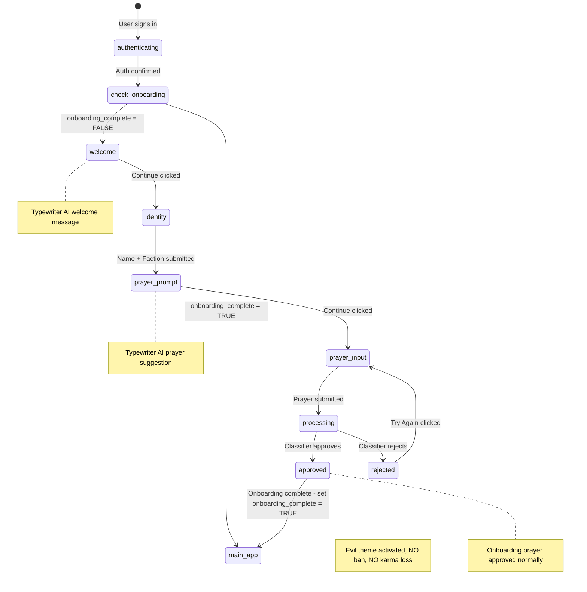
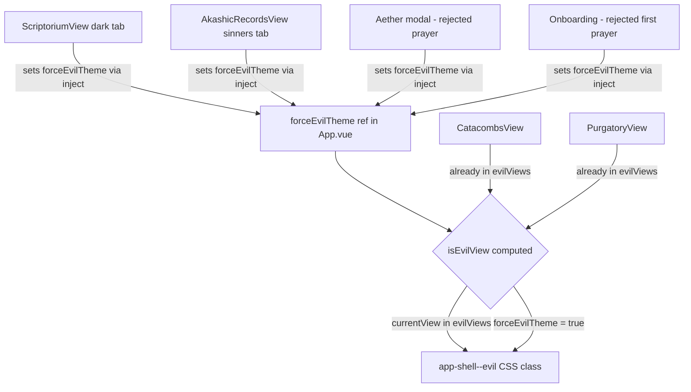

# Onboarding Wizard + Evil Theme Expansion + Genesis 7 SQL

## Overview

Three interlocking features:
1. **Onboarding Wizard** — Intercept new users with an AI-generated welcome, name + faction selection, and first prayer flow
2. **Evil Theme Expansion** — Apply the dark/evil skin to more views (Occult Library, Sinners tab, rejected prayer responses)
3. **Genesis 7 SQL** — Add `onboarding_complete` column to `profiles`

---

## Architecture

### Onboarding Flow (State Machine)



### Evil Theme Triggers



---

## Key Design Decision: Eliminate Identify Yourself Modals

**Current state:** Two separate modals both say "Identify Yourself":
- `IdentityModal.vue` in App.vue — username + sect selection
- `ProfileCompletionModal.vue` in AltarView.vue — username + faith

**New state:** Both modals are **removed from the new-user flow**. The onboarding wizard handles everything:
- Step 2 (identity) collects username + sect selection in one form
- When sect is chosen, `faith` is auto-set to the sect display name (e.g., `gilded_path` -> `"The Gilded Path"`)
- UsernameChangeModal is **kept** as a settings option for existing users

**What stays:**
- `UsernameChangeModal.vue` — kept for settings, unchanged
- `IdentityModal.vue` — file kept but no longer shown to new users; only used if a pre-existing user somehow lacks identity data

**What changes in App.vue:**
- The `watch` on `auth.isAuthenticated` currently shows `IdentityModal` when `!prayers.username || !economy.sectType`
- New flow: check `onboarding_complete` first. If false, start onboarding wizard instead
- `IdentityModal` only shown as fallback for legacy edge cases

---

## File Changes

### 1. `supabase/migrations/genesis_7.sql` — APPEND onboarding column

Append to the END of the existing genesis_7.sql file, BEFORE the final comment:

```sql
-- ============================================
-- PHASE 6: ONBOARDING TRACKING
-- ============================================
-- Tracks whether the user has completed the onboarding wizard.
-- If FALSE or NULL, the user will be intercepted with the onboarding flow.

ALTER TABLE public.profiles
  ADD COLUMN IF NOT EXISTS onboarding_complete BOOLEAN DEFAULT FALSE;

COMMENT ON COLUMN public.profiles.onboarding_complete IS
  'Whether the user has completed the onboarding wizard. FALSE = needs onboarding.';
```

### 2. `supabase/functions/generate-onboarding-content/index.ts` — NEW

Single edge function that generates both the welcome message and prayer prompt.

**Endpoint:** `POST /functions/v1/generate-onboarding-content`

**Request body:**
```json
{ "user_id": "uuid" }
```

**Response:**
```json
{
  "welcome_message": "Welcome, traveler. I am the Electric Monk...",
  "prayer_prompt": "Perhaps you might pray for wisdom in uncertain times..."
}
```

**System prompts:**

Welcome message:
> You are the Electric Monk, a digital devotional engine. Explain that the Monk prays on behalf of humans, dedicating computational thought energy to their intentions. Keep it brief (2-3 sentences), atmospheric, and welcoming. End by inviting them to begin their journey. Output ONLY a JSON object: { "response": "your message here" }

Prayer prompt:
> You are the Electric Monk. Generate a short 1-2 sentence suggestion for what a new user might pray for. Keep it open-ended, respectful, and inspiring. Output ONLY a JSON object: { "response": "your suggestion here" }

Uses same `openai-gpt-oss-120b` model and Venice API as process-prayer.

### 3. `supabase/functions/process-prayer/index.ts` — MODIFY

Add optional `is_onboarding` boolean parameter:

```typescript
const { prayer_id, content, user_id, is_onboarding } = await req.json()
```

**Behavior change when `is_onboarding === true` and prayer is rejected:**
- Do NOT set `ban_until` on the profile — skip the ban entirely
- Still return `judgment: 'rejected'` and `rejection_reason`
- Still return the generated penance response
- Karma change: use 0 instead of -1 for onboarding rejection

### 4. `src/composables/useOnboarding.js` — NEW

State machine composable managing the entire onboarding flow.

**State:**
```js
step: ref('idle')  // idle | loading | welcome | identity | prayer_prompt | prayer_input | processing | approved | rejected
welcomeMessage: ref('')
prayerPrompt: ref('')
rejectionReason: ref(null)
loading: ref(false)
error: ref(null)
```

**Methods:**
- `startOnboarding()` — Call edge function for welcome + prompt content, set step to `welcome`
- `continueToIdentity()` — Step forward from welcome to identity
- `submitIdentity({ username, sectType })` — Upsert profile username, call `choose_sect` RPC, also set `faith` to sect display name, advance to `prayer_prompt`
- `continueToPrayerInput()` — Step from prayer_prompt to prayer_input
- `submitFirstPrayer(content)` — Submit with `is_onboarding: true`, set step to `processing`
- `handleResult(result)` — Route to `approved` or `rejected` step
- `retryPrayer()` — Go back to `prayer_input` from rejected
- `completeOnboarding()` — Set `profiles.onboarding_complete = true`, emit completion event

**Faith auto-set logic:**
```js
const sectFaithMap = {
  gilded_path: 'The Gilded Path',
  holy_way: 'The Holy Way',
  final_watch: 'The Final Watch',
  black_tribunal: 'The Black Tribunal',
}
// When submitting identity, also upsert: faith = sectFaithMap[sectType]
```

### 5. `src/components/organisms/OnboardingWizard.vue` — NEW

Multi-step modal reusing existing Aether modal visual patterns. Uses same CSS classes: `glass-panel`, `aether-modal-overlay`, `btn-primary`, typewriter cursor, etc.

**Steps rendered inside the modal:**

| Step | Content | Action |
|------|---------|--------|
| welcome | Typewriter welcome message from AI | Continue button |
| identity | Username input + Sect grid, reuse IdentityModal layout | Swear the Vow button |
| prayer_prompt | Typewriter prayer prompt from AI | Continue button |
| prayer_input | Textarea for prayer text | Send Prayer button |
| processing | Lightning bolt animation, same as Aether | auto-transitions |
| approved | Typewriter response + karma +1 | Enter the Monastery button |
| rejected | Evil-themed rejection: Let us not get off on the wrong foot. Please make your first prayer something positive. + rejection reason | Try Again button |

**Identity step** embeds the same form fields from IdentityModal — PFP icon, username input, sect selection grid. Calls `choose_sect` RPC + profile upsert + faith auto-set.

**Rejected step** activates evil theme via `forceEvilTheme.value = true` inject.

**No new CSS.** All styling reuses existing classes.

### 6. `src/App.vue` — MODIFY

**Changes:**
1. Import and instantiate `useOnboarding`
2. Add `forceEvilTheme` ref, provide via `provide('forceEvilTheme', forceEvilTheme)`
3. Expand `isEvilView` computed:
   ```js
   const isEvilView = computed(() =>
     evilViews.has(currentView.value) || forceEvilTheme.value
   )
   ```
4. Add `OnboardingWizard` component in template
5. Show `OnboardingWizard` when `onboarding.step !== 'idle'`
6. Modify auth watch logic:
   ```js
   watch(() => auth.isAuthenticated, async (isAuth) => {
     if (isAuth) {
       await economy.fetchEconomy()
       await prayers.fetchProfile()
       // Check onboarding status
       if (!prayers.onboardingComplete) {
         onboarding.startOnboarding()
       } else if (!prayers.username || !economy.sectType) {
         showIdentityModal.value = true  // legacy fallback
       }
     }
   })
   ```
7. On onboarding complete, set `onboarding_complete = true` in DB, refresh state

### 7. `src/views/AltarView.vue` — MODIFY

**Changes:**
1. Inject `forceEvilTheme`
2. Watch `prayers.aetherResult` — when judgment is `rejected`, set `forceEvilTheme.value = true`
3. When Aether modal closes, if judgment was `approved`, reset `forceEvilTheme.value = false`
4. Remove the `ProfileCompletionModal` import and usage — no longer needed for new users
5. Keep `UsernameChangeModal` — still used for settings

### 8. `src/views/AkashicRecordsView.vue` — MODIFY

**Changes:**
1. Inject `forceEvilTheme`
2. Watch `activeSubTab` — set `forceEvilTheme.value = (activeSubTab === 'sinners')`
3. No CSS changes — evil theming applied at App.vue shell level

### 9. `src/views/ScriptoriumView.vue` — MODIFY

**Changes:**
1. Inject `forceEvilTheme`
2. Watch `activeTab` — set `forceEvilTheme.value = (activeTab === 'dark')`
3. The local `evil-shell` class on the dark section REMAINS for inner styling, but now the full app shell also goes evil

### 10. `src/composables/usePrayers.js` — MODIFY

**Changes:**
1. Add `onboarding_complete` to `fetchProfile()` select query
2. Expose `onboardingComplete` ref (mapped from `onboarding_complete`)
3. In `submitPrayer()`, accept optional `isOnboarding` parameter
4. When `isOnboarding` is true, pass `is_onboarding: true` to the edge function body
5. Add `setOnboardingComplete()` method that updates `profiles.onboarding_complete = true`

### 11. `src/components/organisms/ProfileCompletionModal.vue` — KEEP BUT DEPRIORITIZE

This file stays in the codebase but is no longer shown to new users. It's only a fallback for edge cases where a pre-existing user lacks identity data. The onboarding wizard replaces it for all new users.

---

## What We Are NOT Changing

- **`src/style.css`** — HANDS OFF. No CSS modifications. All evil theming uses existing `app-shell--evil` and `evil-shell` classes.
- **`IdentityModal.vue`** — File kept, but no longer shown to new users. Only fallback for legacy edge cases.
- **`PurgatoryView.vue`** — No changes needed, already in evilViews.
- **`CatacombsView.vue`** — No changes needed, already in evilViews.
- **`UsernameChangeModal.vue`** — Kept for settings, unchanged.

---

## Database Schema Addition

Single column on `profiles` table:

| Column | Type | Default | Description |
|--------|------|---------|-------------|
| `onboarding_complete` | BOOLEAN | FALSE | Whether user completed onboarding wizard |

---

## Edge Function: generate-onboarding-content

**Endpoint:** `POST /functions/v1/generate-onboarding-content`

**Request body:**
```json
{ "user_id": "uuid" }
```

**Response:**
```json
{
  "welcome_message": "Welcome, traveler. I am the Electric Monk...",
  "prayer_prompt": "Perhaps you might pray for wisdom in uncertain times..."
}
```

**Error response:**
```json
{ "error": "Error message" }
```

---

## Onboarding Prayer: Special Handling

When `is_onboarding: true` is passed to `process-prayer`:

| Scenario | Normal Behavior | Onboarding Behavior |
|----------|----------------|---------------------|
| Approved | +1 karma, prayer active, no ban | Same: +1 karma, prayer active |
| Rejected | -1 karma, 2hr ban, sent to Purgatory | 0 karma change, NO ban, return rejection reason |

The client handles the rejected onboarding prayer by showing the rejection in-place with a retry option, never redirecting to Purgatory.

---

## Implementation Order

1. Append `onboarding_complete` column to genesis_7.sql
2. Create `generate-onboarding-content` edge function
3. Modify `process-prayer` edge function for `is_onboarding` param
4. Create `useOnboarding.js` composable
5. Create `OnboardingWizard.vue` component
6. Modify `App.vue` — add onboarding interception + forceEvilTheme provide
7. Modify `AltarView.vue` — inject forceEvilTheme for rejection display, remove ProfileCompletionModal from new-user flow
8. Modify `AkashicRecordsView.vue` — inject forceEvilTheme for sinners tab
9. Modify `ScriptoriumView.vue` — inject forceEvilTheme for dark tab
10. Modify `usePrayers.js` — add onboarding_complete tracking + isOnboarding param