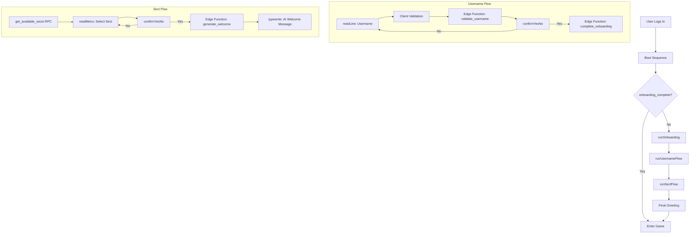

# Onboarding Flow

This document defines the interactive onboarding sequence for new players in Holy War Online.

**Last updated:** 2026-05-23

---

## Technical Sequence

### 1. Initialization & Boot
- User logs in and the terminal runs the `boot.js` sequence.
- Client calls `get_player_status()` RPC.
- If `onboarding_complete` is false, or if `username` or `sect_id` are missing, `runOnboarding()` is triggered.
- `usePlayerState` is hydrated with any existing player data.

### 2. Username Selection (`runUsernameFlow`)
- **Input:** `terminal.readLine()`
- **Validation:**
    - **Client-side:** Length (3-16), Characters (`^[a-zA-Z0-9_]+$`).
    - **Server-side:** Edge Function `welcome-to-hwo` (phase: `validate_username`). Checks for profanity and availability.
- **Confirmation:** `confirmYesNo()` helper asks for confirmation before proceeding.
- **Persistence:** Edge Function `welcome-to-hwo` (phase: `complete_onboarding`) saves the username.

### 3. Sect Affiliation (`runSectFlow`)
- **Fetch:** `getAvailableSects()` RPC retrieves current sects.
- **Selection:** `terminal.readMenu()` provides an interactive arrow-key selection menu.
- **Confirmation:** `confirmYesNo()` helper asks for confirmation.
- **Lore Generation:**
    - Edge Function `welcome-to-hwo` (phase: `generate_welcome`) uses Venice AI (gemma-4-uncensored) to generate a faction-appropriate welcome message.
    - The message is streamed to the terminal using `terminal.typewrite()`.
- **Persistence:** The Edge Function updates the player's `sect_id` and marks `onboarding_complete = true`.

### 4. Completion
- Final greeting is displayed.
- **Tab Title:** The tab title is updated to "Welcome" (or "Error registering" on failure) using `terminal.tab.setTitle()`.
- `usePlayerState` is updated with the new `username`, `sect_id`, `sect_name`, and `sect_emoji`.
- Terminal unblocks (`terminal.busy = false`) and user enters the main game loop.

---

## Edge Function: `welcome-to-hwo`

The onboarding process relies on this secure Edge Function for AI generation and sensitive database updates.

**Phases:**
- `validate_username`: Checks for profanity, availability, and format.
- `complete_onboarding`: Finalizes the player profile username.
- `generate_welcome`: Uses Venice AI to create lore-accurate entry text and sets `onboarding_complete`.

---

## Network Identity

Every player is assigned a unique IPv4 address (`ip_address`) at signup via the `allocate_network_address()` function. This IP is the player's network identity within the game world — used for routing, attacks, and faction interactions. Each sect also has a static IP address defined in the seed data.
