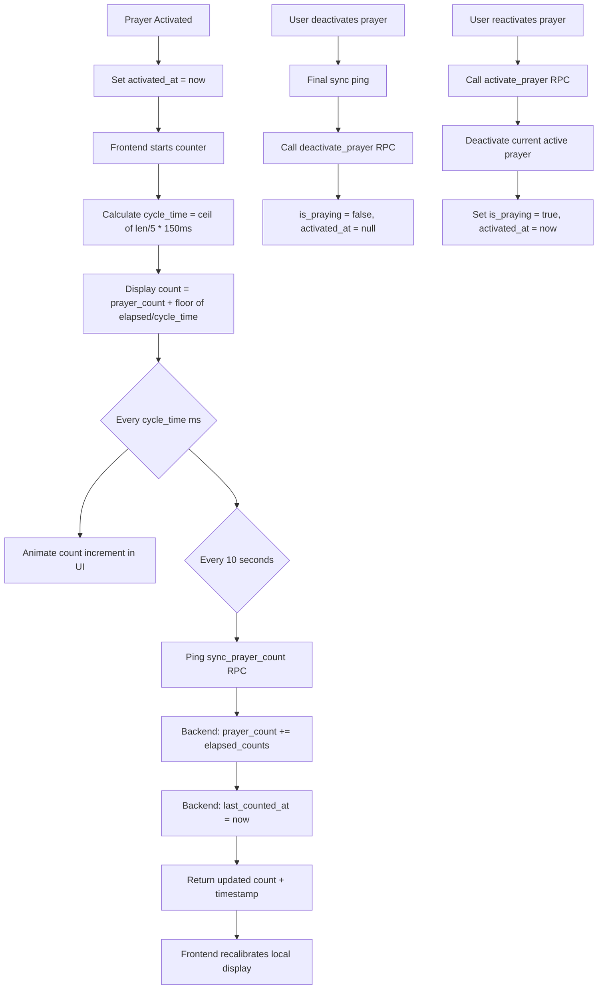
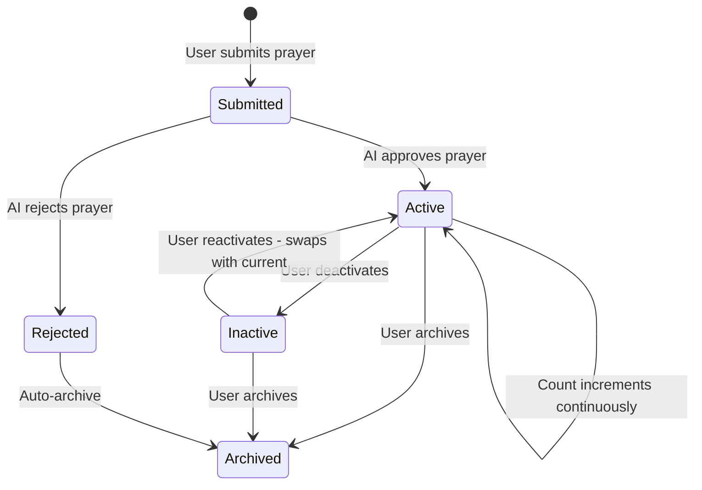

# Prayer Counter Feature Plan

## SQL Migration — Paste This Into Supabase SQL Editor

```sql
-- ============================================
-- Prayer Counter Migration
-- Adds prayer_count, last_counted_at, activated_at columns
-- and RPC functions for sync, activate, deactivate
-- ============================================

-- 1. Add new columns to prayers table
ALTER TABLE prayers
  ADD COLUMN IF NOT EXISTS prayer_count INT DEFAULT 0,
  ADD COLUMN IF NOT EXISTS last_counted_at TIMESTAMPTZ,
  ADD COLUMN IF NOT EXISTS activated_at TIMESTAMPTZ;

-- 2. Initialize existing active prayers with activated_at
UPDATE prayers
SET activated_at = now(),
    last_counted_at = now()
WHERE is_praying = true
  AND activated_at IS NULL;

-- 3. RPC: sync_prayer_count
-- Called every ~10 seconds while a prayer is active.
-- Adds elapsed counts to prayer_count and updates last_counted_at.
-- Returns the updated count data.
CREATE OR REPLACE FUNCTION sync_prayer_count(
  p_prayer_id UUID,
  p_elapsed_counts INT
)
RETURNS JSONB AS $$
DECLARE
  v_user_id UUID;
  v_prayer RECORD;
BEGIN
  SELECT user_id, is_praying INTO v_prayer
  FROM prayers WHERE id = p_prayer_id;

  IF NOT FOUND THEN
    RAISE EXCEPTION 'Prayer not found';
  END IF;

  IF v_prayer.user_id != auth.uid() THEN
    RAISE EXCEPTION 'Not authorized';
  END IF;

  IF NOT v_prayer.is_praying THEN
    RAISE EXCEPTION 'Prayer is not active';
  END IF;

  UPDATE prayers
  SET prayer_count = prayer_count + p_elapsed_counts,
      last_counted_at = now()
  WHERE id = p_prayer_id
  RETURNING prayer_count, last_counted_at, activated_at
  INTO v_prayer;

  RETURN jsonb_build_object(
    'prayer_count', v_prayer.prayer_count,
    'last_counted_at', v_prayer.last_counted_at,
    'activated_at', v_prayer.activated_at
  );
END;
$$ LANGUAGE plpgsql SECURITY DEFINER;

-- 4. RPC: deactivate_prayer
-- Final sync of elapsed counts, then set is_praying = false and activated_at = null.
CREATE OR REPLACE FUNCTION deactivate_prayer(
  p_prayer_id UUID,
  p_elapsed_counts INT
)
RETURNS JSONB AS $$
DECLARE
  v_user_id UUID;
  v_prayer RECORD;
BEGIN
  SELECT user_id INTO v_user_id
  FROM prayers WHERE id = p_prayer_id;

  IF NOT FOUND THEN
    RAISE EXCEPTION 'Prayer not found';
  END IF;

  IF v_user_id != auth.uid() THEN
    RAISE EXCEPTION 'Not authorized';
  END IF;

  UPDATE prayers
  SET prayer_count = prayer_count + p_elapsed_counts,
      last_counted_at = now(),
      is_praying = false,
      activated_at = NULL
  WHERE id = p_prayer_id
  RETURNING id, prayer_count, is_praying, activated_at
  INTO v_prayer;

  RETURN jsonb_build_object(
    'id', v_prayer.id,
    'prayer_count', v_prayer.prayer_count,
    'is_praying', v_prayer.is_praying,
    'activated_at', v_prayer.activated_at
  );
END;
$$ LANGUAGE plpgsql SECURITY DEFINER;

-- 5. RPC: activate_prayer
-- Deactivates any currently active prayer for this user first,
-- then activates the target prayer.
CREATE OR REPLACE FUNCTION activate_prayer(
  p_prayer_id UUID
)
RETURNS JSONB AS $$
DECLARE
  v_user_id UUID;
  v_current_active RECORD;
  v_elapsed_counts INT;
  v_cycle_time_ms INT;
  v_new_activated RECORD;
BEGIN
  v_user_id := auth.uid();

  -- Deactivate any currently active prayer
  SELECT id, content, activated_at, last_counted_at, prayer_count
  INTO v_current_active
  FROM prayers
  WHERE user_id = v_user_id
    AND is_praying = true
    AND id != p_prayer_id;

  IF FOUND THEN
    v_cycle_time_ms := GREATEST(150, ceil(length(v_current_active.content) / 5.0) * 150);
    v_elapsed_counts := GREATEST(0, floor(
      EXTRACT(EPOCH FROM (now() - COALESCE(v_current_active.last_counted_at, v_current_active.activated_at)))
      * 1000.0 / v_cycle_time_ms
    ));

    UPDATE prayers
    SET prayer_count = prayer_count + v_elapsed_counts,
        last_counted_at = now(),
        is_praying = false,
        activated_at = NULL
    WHERE id = v_current_active.id;
  END IF;

  -- Activate the target prayer
  UPDATE prayers
  SET is_praying = true,
      activated_at = now(),
      last_counted_at = now()
  WHERE id = p_prayer_id
    AND user_id = v_user_id
  RETURNING id, prayer_count, is_praying, activated_at, last_counted_at
  INTO v_new_activated;

  IF NOT FOUND THEN
    RAISE EXCEPTION 'Prayer not found or not authorized';
  END IF;

  RETURN jsonb_build_object(
    'activated', jsonb_build_object(
      'id', v_new_activated.id,
      'prayer_count', v_new_activated.prayer_count,
      'is_praying', v_new_activated.is_praying,
      'activated_at', v_new_activated.activated_at,
      'last_counted_at', v_new_activated.last_counted_at
    ),
    'deactivated_id', CASE WHEN v_current_active.id IS NOT NULL THEN v_current_active.id ELSE NULL END
  );
END;
$$ LANGUAGE plpgsql SECURITY_DEFINER;

-- 6. Grant execute permissions on new RPCs
GRANT EXECUTE ON FUNCTION sync_prayer_count TO authenticated;
GRANT EXECUTE ON FUNCTION deactivate_prayer TO authenticated;
GRANT EXECUTE ON FUNCTION activate_prayer TO authenticated;

-- 7. Update submit_prayer to set activated_at and last_counted_at
-- Also deactivates any currently active prayer before creating a new one
CREATE OR REPLACE FUNCTION submit_prayer(prayer_content TEXT)
RETURNS JSONB AS $$
DECLARE
    v_user_id UUID := auth.uid();
    v_char_limit INT := 1500;
    v_token_ratio INT := 5;
    v_cost INT;
    v_spent INT;
    v_limit INT;
    v_new_prayer_id UUID;
BEGIN
    SELECT tokens_spent_today, daily_token_limit
    INTO v_spent, v_limit
    FROM profiles WHERE id = v_user_id;

    IF length(prayer_content) > v_char_limit THEN
        RAISE EXCEPTION 'Prayer exceeds maximum length of % characters.', v_char_limit;
    END IF;

    v_cost := ceil(length(prayer_content)::float / v_token_ratio);

    IF (v_spent + v_cost) > v_limit THEN
        RAISE EXCEPTION 'Insufficient Mana. This prayer costs % Mana, but you only have % remaining.', v_cost, (v_limit - v_spent);
    END IF;

    -- Deactivate any currently active prayer first
    UPDATE prayers
    SET is_praying = false,
        activated_at = NULL
    WHERE user_id = v_user_id
      AND is_praying = true;

    -- Insert new prayer with activated_at set
    INSERT INTO prayers (user_id, content, is_praying, activated_at, last_counted_at)
    VALUES (v_user_id, prayer_content, true, now(), now())
    RETURNING id INTO v_new_prayer_id;

    UPDATE profiles
    SET tokens_spent_today = tokens_spent_today + v_cost,
        last_prayer_date = CURRENT_DATE
    WHERE id = v_user_id;

    RETURN jsonb_build_object('id', v_new_prayer_id, 'cost', v_cost);
END;
$$ LANGUAGE plpgsql SECURITY_DEFINER;
```

---


## Overview

Add a prayer count tracker that calculates how many times a prayer has been "prayed" by the Electric Monk, based on elapsed time since activation. The count is computed client-side at a rate of **150ms per 5 characters** and synced to the backend via periodic pings every ~10 seconds.

---

## Architecture



### Key Formula

```
cycle_time_ms = Math.ceil(content.length / 5) * 150
displayed_count = prayer_count + Math.floor((Date.now() - last_counted_at) / cycle_time_ms)
```

Example: A 50-character prayer → `ceil(50/5) * 150 = 1500ms` per prayer cycle. In 15 seconds, it would be prayed ~10 times.

---

## Database Changes

### New Columns on `prayers` table

| Column | Type | Default | Purpose |
|--------|------|---------|---------|
| `prayer_count` | `INT` | `0` | Total times prayed, persisted at last sync |
| `last_counted_at` | `TIMESTAMPTZ` | `NULL` | Timestamp of last count sync |
| `activated_at` | `TIMESTAMPTZ` | `NULL` | When prayer was last activated |

### New RPC Functions

1. **`sync_prayer_count(p_prayer_id UUID, p_elapsed_counts INT)`** — Called every ~10s while prayer is active. Adds `p_elapsed_counts` to `prayer_count` and updates `last_counted_at`.

2. **`deactivate_prayer(p_prayer_id UUID, p_elapsed_counts INT)`** — Final sync + sets `is_praying = false`, `activated_at = NULL`. Freezes the prayer count.

3. **`activate_prayer(p_prayer_id UUID)`** — Deactivates any currently active prayer for this user, then sets `is_praying = true`, `activated_at = now()`, `last_counted_at = now()` on the target prayer.

### Modified RPC

- **`submit_prayer`** — Also set `activated_at = now()` and `last_counted_at = now()` on the new prayer row.

---

## Frontend Changes

### New Composable: `usePrayerCounter.js`

Responsible for:
- Computing `cycle_time_ms` from prayer content length
- Running a `setInterval` that updates `displayed_count` every cycle
- Running a sync `setInterval` every 10 seconds that calls `sync_prayer_count` RPC
- Exposing `displayedCount` ref that triggers animation on change
- Cleanup on unmount or deactivation

### Updates to `usePrayers.js`

- Add `activatePrayer(prayerId)` — calls `activate_prayer` RPC, updates local state
- Add `deactivatePrayer(prayerId)` — final sync + calls `deactivate_prayer` RPC
- Add `syncPrayerCount(prayerId, elapsedCounts)` — calls `sync_prayer_count` RPC
- Split `activePrayers` into:
  - `currentActivePrayer` — the single prayer with `is_praying = true`
  - `inactivePrayers` — prayers with `is_praying = false` but not rejected/deleted
- Keep `archivedPrayers` as-is for rejected/deleted prayers

### Updates to `AltarView.vue`

- **Active prayer card**: Show animated prayer count with increment animation, add "Pause" button to deactivate
- **Inactive prayer cards**: Show frozen prayer count, add "Reactivate" button that swaps with current active prayer
- **Archived prayer cards**: Show total prayer count as static text
- **Animation**: CSS pulse/scale animation on the count number each time it increments

### Updates to Edge Function

- In `process-prayer/index.ts`: When setting `is_praying = true` on approval, also set `activated_at` and `last_counted_at` to `now()`

---

## State Flow



### Prayer States

| State | is_praying | is_rejected | is_deleted | prayer_count | activated_at |
|-------|-----------|-------------|-----------|-------------|-------------|
| Active | true | false | false | incrementing | set |
| Inactive | false | false | false | frozen | null |
| Rejected | false | true | false | frozen | null |
| Archived | any | any | true | frozen | null |

---

## Files to Modify

1. **`src/lib/supabase-schema.sql`** — Add migration SQL for new columns and RPCs
2. **`src/composables/usePrayers.js`** — Add activate/deactivate/sync methods, split computed properties
3. **`src/composables/usePrayerCounter.js`** — New composable for counting logic and animation
4. **`src/views/AltarView.vue`** — Add count display, animations, reactivate/deactivate buttons
5. **`supabase/functions/process-prayer/index.ts`** — Set `activated_at` and `last_counted_at` on approval