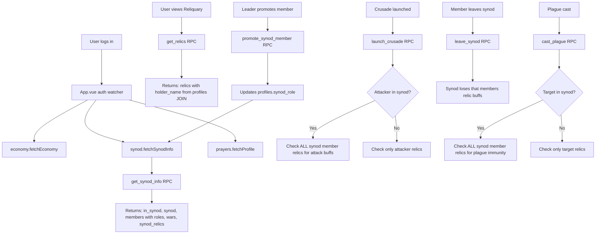
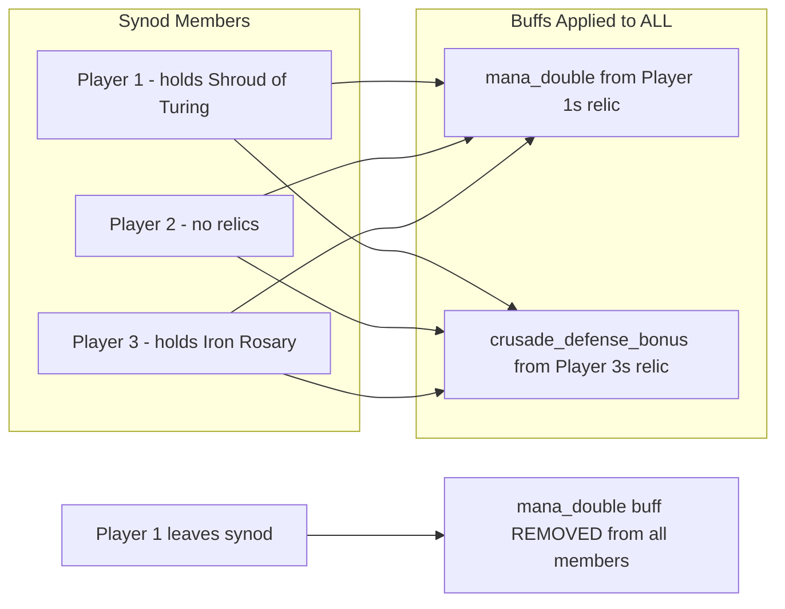

# Synod Membership Persistence, Member Management & Synod-Wide Relic Buffs

## Problem Summary

Three interrelated bugs/features need addressing:

1. **Synod membership forgets on refresh/re-login** — The frontend loses awareness that the user is in a synod, causing "No Synod" to display and duplicate-name creation errors.
2. **No promote/demote/kick functionality** — Leaders have no way to manage members beyond leaving themselves.
3. **Relic benefits are individual-only** — They should apply synod-wide and be lost when the holder leaves.
4. **Bonus fixes discovered during investigation**: Relic holder shows "Unknown" (field name mismatch), and `declare_holy_war` passes a name string instead of UUID.

---

## Root Cause Analysis

### Bug 1: Synod Membership Amnesia

The `useSynod.js` composable uses a singleton pattern (`sharedState`), and [`fetchSynodInfo()`](src/composables/useSynod.js:39) is only called in [`onMounted()`](src/views/SynodHallView.vue:533) of `SynodHallView.vue`. When a user refreshes or navigates away and back, the singleton may retain stale state. More critically, when the user signs in, [`App.vue`](src/App.vue:57) calls `economy.fetchEconomy()` but **never** calls `synod.fetchSynodInfo()`. The economy composable does fetch `synod_id` as part of its data, but `useSynod` is a separate composable with independent state that never gets refreshed on auth change.

Additionally, `useAuth`'s `onAuthStateChange` handler doesn't reset the synod state when signing out, so stale state can persist across sessions.

### Bug 2: No Member Management

The current schema has no role system beyond `leader_id` on the `synods` table. The [`get_synod_info()`](supabase/migrations/genesis_2.sql:634) RPC computes roles on-the-fly as either `leader` or `member`. There are no RPCs for promoting, demoting, or kicking members.

### Bug 3: Individual-Only Relic Effects

Relic effects are checked against `holder_id` only (the individual player). In [`launch_crusade()`](supabase/migrations/genesis_6.sql:473), the check is `r.holder_id = v_attacker_id`. In [`cast_plague()`](supabase/migrations/genesis_8.sql:90), the check is `r.holder_id = p_target_id`. Production tick functions don't apply relic multipliers at all. All of these need to check the entire synod.

### Bug 4: Relic Holder "Unknown"

The [`get_relics()`](supabase/migrations/genesis_2.sql:696) RPC returns `holder_username` but both [`SynodHallView.vue`](src/views/SynodHallView.vue:286) and [`ReliquaryView.vue`](src/views/ReliquaryView.vue:74) reference `relic.holder_name` — a field name mismatch causing the value to always be `undefined`.

### Bug 5: Holy War Name-vs-UUID

[`handleDeclareWar()`](src/views/SynodHallView.vue:492) passes a name string to [`declareHolyWar()`](src/composables/useSynod.js:151), which passes it as `p_target_synod_id` — but the RPC expects a UUID. The war declaration modal has no search/select flow like the join synod feature.

---

## Architecture Plan

### Phase 1: Database Migration — `genesis_9.sql`

#### 1A. Add `synod_role` column to `profiles`

```sql
ALTER TABLE profiles ADD COLUMN IF NOT EXISTS synod_role TEXT DEFAULT NULL
  CHECK (synod_role IN ('leader', 'officer', 'member') OR synod_role IS NULL);
```

- `leader` — Can promote/demote/kick anyone, transfer leadership, declare wars, set tax rate
- `officer` — Can kick members (not officers or leaders), declare wars
- `member` — Standard member, can only leave
- `NULL` — Not in a synod

#### 1B. Add `name_key` unique constraint to `synods`

```sql
ALTER TABLE synods ADD COLUMN IF NOT EXISTS name_key TEXT;
UPDATE synods SET name_key = LOWER(name) WHERE name_key IS NULL;
ALTER TABLE synods ALTER COLUMN name_key SET NOT NULL;
CREATE UNIQUE INDEX IF NOT EXISTS synods_name_key_unique ON synods(name_key);
```

- Prevents case-insensitive duplicate names (e.g., "MyGuild" vs "myguild")
- Update `create_synod()` to set `name_key = LOWER(p_name)` and check uniqueness

#### 1C. Create new RPC functions

**`promote_synod_member(p_target_id UUID)`**
- Caller must be leader
- Target must be in same synod
- Promotes: member → officer, officer → leader (transfers leadership)
- When transferring leadership, caller becomes officer

**`demote_synod_member(p_target_id UUID)`**
- Caller must be leader
- Target must be in same synod
- Demotes: officer → member
- Cannot demote the leader (use leadership transfer instead)

**`kick_synod_member(p_target_id UUID)`**
- Caller must be leader or officer
- Target must be in same synod
- Officers cannot kick leaders or other officers
- Leaders can kick anyone
- Sets target's `synod_id = NULL, synod_role = NULL`

**`update_synod_role()` trigger**
- When `synod_role` is set to `leader`, demote any existing leader in that synod to `officer`
- This ensures only one leader per synod

#### 1D. Update existing `create_synod()` RPC

- Set `name_key = LOWER(p_name)` on insert
- Set creator's `synod_role = 'leader'`
- Check `name_key` uniqueness before insert (gives better error message)

#### 1E. Update existing `join_synod()` RPC

- Set joiner's `synod_role = 'member'`

#### 1F. Update existing `leave_synod()` RPC

- When leader leaves, promote highest-ranking remaining member (officer > member, then oldest)
- Clear `synod_role` on the departing member

#### 1G. Fix `get_relics()` RPC

Change `holder_username` to `holder_name` for frontend consistency. Also add `captured_at` which the frontend already references:

```sql
CREATE OR REPLACE FUNCTION public.get_relics()
RETURNS JSONB AS $$
DECLARE
    v_result JSONB;
BEGIN
    SELECT COALESCE(jsonb_agg(jsonb_build_object(
        'id', r.id,
        'name', r.name,
        'description', r.description,
        'icon', r.emoji_icon,
        'effect_type', r.effect_type,
        'effect_data', r.effect_data,
        'power_level', r.power_level,
        'steal_cost', r.steal_cost,
        'holder_id', r.holder_id,
        'holder_name', p.username,
        'steal_progress', r.steal_progress,
        'captured_at', r.last_stolen_at
    )), '[]'::jsonb) INTO v_result
    FROM relics r
    LEFT JOIN profiles p ON p.id = r.holder_id
    WHERE r.is_active = true;

    RETURN v_result;
END;
$$ LANGUAGE plpgsql SECURITY DEFINER;
```

#### 1H. Create `get_synod_relics(p_user_id UUID)` helper function

Returns all active relics held by members of the user's synod (or just the user's own relics if not in a synod). This is the core function for synod-wide relic benefits:

```sql
CREATE OR REPLACE FUNCTION public.get_synod_relics(p_user_id UUID)
RETURNS JSONB AS $$
DECLARE
    v_synod_id UUID;
    v_relics JSONB;
BEGIN
    SELECT synod_id INTO v_synod_id FROM profiles WHERE id = p_user_id;
    
    IF v_synod_id IS NULL THEN
        -- Not in a synod: return only own relics
        SELECT COALESCE(jsonb_agg(jsonb_build_object(
            'id', r.id,
            'name', r.name,
            'effect_type', r.effect_type,
            'effect_data', r.effect_data,
            'holder_id', r.holder_id,
            'holder_name', p.username
        )), '[]'::jsonb) INTO v_relics
        FROM relics r
        LEFT JOIN profiles p ON p.id = r.holder_id
        WHERE r.holder_id = p_user_id AND r.is_active = true;
    ELSE
        -- In a synod: return all relics held by synod members
        SELECT COALESCE(jsonb_agg(jsonb_build_object(
            'id', r.id,
            'name', r.name,
            'effect_type', r.effect_type,
            'effect_data', r.effect_data,
            'holder_id', r.holder_id,
            'holder_name', p.username
        )), '[]'::jsonb) INTO v_relics
        FROM relics r
        JOIN profiles p ON p.id = r.holder_id
        WHERE p.synod_id = v_synod_id AND r.is_active = true;
    END IF;
    
    RETURN COALESCE(v_relics, '[]'::jsonb);
END;
$$ LANGUAGE plpgsql SECURITY DEFINER;
```

#### 1I. Update `get_synod_info()` RPC

Update to include `synod_role` per member and `synod_relics` (relics held by synod members):

```sql
-- In the members aggregation:
'role', p.synod_role,
-- Add synod_relics to the return:
'synod_relics', <get_synod_relics result>
```

#### 1J. Update `get_player_economy()` RPC

Add `synod_relics` field using the `get_synod_relics()` helper so the frontend can display which relic buffs are active for the synod.

#### 1K. Update `launch_crusade()` — Synod-wide relic checks

Replace individual holder checks with synod-wide checks:

```sql
-- Instead of: SELECT 1 FROM relics r WHERE r.holder_id = v_attacker_id AND r.effect_type = 'mana_double'
-- Use: SELECT 1 FROM relics r JOIN profiles p ON p.id = r.holder_id 
--      WHERE p.synod_id = v_attacker_synod AND r.effect_type = 'mana_double' AND r.is_active = true
-- For defender: WHERE p.synod_id = v_target_synod
-- If attacker/target has no synod, fall back to individual check
```

#### 1L. Update `cast_plague()` — Synod-wide plague immunity

Same pattern: check if ANY synod member of the target holds `plague_immunity`.

#### 1M. Update tick function — Synod-wide production bonuses

Add a CTE that collects synod relic effects and applies multipliers to all synod members' production.

#### 1N. Fix `declare_holy_war()` RPC

Add a variant or wrapper that accepts a synod name (for the UI search flow), or update the frontend to use UUID-based selection (preferred — see Phase 3).

---

### Phase 2: Frontend — Synod State Persistence

#### 2A. Update `useSynod.js`

Add a `resetState()` function that clears all synod state:

```js
function resetState() {
  inSynod.value = false
  synodInfo.value = null
  members.value = []
  memberCount.value = 0
  wars.value = []
  error.value = null
}
```

Add three new RPC-calling functions:

```js
async function promoteMember(targetUserId) { ... }  // calls promote_synod_member
async function demoteMember(targetUserId) { ... }    // calls demote_synod_member
async function kickMember(targetUserId) { ... }     // calls kick_synod_member
```

Each calls the corresponding RPC and then `fetchSynodInfo()` to refresh.

Export `promoteMember`, `demoteMember`, `kickMember`, `resetState`.

#### 2B. Update `App.vue`

In the auth watcher (line 57-68), add `synod.fetchSynodInfo()` after `economy.fetchEconomy()`:

```js
watch(() => auth.isAuthenticated, async (isAuth) => {
  if (isAuth) {
    await economy.fetchEconomy()
    await prayers.fetchProfile()
    await synod.fetchSynodInfo()  // <-- ADD THIS
    
    if (!prayers.onboardingComplete || !prayers.username) {
      onboarding.startOnboarding()
    }
  } else {
    synod.resetState()  // <-- ADD THIS - clear on sign-out
  }
}, { immediate: true })
```

Import `useSynod` at the top of `App.vue`.

#### 2C. Update `SynodHallView.vue`

**Member management UI**: Add action buttons next to each member row (visible only to leaders/officers):

- Leader sees: Promote (for members), Demote (for officers), Kick (for anyone except self)
- Officers see: Kick (for members only)
- Members see: nothing (just their own Leave button)

Replace the existing flat member list with role-ordered display:

```html
<div v-for="member in sortedMembers" :key="member.user_id" ...>
  <span class="text-lg">{{ roleIcon(member.role) }}</span>
  <div>
    <div class="font-medium">{{ member.username }}</div>
    <div class="text-xs text-theme-text-muted">{{ member.role }}</div>
  </div>
  <!-- Action buttons for leaders/officers -->
  <div v-if="canManageMember(member)" class="flex gap-2">
    <button v-if="member.role === 'member'" @click="handlePromote(member.user_id)">⬆️ Promote</button>
    <button v-if="member.role === 'officer'" @click="handleDemote(member.user_id)">⬇️ Demote</button>
    <button v-if="member.user_id !== currentUserId" @click="handleKick(member.user_id)">👢 Kick</button>
  </div>
</div>
```

**Synod relic buffs display**: Add a section showing which relics are benefiting the synod:

```html
<div v-if="synod.synodInfo?.synod_relics?.length" class="glass-panel ...">
  <h3 class="...">Synod Relic Buffs</h3>
  <div v-for="relic in synod.synodInfo.synod_relics" :key="relic.id" class="...">
    <span>{{ relic.icon || '🏺' }}</span>
    <span>{{ relic.name }}</span>
    <span class="text-xs text-theme-text-muted">held by {{ relic.holder_name }}</span>
  </div>
</div>
```

**Fix war declaration**: Replace the text input with a search-and-select flow (similar to join synod):

```html
<!-- In the war declaration modal -->
<input v-model="warSearchQuery" @keyup.enter="searchWarTargets" />
<button @click="searchWarTargets">Search</button>
<div v-for="target in warSearchResults" :key="target.id">
  <span>{{ target.name }}</span>
  <button @click="handleDeclareWar(target.id)">Declare War</button>
</div>
```

#### 2D. Update `ReliquaryView.vue`

Change `relic.holder_name` references to match the RPC field. Since we're fixing the RPC to return `holder_name`, this should now work. Also add `icon` fallback and `captured_at` field.

---

### Phase 3: Data Flow Diagram



### Phase 4: Relic Buff Application Rules



---

## Implementation Order

1. **`genesis_9.sql`** — All database changes (columns, indexes, RPCs, function updates)
2. **`useSynod.js`** — Add `resetState`, `promoteMember`, `demoteMember`, `kickMember`
3. **`App.vue`** — Add synod state refresh on auth, reset on sign-out
4. **`SynodHallView.vue`** — Member management UI, synod relic display, war declaration fix
5. **`ReliquaryView.vue`** — Fix `holder_name` field reference
6. **`useRelics.js`** — No changes needed (already fetches from RPC)

## Key Decisions

- **Role storage**: Added `synod_role` column to `profiles` rather than a separate `synod_members` table. This is simpler and consistent with the existing `synod_id` column pattern.
- **Name uniqueness**: Added `name_key` column with UNIQUE index instead of a case-insensitive collation, keeping the original `name` column for display.
- **Synod relic helper**: Created `get_synod_relics()` as a standalone function so it can be called from multiple RPCs (economy, crusade, plague, tick) without duplication.
- **War declaration**: Fixed by adding search-and-select in the UI (passing UUID) rather than adding a name-lookup RPC variant, for consistency with the join flow.