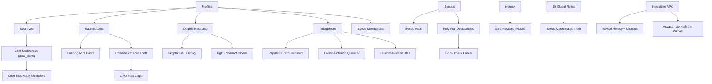
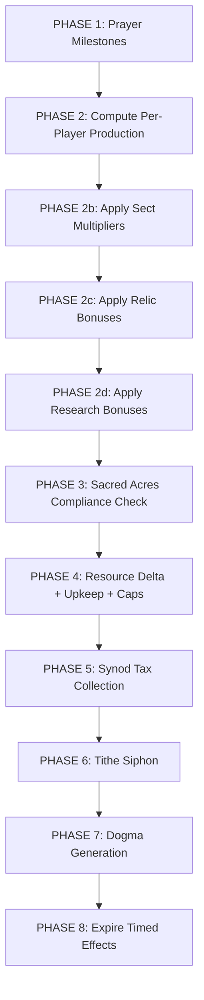
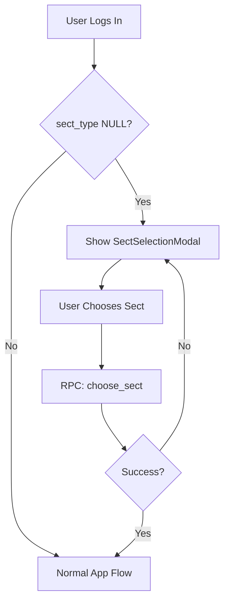

# THE RAPTURE UPDATE — Architectural Plan

**Version:** 8.0 — The Rapture Update  
**Date:** 2026-05-17  
**Status:** Planning

---

## System Overview

This update introduces 7 interconnected systems that transform Electric Monk from a linear idle game into an asymmetric PBBGO with alliance politics, territory control, tech progression, and premium monetization.



---

## 1. DATABASE SCHEMA — Additive YAML

### 1.1 New Columns on `profiles`

```yaml
profiles_alterations:
  - column: sect_type
    type: TEXT
    default: NULL
    constraint: CHECK IN NULL, prosperity_gospel, ascetic_order, doomsday_preppers, inquisition
    notes: Chosen once at account creation. NULL means sect selection pending.
    
  - column: sacred_acres
    type: INTEGER
    default: 25
    constraint: CHECK >= 0
    notes: Finite land. Stolen in Crusades. Buildings consume acres.
    
  - column: dogma
    type: INTEGER
    default: 0
    notes: Light research currency. Generated by Scriptorium.
    
  - column: indulgences
    type: INTEGER
    default: 0
    notes: Premium currency. Purchased via Stripe.
    
  - column: synod_id
    type: UUID
    default: NULL
    references: synods.id ON DELETE SET NULL
    notes: Alliance membership.
    
  - column: papal_bull_until
    type: TIMESTAMPTZ
    default: NULL
    notes: Active Papal Bull immunity timestamp.
    
  - column: title
    type: TEXT
    default: NULL
    notes: Custom leaderboard title from indulgences.
    
  - column: avatar_url
    type: TEXT
    default: NULL
    notes: Custom avatar URL from indulgences.
```

### 1.2 New Columns on `shop_items`

```yaml
shop_items_alterations:
  - column: acre_cost
    type: INTEGER
    default: 0
    constraint: CHECK >= 0
    notes: Sacred acres consumed when building is active. 0 = no acre cost.
    
  - column: sect_restriction
    type: TEXT
    default: NULL
    constraint: CHECK IN NULL, prosperity_gospel, ascetic_order, doomsday_preppers, inquisition
    notes: If set, only members of this sect can purchase. NULL = available to all.
    
  - column: sect_exclusion
    type: TEXT
    default: NULL
    constraint: CHECK IN NULL, prosperity_gospel, ascetic_order, doomsday_preppers, inquisition
    notes: If set, members of this sect CANNOT purchase. NULL = no exclusion.
```

### 1.3 New Table: `synods`

```yaml
synods:
  columns:
    - column: id
      type: UUID DEFAULT gen_random_uuid PRIMARY KEY
    - column: name
      type: TEXT NOT NULL UNIQUE
      constraint: LENGTH BETWEEN 3 AND 30
    - column: leader_id
      type: UUID REFERENCES profiles.id ON DELETE CASCADE NOT NULL
    - column: tax_rate
      type: NUMERIC DEFAULT 0.05
      constraint: CHECK >= 0.01 AND <= 0.15
      notes: 1-15% tax on member production siphoned to vault.
    - column: vault_gold
      type: INTEGER DEFAULT 0
    - column: vault_mana
      type: INTEGER DEFAULT 0
    - column: created_at
      type: TIMESTAMPTZ DEFAULT now
  indexes:
    - idx_synods_leader ON synods(leader_id)
  rls:
    - SELECT USING true
    - INSERT USING auth.uid = leader_id
    - UPDATE USING auth.uid = leader_id
    - DELETE USING auth.uid = leader_id
```

### 1.4 New Table: `synod_wars`

```yaml
synod_wars:
  columns:
    - column: id
      type: UUID DEFAULT gen_random_uuid PRIMARY KEY
    - column: attacker_synod_id
      type: UUID REFERENCES synods(id) ON DELETE CASCADE NOT NULL
    - column: defender_synod_id
      type: UUID REFERENCES synods(id) ON DELETE CASCADE NOT NULL
    - column: declared_at
      type: TIMESTAMPTZ DEFAULT now
    - column: expires_at
      type: TIMESTAMPTZ NOT NULL
      notes: 48 hours after declaration.
    - column: is_active
      type: BOOLEAN DEFAULT true
  indexes:
    - idx_synod_wars_attacker ON synod_wars(attacker_synod_id)
    - idx_synod_wars_defender ON synod_wars(defender_synod_id)
    - idx_synod_wars_active ON synod_wars(is_active) WHERE is_active = true
  rls:
    - SELECT USING true
    - All writes via SECURITY DEFINER RPCs only
```

### 1.5 New Table: `research_nodes`

```yaml
research_nodes:
  columns:
    - column: id
      type: TEXT PRIMARY KEY
      notes: e.g. tax_evasion, holy_war, false_prophet
    - column: name
      type: TEXT NOT NULL
    - column: description
      type: TEXT
    - column: emoji_icon
      type: TEXT
    - column: alignment
      type: TEXT NOT NULL
      constraint: CHECK IN light, dark
      notes: light = costs dogma, dark = costs heresy
    - column: cost
      type: INTEGER NOT NULL
      notes: Amount of dogma or heresy required.
    - column: effect_type
      type: TEXT NOT NULL
      notes: e.g. vassal_tithe_reduction, crusade_attack_bonus, tithe_intercept, inquisition_immunity
    - column: effect_data
      type: JSONB NOT NULL DEFAULT '{}'
      notes: Effect parameters. e.g. reduction_percent: 50
    - column: requires_node
      type: TEXT REFERENCES research_nodes(id) ON DELETE SET NULL
      notes: Prerequisite research node. NULL = unlocked by default.
    - column: sort_order
      type: INTEGER DEFAULT 0
    - column: is_active
      type: BOOLEAN DEFAULT true
  rls:
    - SELECT USING true
    - All writes via service_role only
```

### 1.6 New Table: `player_research`

```yaml
player_research:
  columns:
    - column: id
      type: UUID DEFAULT gen_random_uuid PRIMARY KEY
    - column: user_id
      type: UUID REFERENCES profiles(id) ON DELETE CASCADE NOT NULL
    - column: node_id
      type: TEXT REFERENCES research_nodes(id) ON DELETE CASCADE NOT NULL
    - column: unlocked_at
      type: TIMESTAMPTZ DEFAULT now
    - column: expires_at
      type: TIMESTAMPTZ
      notes: NULL = permanent. For timed effects like False Prophet.
  unique_constraint: UNIQUE(user_id, node_id)
  indexes:
    - idx_player_research_user ON player_research(user_id)
  rls:
    - SELECT USING auth.uid = user_id
    - INSERT/UPDATE/DELETE via SECURITY DEFINER RPCs only
```

### 1.7 New Table: `relics`

```yaml
relics:
  columns:
    - column: id
      type: UUID DEFAULT gen_random_uuid PRIMARY KEY
    - column: name
      type: TEXT NOT NULL UNIQUE
    - column: description
      type: TEXT
    - column: emoji_icon
      type: TEXT
    - column: effect_type
      type: TEXT NOT NULL
      notes: e.g. mana_double, acres_bonus, crusade_bonus
    - column: effect_data
      type: JSONB NOT NULL DEFAULT '{}'
      notes: e.g. acres_bonus: 50
    - column: holder_id
      type: UUID REFERENCES profiles(id) ON DELETE SET NULL
      notes: NULL = unclaimed or lost.
    - column: last_stolen_at
      type: TIMESTAMPTZ
    - column: steal_progress
      type: INTEGER DEFAULT 0
      notes: Successful crusades against holder within window. Resets on steal or timeout.
    - column: steal_window_start
      type: TIMESTAMPTZ
      notes: When the current steal attempt window began.
    - column: is_active
      type: BOOLEAN DEFAULT true
  indexes:
    - idx_relics_holder ON relics(holder_id)
  rls:
    - SELECT USING true
    - All writes via SECURITY DEFINER RPCs only
  notes: Exactly 10 rows seeded. Never INSERT more. UPDATE holder_id on theft.
```

### 1.8 New Table: `active_miracles`

```yaml
active_miracles:
  columns:
    - column: id
      type: UUID DEFAULT gen_random_uuid PRIMARY KEY
    - column: user_id
      type: UUID REFERENCES profiles(id) ON DELETE CASCADE NOT NULL
    - column: miracle_type
      type: TEXT NOT NULL
      notes: e.g. divine_architect_queue, papal_bull
    - column: effect_data
      type: JSONB NOT NULL DEFAULT '{}'
    - column: expires_at
      type: TIMESTAMPTZ NOT NULL
    - column: created_at
      type: TIMESTAMPTZ DEFAULT now
  indexes:
    - idx_active_miracles_user ON active_miracles(user_id)
    - idx_active_miracles_expires ON active_miracles(expires_at)
  rls:
    - SELECT USING auth.uid = user_id OR true
      notes: Inquisition can reveal these, so public read.
    - INSERT/UPDATE/DELETE via SECURITY DEFINER RPCs only
```

### 1.9 New Table: `build_queue`

```yaml
build_queue:
  columns:
    - column: id
      type: UUID DEFAULT gen_random_uuid PRIMARY KEY
    - column: user_id
      type: UUID REFERENCES profiles(id) ON DELETE CASCADE NOT NULL
    - column: item_id
      type: TEXT REFERENCES shop_items(id) ON DELETE CASCADE NOT NULL
    - column: queued_at
      type: TIMESTAMPTZ DEFAULT now
    - column: auto_execute
      type: BOOLEAN DEFAULT true
      notes: Divine Architect queues auto-execute when resources/acres met.
    - column: executed_at
      type: TIMESTAMPTZ
      notes: NULL = pending. Set when auto-executed.
  indexes:
    - idx_build_queue_user ON build_queue(user_id)
    - idx_build_queue_pending ON build_queue(user_id) WHERE executed_at IS NULL
  rls:
    - SELECT USING auth.uid = user_id
    - INSERT/UPDATE/DELETE via SECURITY DEFINER RPCs only
```

---

## 2. SEED DATA

### 2.1 Sect Modifiers in `game_config`

```yaml
sect_modifiers:
  prosperity_gospel:
    - key: sect.prosperity_gospel.gold_multiplier
      value: 1.5
      description: +50% Gold generation for Prosperity Gospel
      category: sect
    - key: sect.prosperity_gospel.faith_multiplier
      value: 0.8
      description: -20% Faith generation for Prosperity Gospel
      category: sect
    - key: sect.prosperity_gospel.cathedral_upkeep_multiplier
      value: 2.0
      description: +100% Cathedral upkeep cost for Prosperity Gospel
      category: sect
      
  ascetic_order:
    - key: sect.ascetic_order.food_consumption_multiplier
      value: 0.5
      description: -50% Food consumption for Ascetic Order
      category: sect
    - key: sect.ascetic_order.faith_multiplier
      value: 1.2
      description: +20% Faith generation for Ascetic Order
      category: sect
    - key: sect.ascetic_order.max_building_tier
      value: 2
      description: Ascetic Order capped at tier 2 - Shrine max for mana estates
      category: sect
      
  doomsday_preppers:
    - key: sect.doomsday_preppers.food_multiplier
      value: 1.5
      description: +50% Food generation for Doomsday Preppers
      category: sect
    - key: sect.doomsday_preppers.crusade_defense_bonus
      value: 0.5
      description: +50% defensive power in Crusades for Doomsday Preppers
      category: sect
    - key: sect.doomsday_preppers.gold_multiplier
      value: 0.75
      description: -25% Gold generation for Doomsday Preppers
      category: sect
      
  inquisition:
    - key: sect.inquisition.heresy_multiplier
      value: 2.0
      description: +100% Heresy generation for Inquisition
      category: sect
    - key: sect.inquisition.mana_multiplier
      value: 0.7
      description: -30% Mana generation for Inquisition
      category: sect
    - key: sect.inquisition.inquisition_gold_cost_multiplier
      value: 0.5
      description: -50% Gold cost for Inquisitions
      category: sect
```

### 2.2 Building Acre Costs in `game_config`

```yaml
acre_costs:
  - key: building.altar.acre_cost
    value: 1
  - key: building.shrine.acre_cost
    value: 2
  - key: building.temple.acre_cost
    value: 3
  - key: building.church.acre_cost
    value: 5
  - key: building.cathedral.acre_cost
    value: 8
  - key: building.pot.acre_cost
    value: 1
  - key: building.patch.acre_cost
    value: 2
  - key: building.garden.acre_cost
    value: 3
  - key: building.field.acre_cost
    value: 5
  - key: building.farm.acre_cost
    value: 8
  - key: building.novice.acre_cost
    value: 1
  - key: building.monk.acre_cost
    value: 1
  - key: building.cleric.acre_cost
    value: 2
  - key: building.bishop.acre_cost
    value: 3
  - key: building.cardinal.acre_cost
    value: 5
  - key: building.cultist.acre_cost
    value: 1
  - key: building.coven.acre_cost
    value: 3
  - key: building.scriptorium.acre_cost
    value: 4
```

### 2.3 Scriptorium Building Seed in `shop_items`

```yaml
scriptorium_item:
  id: scriptorium
  category: research
  name: Scriptorium
  description: A monastery scriptorium where Clerics transcribe sacred texts. Generates Dogma instead of Gold when active.
  emoji_icon: "\U0001F4DC"
  karma_cost: 500
  gold_cost: 300
  heresy_cost: 0
  effect_type: add_building
  effect_data:
    building_type: scriptorium
  purchase_limit: NULL
  requires_building: cleric
  sort_order: 51
  is_active: true
  cost_scaling: true
  acre_cost: 4
  sect_restriction: NULL
  sect_exclusion: NULL
```

```yaml
scriptorium_game_config:
  - key: building.scriptorium.dogma_per_day
    value: 20
    description: Dogma generated per day by a Scriptorium
    category: production
  - key: building.scriptorium.gold_per_day
    value: 0
    description: Scriptorium produces no gold
    category: production
  - key: building.scriptorium.food_consumption_per_day
    value: 4
    description: Food consumed per day by a Scriptorium
    category: upkeep
  - key: building.scriptorium.gold_upkeep_per_day
    value: 2
    description: Gold upkeep per day for a Scriptorium
    category: upkeep
```

### 2.4 Research Nodes Seed

```yaml
light_research_nodes:
  - id: tax_evasion
    name: Tax Evasion
    description: Reduces vassal tithe from 10% to 5%
    emoji_icon: "\U0001F4B8"
    alignment: light
    cost: 200
    effect_type: vassal_tithe_reduction
    effect_data:
      reduction_percent: 50
    requires_node: NULL
    sort_order: 1
    
  - id: holy_war
    name: Holy War
    description: +15% Crusade Attack Power
    emoji_icon: "\u2694"
    alignment: light
    cost: 300
    effect_type: crusade_attack_bonus
    effect_data:
      bonus_percent: 15
    requires_node: tax_evasion
    sort_order: 2
    
  - id: divine_architecture
    name: Divine Architecture
    description: Reduces all building acre costs by 20%
    emoji_icon: "\U0001F3DB"
    alignment: light
    cost: 400
    effect_type: acre_cost_reduction
    effect_data:
      reduction_percent: 20
    requires_node: holy_war
    sort_order: 3
    
  - id: fertile_ground
    name: Fertile Ground
    description: +25% Food generation
    emoji_icon: "\U0001F331"
    alignment: light
    cost: 350
    effect_type: food_bonus
    effect_data:
      bonus_percent: 25
    requires_node: NULL
    sort_order: 4
    
  - id: consecrated_ground
    name: Consecrated Ground
    description: +10 Sacred Acres
    emoji_icon: "\u271E"
    alignment: light
    cost: 500
    effect_type: acres_bonus
    effect_data:
      acres_bonus: 10
    requires_node: fertile_ground
    sort_order: 5

dark_research_nodes:
  - id: false_prophet
    name: False Prophet
    description: Intercept 25% of a targets incoming tithes for 12 hours
    emoji_icon: "\U0001F474"
    alignment: dark
    cost: 150
    effect_type: tithe_intercept
    effect_data:
      intercept_percent: 25
      duration_hours: 12
    requires_node: NULL
    sort_order: 11
    
  - id: shadow_veil
    name: Shadow Veil
    description: Immune to Inquisitions for 24 hours
    emoji_icon: "\U0001F5E8"
    alignment: dark
    cost: 200
    effect_type: inquisition_immunity
    effect_data:
      duration_hours: 24
    requires_node: false_prophet
    sort_order: 12
    
  - id: dark_harvest
    name: Dark Harvest
    description: +50% Heresy generation
    emoji_icon: "\u2620"
    alignment: dark
    cost: 250
    effect_type: heresy_bonus
    effect_data:
      bonus_percent: 50
    requires_node: NULL
    sort_order: 13
    
  - id: plague_mastery
    name: Plague Mastery
    description: Plagues destroy 150% of food instead of 100%
    emoji_icon: "\U0001F9A0"
    alignment: dark
    cost: 300
    effect_type: plague_amplification
    effect_data:
      amplification_percent: 150
    requires_node: dark_harvest
    sort_order: 14
```

### 2.5 Relic Seeds

```yaml
relics_seed:
  - name: The Shroud of Turing
    emoji_icon: "\U0001F4DC"
    description: +100% Mana generation
    effect_type: mana_double
    effect_data:
      mana_multiplier: 2.0
  - name: The Holy Server Rack
    emoji_icon: "\U0001F5A5"
    description: +50 Sacred Acres
    effect_type: acres_bonus
    effect_data:
      acres_bonus: 50
  - name: The Golden Compiler
    emoji_icon: "\u2728"
    description: +100% Gold generation
    effect_type: gold_double
    effect_data:
      gold_multiplier: 2.0
  - name: The Eternal Patch
    emoji_icon: "\U0001F4DC"
    description: +100% Food generation
    effect_type: food_double
    effect_data:
      food_multiplier: 2.0
  - name: The Obsidian Bible
    emoji_icon: "\U0001F4D6"
    description: +100% Heresy generation
    effect_type: heresy_double
    effect_data:
      heresy_multiplier: 2.0
  - name: The Iron Rosary
    emoji_icon: "\U0001F4FF"
    description: +50% Crusade defense
    effect_type: crusade_defense_bonus
    effect_data:
      bonus_percent: 50
  - name: The Sacred Firewall
    emoji_icon: "\U0001F6E1"
    description: Immune to Plagues
    effect_type: plague_immunity
    effect_data:
      immune: true
  - name: The Daemon Core
    emoji_icon: "\U0001F525"
    description: +100% Dogma generation
    effect_type: dogma_double
    effect_data:
      dogma_multiplier: 2.0
  - name: The Papal Buffer
    emoji_icon: "\U0001F4DB"
    description: -50% all upkeep costs
    effect_type: upkeep_reduction
    effect_data:
      reduction_percent: 50
  - name: The Null Pointer Relic
    emoji_icon: "\U0001F4A5"
    description: +100% Dogma AND Heresy generation
    effect_type: dual_research_double
    effect_data:
      dogma_multiplier: 2.0
      heresy_multiplier: 2.0
```

### 2.6 Inquisition Config in `game_config`

```yaml
inquisition_config:
  - key: inquisition.gold_cost
    value: 200
    description: Gold cost to launch an Inquisition
    category: combat
  - key: inquisition.gold_cost_inquisition_multiplier
    value: 0.5
    description: Inquisition sect pays 50% of the gold cost
    category: combat
  - key: inquisition.crusade_acres_stolen
    value: 3
    description: Acres stolen from defender on successful Crusade
    category: combat
```

### 2.7 Synod Config in `game_config`

```yaml
synod_config:
  - key: synod.max_members
    value: 20
    description: Maximum members per Synod
    category: synod
  - key: synod.creation_cost_gold
    value: 500
    description: Gold cost to create a Synod
    category: synod
  - key: synod.holy_war_duration_hours
    value: 48
    description: Duration of Holy War bonus
    category: synod
  - key: synod.holy_war_attack_bonus
    value: 0.20
    description: +20% attack bonus during Holy War
    category: synod
  - key: synod.relic_steal_crusades_required
    value: 5
    description: Number of unique Synod members who must Crusade the holder
    category: synod
  - key: synod.relic_steal_window_hours
    value: 1
    description: Hours window for coordinated relic theft
    category: synod
```

### 2.8 Indulgence Config in `game_config`

```yaml
indulgence_config:
  - key: indulgence.papal_bull_cost
    value: 500
    description: Indulgences cost for Papal Bull of Protection
    category: indulgences
  - key: indulgence.papal_bull_duration_hours
    value: 12
    description: Hours of immunity from Papal Bull
    category: indulgences
  - key: indulgence.divine_architect_cost
    value: 200
    description: Indulgences cost for Divine Architect
    category: indulgences
  - key: indulgence.divine_architect_queue_limit
    value: 5
    description: Max queued buildings with Divine Architect
    category: indulgences
```

---

## 3. RPC SPECIFICATIONS

### 3.1 `choose_sect(p_sect_type TEXT)` → JSONB

- Sets `profiles.sect_type` for `auth.uid()`
- **Fails if already set** — one-time choice
- Validates `p_sect_type` is one of: `prosperity_gospel`, `ascetic_order`, `doomsday_preppers`, `inquisition`
- Returns updated profile data

### 3.2 `launch_crusade(p_target_id UUID)` → JSONB **[MODIFIED]**

Extends existing crusade logic:
1. All existing validation (mana cost, self-target, shield check, circular vassalage)
2. **New**: Check attacker is not under Papal Bull immunity
3. **New**: Check target is not under Papal Bull immunity
4. **New**: Apply Holy War bonus if attacker's synod has an active war against target's synod
5. **New**: Apply sect modifiers to attack/defense ratings
6. **New**: Apply relic bonuses to attack/defense
7. **New**: Apply research bonuses (Holy War, etc.)
8. On success: steal `N` sacred_acres from target → attacker (config: `inquisition.crusade_acres_stolen`)
9. After acre transfer: **LIFO Ruin Check** — deactivate defender's buildings if acres < total acre cost
10. Log acre theft in `akashic_logs`

**LIFO Ruin Logic:**
```sql
-- After stealing acres, check if defender's active buildings exceed their remaining acres
WITH active_buildings AS (
  SELECT pb.id, pb.building_type, pb.purchased_at,
    COALESCE((SELECT value FROM game_config WHERE key = 'building.' || pb.building_type || '.acre_cost'), 0) AS acre_cost
  FROM player_buildings pb
  WHERE pb.user_id = v_target_id AND pb.is_active = true
  ORDER BY pb.purchased_at DESC  -- LIFO: newest first
),
running_total AS (
  SELECT id, SUM(acre_cost) OVER (ORDER BY purchased_at ASC) AS cumulative_acres
  FROM active_buildings
)
UPDATE player_buildings SET is_active = false
WHERE id IN (
  SELECT id FROM running_total WHERE cumulative_acres > v_target_remaining_acres
);
```

### 3.3 `launch_inquisition(p_target_id UUID)` → JSONB

- Costs Gold (base 200, ×0.5 for Inquisition sect)
- **Does NOT steal land**
- Reveals target's exact `heresy` amount
- Reveals target's `active_miracles`
- Assassinates one high-tier worker (Cardinal → Bishop → Cleric → Monk → Novice priority, set `is_active = false`)
- Cannot target someone with Shadow Veil (check `player_research`)
- Logs to `akashic_logs` with `action_type = 'inquisition'`

### 3.4 `research_tech(p_node_id TEXT)` → JSONB

- Validates `p_node_id` exists in `research_nodes` and is active
- Checks prerequisite (`requires_node`) is in `player_research`
- Checks currency: light nodes cost `dogma`, dark nodes cost `heresy`
- Deducts currency, inserts into `player_research`
- For timed effects (like False Prophet), sets `expires_at`
- Returns success + effect_data

### 3.5 `create_synod(p_name TEXT)` → JSONB

- Deducts gold cost from creator
- Creates synod row with `leader_id = auth.uid()`
- Sets `profiles.synod_id` for creator
- Returns synod data

### 3.6 `join_synod(p_synod_id UUID)` → JSONB

- Validates synod exists and member count < max
- Sets `profiles.synod_id` for caller
- Returns updated membership data

### 3.7 `leave_synod()`` → JSONB

- Nullifies `profiles.synod_id` for caller
- If caller was leader, promote oldest member or dissolve synod
- Returns success

### 3.8 `declare_holy_war(p_target_synod_id UUID)` → JSONB

- Only synod leader can declare
- Validates target synod exists and is different
- Creates `synod_wars` row with 48-hour expiry
- Returns war data

### 3.9 `attempt_relic_steal(p_relic_id UUID)` → JSONB

- Validates caller is in a synod
- Increments `relics.steal_progress` if caller is a different synod member than previous crusaders
- If `steal_progress >= required_count` AND within window: transfers `holder_id` to attacker's synod leader, resets progress
- Returns current progress

### 3.10 `consume_indulgence(p_action_type TEXT)` → JSONB

Action types:
- `papal_bull`: Costs 500 indulgences → sets `profiles.papal_bull_until = now() + 12h`, inserts `active_miracles` row. Cannot use during active Holy War.
- `divine_architect`: Costs 200 indulgences → enables build queue with up to 5 items.
- `custom_title`: Deducts indulgences → sets `profiles.title`.
- `custom_avatar`: Deducts indulgences → sets `profiles.avatar_url`.

### 3.11 `get_player_economy()` → JSONB **[MODIFIED]**

Add to return object:
- `sect_type`
- `sacred_acres` + `sacred_acres_used` + `sacred_acres_free`
- `dogma`
- `indulgences`
- `synod_id`
- `synod_name`
- `papal_bull_until`
- `research_unlocks` (array of node_ids)
- `active_miracles` (array)
- `held_relics` (array)

### 3.12 `get_sect_info()` → JSONB

Returns all sect modifiers from `game_config` for the user's sect_type, plus general sect info.

### 3.13 `get_synod_info()` → JSONB

Returns synod details, member list, vault balance, active wars.

### 3.14 `get_relics()` → JSONB

Returns all 10 relics with holder info. Public data.

### 3.15 `get_research_tree()` → JSONB

Returns all research nodes with user's unlock status.

---

## 4. CRON JOB MODIFICATIONS

The `calculate_automated_karma()` function must be rewritten with these additional phases:



### Key Logic Changes:

1. **Sect Multipliers**: After computing `user_production` CTE, join with `profiles.sect_type` and multiply production values by sect modifier config keys.

2. **Relic Bonuses**: After sect multipliers, check `relics` table for held relics and apply their effect multipliers.

3. **Research Bonuses**: After relics, check `player_research` for unlocked nodes and apply effects like `food_bonus`, `mana_double`, etc.

4. **Sacred Acres Compliance**: Before applying resource deltas, check each player's `sacred_acres` vs total acre cost of active buildings. If over capacity, deactivate buildings LIFO.

5. **Synod Tax**: Calculate `tax_rate` percentage of each member's gross production and deposit into `synods.vault_gold` / `synods.vault_mana`.

6. **Dogma Generation**: Scriptorium buildings generate `dogma_per_day` similar to other resources. Cap dogma similarly.

7. **Expire Timed Effects**: Clean up `active_miracles` where `expires_at < now()`, `player_research` where `expires_at < now()`, and `synod_wars` where `expires_at < now()`, and `profiles.papal_bull_until < now()`.

---

## 5. FRONTEND ARCHITECTURE

### 5.1 New Composables

| Composable | Purpose |
|---|---|
| `useSects.js` | Fetch sect info, choose sect, display modifiers |
| `useResearch.js` | Fetch research tree, unlock nodes, display progress |
| `useSynod.js` | Create/join/leave synod, declare holy war, view vault |
| `useRelics.js` | Fetch global relics, view holders, track steal progress |
| `useIndulgences.js` | Purchase/consume indulgences, activate Papal Bull / Divine Architect |
| `useInquisition.js` | Launch inquisitions, view results |

### 5.2 New Views

| View | Route/Tab | Purpose |
|---|---|---|
| `SectSelectionModal.vue` | Modal overlay | Forced on login if `sect_type` is null |
| `ScriptoriumView.vue` | New tab | Light/Dark tech tree UI |
| `SynodHallView.vue` | New tab | Guild management, chat, Holy War |
| `ReliquaryView.vue` | New tab | Global relic tracker |

### 5.3 Updated Views

| View | Changes |
|---|---|
| `AltarView.vue` header | Add sacred_acres (Used/Total), dogma, indulgences display |
| `App.vue` nav | Add Scriptorium, Synod Hall, Reliquary tabs |
| `LoginView.vue` | Trigger SectSelectionModal on first login |
| `useEconomy.js` | Add dogma, sacred_acres, indulgences, sect_type, synod_id fields |

### 5.4 Sect Selection Modal Flow



### 5.5 Scriptorium Tech Tree UI

- Left panel: Light Techs (Dogma cost, prerequisite lines)
- Right panel: Dark Techs (Heresy cost, prerequisite lines)
- Each node shows: emoji, name, cost, effect description, locked/unlocked status
- Visual connections between prerequisite nodes
- Current dogma/heresy balance at top

### 5.6 Synod Hall UI

- Synod name, leader, member count, tax rate
- Member list with roles
- Vault balance display
- Declare Holy War button
- Active wars section
- Leave Synod button

### 5.7 Reliquary UI

- Grid of 10 relic cards
- Each shows: emoji, name, effect, holder username
- Steal progress bar if applicable
- Synod coordination hint

---

## 6. CRITICAL DESIGN DECISIONS

### 6.1 Sacred Acres LIFO Ruin

When a player loses acres (via Crusade), their buildings are evaluated:
- Sum all `acre_cost` values from `game_config` for each active building
- Sort buildings by `purchased_at DESC` (newest first = LIFO)
- Deactivate buildings until `SUM(acre_cost) <= sacred_acres`
- This means recently purchased high-tier buildings are ruined first, preserving the player's foundational infrastructure

### 6.2 Sect Restrictions

- **Ascetic Order** cannot purchase Temple, Church, or Cathedral (max tier Shrine). Enforced in `purchase_shop_item` RPC via `sect_exclusion` column.
- **Inquisition** pays 50% gold cost for Inquisitions. Applied in `launch_inquisition` RPC.

### 6.3 Synod Tax Safety

- Tax is calculated on **gross production** (before upkeep), same as vassal tithes
- Tax is deposited to `synods.vault_gold` and `synods.vault_mana` in the same CTE transaction
- Only the leader can spend from the vault (future: Synod upgrades, war declarations)

### 6.4 Relic Coordinated Theft

- A relic steal requires `synod.relic_steal_crusades_required` (default: 5) **unique** members of the same Synod to successfully Crusade the holder
- All crusades must occur within `synod.relic_steal_window_hours` (default: 1 hour)
- Progress resets if the window expires
- On success, the relic's `holder_id` transfers to the attacking synod's leader

### 6.5 Papal Bull vs Holy War

- Papal Bull grants 12-hour immunity from Crusades and Plagues
- **Cannot be activated** if the player's Synod is currently in a Holy War
- Does NOT protect against Inquisitions (espionage is not warfare)

### 6.6 Divine Architect Queue

- The `build_queue` table holds pending purchases
- The cron job checks each pending item: if the player has sufficient resources AND free acres, auto-execute the purchase
- Max 5 queued items at a time
- Each auto-executed item deducts resources, adds the building, and marks `executed_at`

---

## 7. MIGRATION EXECUTION ORDER

1. ALTER `profiles` — add all new columns
2. ALTER `shop_items` — add `acre_cost`, `sect_restriction`, `sect_exclusion`
3. CREATE `synods` table
4. CREATE `synod_wars` table
5. CREATE `research_nodes` table
6. CREATE `player_research` table
7. CREATE `relics` table
8. CREATE `active_miracles` table
9. CREATE `build_queue` table
10. SEED `game_config` — sect modifiers, acre costs, inquisition config, synod config, indulgence config, scriptorium
11. SEED `shop_items` — Scriptorium building
12. SEED `research_nodes` — all light + dark nodes
13. SEED `relics` — 10 global relics
14. UPDATE `shop_items` — add acre_cost values to existing buildings
15. CREATE all new RPCs
16. REWRITE `calculate_automated_karma()` — add all phases
17. REWRITE `launch_crusade()` — acre theft + LIFO + sect/relic/war bonuses
18. REWRITE `purchase_shop_item()` — acre validation + sect restrictions
19. REWRITE `get_player_economy()` — include all new data
20. ADD RLS policies
21. GRANT permissions
22. VERIFY cron schedule

---

## 8. RISK MITIGATION

| Risk | Mitigation |
|---|---|
| Cron job performance with sect/relic/research lookups | Cache all config in variables at function start, use CTEs for set-based operations |
| Deadlock on synod vault updates | Use CTE-based UPDATE with explicit ordering by user_id |
| LIFO ruin causing cascading game-over | Minimum 25 acres guaranteed; starting buildings use 0 acres; Cathedral is 8 acres max |
| Relic steal race conditions | Use `UPDATE ... WHERE` with progress check in single statement |
| Papal Bull + Holy War conflict | Check `synod_wars` for active wars before allowing activation |
| Ascetic Order building purchase bypass | Enforce at RPC level in `purchase_shop_item`, not just frontend |

---

This plan covers the complete Rapture Update. Implementation should proceed in the order specified in Section 7, with each step tested individually before moving to the next.