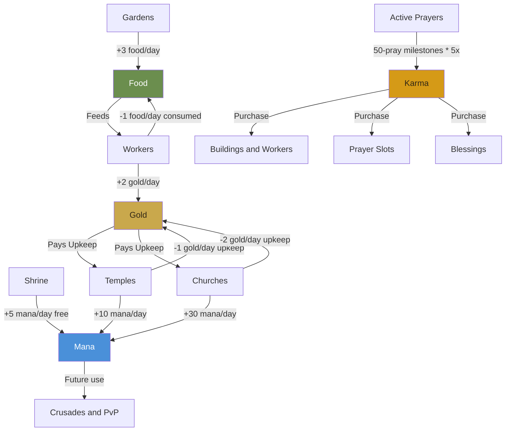
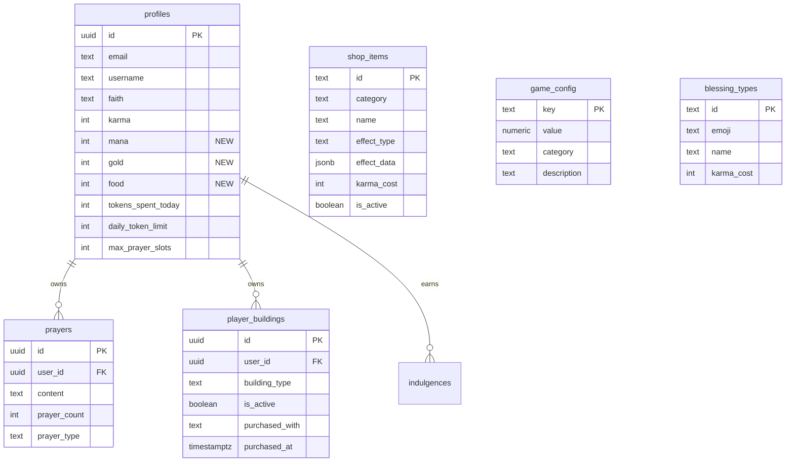
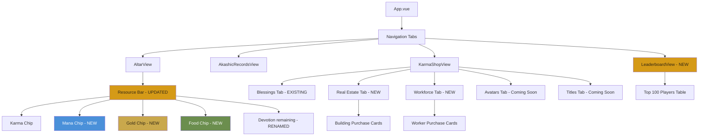

# THE GREAT SCHISM - Theological PBBG Pivot Plan

**Project:** Electric Monk  
**Date:** 2026-05-17  
**Status:** APPROVED - Ready for Implementation  

---

## 0. Finalized Design Decisions

1. **Prayer budget renamed to Devotion** - The existing `daily_token_limit` / `tokens_spent_today` columns stay in DB but UI labels change from "Mana" to "Devotion". Building-generated resource is "Mana".
2. **Mana has a configurable cap** - Default cap is 10x daily generation rate. The `v_mana_cap_multiplier` variable in the cron function makes it easy to tweak without schema changes.
3. **All users start with a Shrine, Garden, and Worker** - New signups get all three via trigger. Existing users get them via migration backfill. It is impossible to have zero buildings.
4. **Church upgrade is FIFO** - Upgrades the oldest Temple automatically. Simple and fair.
5. **Leaderboard uses manual refresh** - No real-time subscriptions to control Supabase costs.
6. **Four-resource economy** - Food, Gold, Karma, Mana with production chains and upkeep.
7. **All game balance values centralized** - `game_config` table holds every tweakable number. Change a row, rebalance the game. No code changes needed.

---

## 1. Economy Architecture

### 1.1 Four-Resource System

```yaml
resources:
  karma:
    type: premium_passive
    source: active_prayers
    generation: milestone_based  # every 50 prays = 1 milestone * 5x multiplier
    storage: profiles.karma
    cap: none
    usage:
      - purchase_shop_items
      - purchase_blessings
      - future_pvp_stakes

  mana:
    type: accumulated_action
    source: buildings  # shrine, temple, church
    generation: cron_heartbeat_per_minute
    storage: profiles.mana
    cap: total_daily_mana * mana_cap_multiplier  # default 10x
    cap_configurable: true
    usage:
      - future_crusades
      - future_pvp_actions

  gold:
    type: intermediate_currency
    source: workers  # workers produce gold per tick
    generation: cron_heartbeat_per_minute
    storage: profiles.gold
    cap: total_daily_gold * gold_cap_multiplier  # default 10x
    cap_configurable: true
    usage:
      - pay_building_upkeep  # temples and churches cost gold per day
      - future_shop_purchases

  food:
    type: sustaining_resource
    source: gardens  # gardens produce food per tick
    generation: cron_heartbeat_per_minute
    storage: profiles.food
    cap: total_daily_food * food_cap_multiplier  # default 10x
    cap_configurable: true
    usage:
      - feed_workers  # workers consume food per tick
```

### 1.2 Production Chain Diagram



### 1.3 Starting Assets

Every new player receives:
- **1 Shrine** - Free mana generation, no upkeep
- **1 Garden** - Produces food to sustain workers
- **1 Worker** - Produces gold, consumes food

Starting daily economy: +5 mana, +3 food, -1 food (worker), +2 gold = **net: +5 mana, +2 food, +2 gold**

### 1.4 Building Definitions

All production rates and upkeep costs are stored in `game_config`, NOT hardcoded. Change a config row to rebalance.

```yaml
building_stats:  # ALL of these values come from game_config table
  shrine:
    mana_per_day: 5
    gold_per_day: 0
    food_per_day: 0
    gold_upkeep_per_day: 0
    food_consumption_per_day: 0
    description: A humble place of worship. Every soul begins here.

  garden:
    mana_per_day: 0
    gold_per_day: 0
    food_per_day: 3
    gold_upkeep_per_day: 0
    food_consumption_per_day: 0
    description: A small garden that produces food to sustain your workers.

  worker:
    mana_per_day: 0
    gold_per_day: 2
    food_per_day: 0
    gold_upkeep_per_day: 0
    food_consumption_per_day: 1
    description: A devoted worker who generates gold but consumes food.

  temple:
    mana_per_day: 10
    gold_per_day: 0
    food_per_day: 0
    gold_upkeep_per_day: 1
    food_consumption_per_day: 0
    description: A proper temple generating mana, but requires gold upkeep.

  church:
    mana_per_day: 30
    gold_per_day: 0
    food_per_day: 0
    gold_upkeep_per_day: 2
    food_consumption_per_day: 0
    description: An elevated temple producing triple mana, with higher gold upkeep.
```

### 1.5 Initial Shop Catalog

```yaml
shop_items:
  # -- REAL ESTATE --
  garden_2:
    id: garden-2
    category: real_estate
    name: Second Garden
    description: Grow more food to sustain additional workers.
    emoji_icon: garden
    karma_cost: 200
    effect_type: add_building
    effect_data:
      building_type: garden
    sort_order: 1
    is_active: true

  garden_3:
    id: garden-3
    category: real_estate
    name: Third Garden
    description: A thriving agricultural operation.
    emoji_icon: garden
    karma_cost: 600
    effect_type: add_building
    effect_data:
      building_type: garden
    sort_order: 2
    is_active: true

  garden_4:
    id: garden-4
    category: real_estate
    name: Fourth Garden
    description: Food security for a growing congregation.
    emoji_icon: garden
    karma_cost: 1800
    effect_type: add_building
    effect_data:
      building_type: garden
    sort_order: 3
    is_active: true

  temple_1:
    id: temple-1
    category: real_estate
    name: Temple
    description: A proper temple generating mana. Requires gold upkeep.
    emoji_icon: temple
    karma_cost: 500
    effect_type: add_building
    effect_data:
      building_type: temple
    sort_order: 4
    is_active: true

  temple_2:
    id: temple-2
    category: real_estate
    name: Second Temple
    description: Expand your spiritual dominion with another temple.
    emoji_icon: temple
    karma_cost: 1500
    effect_type: add_building
    effect_data:
      building_type: temple
    sort_order: 5
    is_active: true

  temple_3:
    id: temple-3
    category: real_estate
    name: Third Temple
    description: A sprawling estate of devotion.
    emoji_icon: temple
    karma_cost: 4000
    effect_type: add_building
    effect_data:
      building_type: temple
    sort_order: 6
    is_active: true

  church_upgrade:
    id: church-upgrade
    category: real_estate
    name: Upgrade to Church
    description: Elevate a Temple into a Church for triple mana output.
    emoji_icon: church
    karma_cost: 2000
    effect_type: upgrade_building
    effect_data:
      from_type: temple
      to_type: church
    sort_order: 7
    is_active: true
    requires_building: temple

  # -- WORKFORCE --
  worker_2:
    id: worker-2
    category: workforce
    name: Second Worker
    description: Another devoted worker generating gold. Consumes food.
    emoji_icon: worker
    karma_cost: 300
    effect_type: add_building
    effect_data:
      building_type: worker
    sort_order: 10
    is_active: true

  worker_3:
    id: worker-3
    category: workforce
    name: Third Worker
    description: A growing labor force for your congregation.
    emoji_icon: worker
    karma_cost: 900
    effect_type: add_building
    effect_data:
      building_type: worker
    sort_order: 11
    is_active: true

  worker_4:
    id: worker-4
    category: workforce
    name: Fourth Worker
    description: A small army of devoted workers.
    emoji_icon: worker
    karma_cost: 2700
    effect_type: add_building
    effect_data:
      building_type: worker
    sort_order: 12
    is_active: true

  # -- INFRASTRUCTURE --
  prayer_slot_2:
    id: prayer-slot-2
    category: infrastructure
    name: Second Prayer Slot
    description: Pray two prayers simultaneously.
    emoji_icon: prayer-slot
    karma_cost: 100
    effect_type: add_prayer_slot
    effect_data:
      slots_to_add: 1
      daily_devotion_bonus: 100
    sort_order: 20
    is_active: true

  prayer_slot_3:
    id: prayer-slot-3
    category: infrastructure
    name: Third Prayer Slot
    description: The truly devoted can pray three prayers at once.
    emoji_icon: prayer-slot
    karma_cost: 300
    effect_type: add_prayer_slot
    effect_data:
      slots_to_add: 1
      daily_devotion_bonus: 100
    sort_order: 21
    is_active: true

  prayer_slot_4:
    id: prayer-slot-4
    category: infrastructure
    name: Fourth Prayer Slot
    description: Four simultaneous prayers. A holy multitasker.
    emoji_icon: prayer-slot
    karma_cost: 800
    effect_type: add_prayer_slot
    effect_data:
      slots_to_add: 1
      daily_devotion_bonus: 100
    sort_order: 22
    is_active: true

  prayer_slot_5:
    id: prayer-slot-5
    category: infrastructure
    name: Fifth Prayer Slot
    description: Five prayers at once. Divine concurrency.
    emoji_icon: prayer-slot
    karma_cost: 2000
    effect_type: add_prayer_slot
    effect_data:
      slots_to_add: 1
      daily_devotion_bonus: 100
    sort_order: 23
    is_active: true
```

---

## 2. Database Schema Changes

### 2.1 New Tables

```yaml
game_config:
  description: >
    Central configuration for ALL tweakable game balance values.
    Change a row here to rebalance the game. No code changes needed.
    The cron function and purchase RPCs read from this table.
  columns:
    key:
      type: TEXT
      primary_key: true
      description: "Dot-notation key e.g. building.temple.mana_per_day"
    value:
      type: NUMERIC
      nullable: false
      description: The numeric value for this config key
    description:
      type: TEXT
      description: Human-readable explanation of what this value controls
    category:
      type: TEXT
      description: Grouping for admin UI - production, upkeep, caps, costs
    updated_at:
      type: TIMESTAMPTZ
      default: now
  examples:
    - key: building.shrine.mana_per_day, value: 5, category: production
    - key: building.garden.food_per_day, value: 3, category: production
    - key: building.worker.gold_per_day, value: 2, category: production
    - key: building.worker.food_consumption_per_day, value: 1, category: upkeep
    - key: building.temple.mana_per_day, value: 10, category: production
    - key: building.temple.gold_upkeep_per_day, value: 1, category: upkeep
    - key: cap.mana_multiplier, value: 10, category: caps
    - key: cap.gold_multiplier, value: 10, category: caps
    - key: cap.food_multiplier, value: 10, category: caps

shop_items:
  description: Server-authoritative catalog of all purchasable items
  columns:
    id:
      type: TEXT
      primary_key: true
    category:
      type: TEXT
      nullable: false
      description: real_estate, workforce, infrastructure, avatars, titles
    name:
      type: TEXT
      nullable: false
    description:
      type: TEXT
    emoji_icon:
      type: TEXT
      description: Text key for icon rendering, NOT an emoji character
    karma_cost:
      type: INTEGER
      nullable: false
      default: 0
    effect_type:
      type: TEXT
      nullable: false
      description: add_building, upgrade_building, add_prayer_slot, unlock_avatar, unlock_title
    effect_data:
      type: JSONB
      nullable: false
      default: "'{}'::jsonb"
      description: Flexible payload for effect-specific parameters
    purchase_limit:
      type: INTEGER
      nullable: true
      description: Max times a single user can purchase this item, null = unlimited
    requires_building:
      type: TEXT
      nullable: true
      description: Building type required before purchase is allowed
    sort_order:
      type: INTEGER
      default: 0
    is_active:
      type: BOOLEAN
      default: true
    created_at:
      type: TIMESTAMPTZ
      default: now

player_buildings:
  description: Tracks building ownership per player. Production rates come from game_config.
  columns:
    id:
      type: UUID
      primary_key: true
      default: gen_random_uuid
    user_id:
      type: UUID
      references: profiles.id ON DELETE CASCADE
      nullable: false
    building_type:
      type: TEXT
      nullable: false
      description: shrine, garden, worker, temple, church
    is_active:
      type: BOOLEAN
      default: true
      description: Inactive buildings do not produce resources when upkeep is unmet
    purchased_with:
      type: TEXT
      nullable: true
      description: shop_items.id that was purchased to create this building, or starting-X for freebies
    purchased_at:
      type: TIMESTAMPTZ
      default: now
  indexes:
    - idx_player_buildings_user: user_id
    - idx_player_buildings_user_type: user_id, building_type
```

### 2.2 Altered Tables

```yaml
profiles_alterations:
  add_columns:
    mana:
      type: INTEGER
      default: 0
      nullable: false
      description: Accumulated mana resource from buildings
    gold:
      type: INTEGER
      default: 0
      nullable: false
      description: Accumulated gold from workers
    food:
      type: INTEGER
      default: 0
      nullable: false
      description: Accumulated food from gardens
```

### 2.3 Entity Relationship Diagram



---

## 3. SQL Migration Script

File: `supabase/migrations/theological-pbbg-pivot.sql`

The migration will:

1. **Create `game_config` table** - central tweakable values
2. **Seed `game_config`** with all default balance values
3. **Create `shop_items` table** with RLS
4. **Create `player_buildings` table** with RLS
5. **Add `mana`, `gold`, `food` columns to `profiles`**
6. **Seed `shop_items`** with the initial catalog
7. **Create `purchase_shop_item()` RPC** - atomic purchase
8. **Create `get_leaderboard()` RPC** - top 100 players
9. **Create `get_player_economy()` RPC** - returns player resources + building summary
10. **Modify `calculate_automated_karma()`** - add resource generation + upkeep logic
11. **Modify `create_profile_on_signup()` trigger** - grant Shrine + Garden + Worker
12. **Backfill existing users** with starting buildings
13. **Grant permissions** for all new RPCs

### 3.1 Key RPC: `purchase_shop_item`

Same as before but effect_data no longer contains production numbers (those come from game_config).

### 3.2 Key RPC: `calculate_automated_karma` Modification

The cron function now handles ALL resource generation and upkeep:

```sql
-- Resource generation loop (runs every minute)
DECLARE
    v_mana_cap_multiplier NUMERIC;
    v_gold_cap_multiplier NUMERIC;
    v_food_cap_multiplier NUMERIC;
    v_mana_per_tick INT;
    v_gold_per_tick INT;
    v_food_per_tick INT;
    v_mana_upkeep_tick INT;
    v_gold_upkeep_tick INT;
    v_food_consume_tick INT;
    v_mana_cap INT;
    v_gold_cap INT;
    v_food_cap INT;
    v_total_mana_rate INT;
    v_total_gold_rate INT;
    v_total_food_rate INT;
BEGIN
    -- Load configurable multipliers from game_config
    SELECT value INTO v_mana_cap_multiplier FROM game_config WHERE key = 'cap.mana_multiplier';
    SELECT value INTO v_gold_cap_multiplier FROM game_config WHERE key = 'cap.gold_multiplier';
    SELECT value INTO v_food_cap_multiplier FROM game_config WHERE key = 'cap.food_multiplier';

    -- Per-player resource calculation
    FOR r IN
        SELECT pb.user_id,
               SUM(COALESCE(gc_mana.value, 0))::INT AS total_mana_per_day,
               SUM(COALESCE(gc_gold.value, 0))::INT AS total_gold_per_day,
               SUM(COALESCE(gc_food.value, 0))::INT AS total_food_per_day,
               SUM(COALESCE(gc_gold_upkeep.value, 0))::INT AS total_gold_upkeep_per_day,
               SUM(COALESCE(gc_food_consume.value, 0))::INT AS total_food_consumption_per_day
        FROM player_buildings pb
        LEFT JOIN game_config gc_mana 
            ON gc_mana.key = 'building.' || pb.building_type || '.mana_per_day'
        LEFT JOIN game_config gc_gold 
            ON gc_gold.key = 'building.' || pb.building_type || '.gold_per_day'
        LEFT JOIN game_config gc_food 
            ON gc_food.key = 'building.' || pb.building_type || '.food_per_day'
        LEFT JOIN game_config gc_gold_upkeep 
            ON gc_gold_upkeep.key = 'building.' || pb.building_type || '.gold_upkeep_per_day'
        LEFT JOIN game_config gc_food_consume 
            ON gc_food_consume.key = 'building.' || pb.building_type || '.food_consumption_per_day'
        WHERE pb.is_active = true
        GROUP BY pb.user_id
    LOOP
        -- Calculate per-tick amounts (1440 minutes per day)
        v_mana_per_tick := GREATEST(0, FLOOR(r.total_mana_per_day::FLOAT / 1440));
        v_gold_per_tick := GREATEST(0, FLOOR(r.total_gold_per_day::FLOAT / 1440));
        v_food_per_tick := GREATEST(0, FLOOR(r.total_food_per_day::FLOAT / 1440));
        v_gold_upkeep_tick := GREATEST(0, FLOOR(r.total_gold_upkeep_per_day::FLOAT / 1440));
        v_food_consume_tick := GREATEST(0, FLOOR(r.total_food_consumption_per_day::FLOAT / 1440));

        -- Apply caps
        v_mana_cap := FLOOR(r.total_mana_per_day * v_mana_cap_multiplier);
        v_gold_cap := FLOOR(r.total_gold_per_day * v_gold_cap_multiplier);
        v_food_cap := FLOOR(r.total_food_per_day * v_food_cap_multiplier);

        -- Net resource calculation with floor at 0
        -- Gold: production minus upkeep, cannot go below 0
        -- Food: production minus consumption, cannot go below 0
        -- Mana: pure production, capped
        UPDATE profiles SET
            mana = LEAST(mana + v_mana_per_tick, v_mana_cap),
            gold = GREATEST(0, gold + v_gold_per_tick - v_gold_upkeep_tick),
            food = GREATEST(0, food + v_food_per_tick - v_food_consume_tick),
            updated_at = now()
        WHERE id = r.user_id;
    END LOOP;
END;
```

### 3.3 Signup Trigger Modification

```sql
CREATE OR REPLACE FUNCTION public.create_profile_on_signup()
RETURNS TRIGGER AS $$
BEGIN
    INSERT INTO public.profiles (id, email)
    VALUES (NEW.id, NEW.email)
    ON CONFLICT (id) DO NOTHING;

    -- Grant starting buildings
    INSERT INTO public.player_buildings (user_id, building_type, is_active, purchased_with) VALUES
        (NEW.id, 'shrine', true, 'starting-shrine'),
        (NEW.id, 'garden', true, 'starting-garden'),
        (NEW.id, 'worker', true, 'starting-worker');

    RETURN NEW;
END;
$$ LANGUAGE plpgsql SECURITY DEFINER;
```

### 3.4 Backfill Existing Users

```sql
-- Grant starting buildings to any existing user who lacks them
INSERT INTO player_buildings (user_id, building_type, is_active, purchased_with)
SELECT p.id, 'shrine', true, 'starting-shrine'
FROM profiles p
WHERE NOT EXISTS (SELECT 1 FROM player_buildings pb WHERE pb.user_id = p.id AND pb.building_type = 'shrine');

INSERT INTO player_buildings (user_id, building_type, is_active, purchased_with)
SELECT p.id, 'garden', true, 'starting-garden'
FROM profiles p
WHERE NOT EXISTS (SELECT 1 FROM player_buildings pb WHERE pb.user_id = p.id AND pb.building_type = 'garden');

INSERT INTO player_buildings (user_id, building_type, is_active, purchased_with)
SELECT p.id, 'worker', true, 'starting-worker'
FROM profiles p
WHERE NOT EXISTS (SELECT 1 FROM player_buildings pb WHERE pb.user_id = p.id AND pb.building_type = 'worker');
```

---

## 4. Frontend Component Architecture

### 4.1 New/Modified Files Overview

```yaml
new_files:
  - src/composables/useShop.js         # Shop state, item fetching, purchase flow
  - src/composables/useLeaderboard.js   # Leaderboard data fetching
  - src/composables/useEconomy.js       # Economy state, resource tracking, building data
  - src/views/LeaderboardView.vue      # Divine Rankings page

modified_files:
  - src/App.vue                        # Add Leaderboard nav tab
  - src/views/KarmaShopView.vue         # Add Real Estate + Workforce tabs, Coming Soon tabs
  - src/views/AltarView.vue             # Add resource bar, rename Mana -> Devotion
  - src/composables/usePrayers.js       # Add mana/gold/food to fetchProfile, rename labels
  - supabase/migrations/theological-pbbg-pivot.sql  # New migration
```

### 4.2 Component Hierarchy Diagram



### 4.3 Composable: `useEconomy.js`

New composable for the 4-resource economy:

```javascript
// Key state and methods:
// - mana: ref(0)              // accumulated mana from buildings
// - gold: ref(0)              // accumulated gold from workers
// - food: ref(0)              // accumulated food from gardens
// - buildings: ref([])         // player's buildings
// - buildingStats: ref({})    // production rates from game_config
// - totalProduction: computed  // aggregated daily rates
// - fetchEconomy()            -> loads profile resources + buildings + config
// - fetchBuildings()           -> reads from player_buildings table
// - fetchBuildingStats()       -> reads from game_config table
```

### 4.4 Composable: `useShop.js`

```javascript
// Key state and methods:
// - shopItems: ref([])         // all items from shop_items table
// - playerBuildings: ref([])   // buildings owned by current user
// - activeCategory: ref('real_estate')
// - purchaseItem(itemId)       -> calls purchase_shop_item RPC
// - fetchShopItems()           -> reads from shop_items table
// - fetchPlayerBuildings()     -> reads from player_buildings table
// - canPurchase(item)          -> computed check against karma and limits
// - computed: buildingsByCategory -> groups items by category
```

### 4.5 Composable: `useLeaderboard.js`

```javascript
// Key state and methods:
// - rankings: ref([])           // top 100 players
// - loading: ref(false)
// - error: ref(null)
// - fetchLeaderboard()          -> calls get_leaderboard RPC
// - userRank: computed          -> current user position if in top 100
```

### 4.6 KarmaShopView.vue Overhaul

Tab structure (in order):
1. **Real Estate** (default active) - Gardens, Temples, Church Upgrade
2. **Workforce** - Workers
3. **Blessings** (existing)
4. **Infrastructure** - Prayer Slots
5. **Avatars** (greyed out, "Coming Soon")
6. **Titles** (greyed out, "Coming Soon")

Each purchase card shows:
- Name, description, emoji icon
- Karma cost
- Production rates (pulled from game_config)
- Upkeep costs (if any)
- Buy button or "Owned" / "Max Reached" state

### 4.7 LeaderboardView.vue

New view for "Divine Rankings":
- Header with warm ivory/gold parchment styling
- Table/cards showing top 100 players sorted by karma primary, mana secondary
- Columns: Rank, Username, Faith, Karma, Mana, Gold
- Current user highlighted if in top 100
- Manual refresh button

### 4.8 AltarView Resource Bar Update

The header chip bar changes from:

```
[Karma: 150] [1/3 slots] [65 Devotion remaining]
```

To:

```
[Karma: 150] [Mana: 47] [Gold: 23] [Food: 31] [1/3 slots] [65 Devotion remaining]
```

Each resource chip uses the existing `chip` class with appropriate color theming:
- Karma: gold accent (existing)
- Mana: blue accent
- Gold: warm gold accent
- Food: green accent

---

## 5. Game Config Centralization

### 5.1 All Tweakable Values

Every number that affects game balance lives in `game_config`. To rebalance, just run:

```sql
UPDATE game_config SET value = 15 WHERE key = 'building.temple.mana_per_day';
```

No code changes, no deployments needed.

```yaml
game_config_seed_data:
  # -- Building Production Rates --
  building.shrine.mana_per_day: 5
  building.garden.food_per_day: 3
  building.worker.gold_per_day: 2
  building.temple.mana_per_day: 10
  building.church.mana_per_day: 30

  # -- Building Upkeep Costs --
  building.shrine.gold_upkeep_per_day: 0
  building.shrine.food_consumption_per_day: 0
  building.garden.gold_upkeep_per_day: 0
  building.garden.food_consumption_per_day: 0
  building.worker.gold_upkeep_per_day: 0
  building.worker.food_consumption_per_day: 1
  building.temple.gold_upkeep_per_day: 1
  building.temple.food_consumption_per_day: 0
  building.church.gold_upkeep_per_day: 2
  building.church.food_consumption_per_day: 0

  # -- Resource Caps (multiplier of daily production) --
  cap.mana_multiplier: 10
  cap.gold_multiplier: 10
  cap.food_multiplier: 10

  # -- Karma Milestone Settings --
  karma.milestone_threshold: 50
  karma.milestone_payout: 5
  karma.altruistic_multiplier: 2
```

---

## 6. Styling Consistency

All new components reuse existing Tailwind theme tokens:

```yaml
theme_tokens_to_reuse:
  backgrounds:
    - bg-theme-wash
    - bg-theme-panel
    - glass-panel, glass-panel-soft, glass-gloss
  text:
    - text-theme-text, text-theme-text-dim, text-theme-text-muted
    - text-theme-accent, text-theme-accent-dark
  borders:
    - border-theme-border, border-theme-border-strong
  buttons:
    - pill-tab, pill-tab-active, pill-tab-inactive
    - segmented-shell
    - btn-secondary, btn-ghost
    - tactile-icon-btn
  headings:
    - ritual-heading
  chips:
    - chip class

new_resource_colors:
  mana: text-blue-500 / bg-blue-50
  gold: text-amber-600 / bg-amber-50
  food: text-emerald-600 / bg-emerald-50
```

---

## 7. Anti-Cheat Considerations

1. **Shop items are server-authoritative** - costs and effects defined in `shop_items` table
2. **Production rates are server-authoritative** - all rates come from `game_config` table
3. **All purchases go through `purchase_shop_item()` RPC** - atomic validation and deduction
4. **All resource generation happens server-side** in the cron heartbeat
5. **RLS policies** prevent direct INSERT/UPDATE on `player_buildings` or `game_config` by authenticated users
6. **Frontend only reads** data; all mutations are RPC calls
7. **game_config is read-only** for authenticated users (only service_role can modify)

---

## 8. Migration Safety

- All `ALTER TABLE` statements use `ADD COLUMN IF NOT EXISTS`
- All `CREATE TABLE` statements use `IF NOT EXISTS`
- The `calculate_automated_karma()` function is replaced with `CREATE OR REPLACE`
- The `create_profile_on_signup()` trigger is replaced with `CREATE OR REPLACE`
- Existing data is preserved; `mana`, `gold`, `food` all default to 0
- Existing profiles get starting buildings via migration backfill
- The seed data for `shop_items` and `game_config` uses `ON CONFLICT DO UPDATE` for idempotency
- No existing columns are renamed or removed (the Devotion rename is UI-only)

---

## 9. Implementation Order

1. **SQL Migration** - `supabase/migrations/theological-pbbg-pivot.sql`
2. **`useEconomy.js` composable** - resource tracking, building stats, economy state
3. **`useShop.js` composable** - shop item fetching, building state, purchase flow
4. **`useLeaderboard.js` composable** - leaderboard query
5. **`usePrayers.js` update** - add mana/gold/food to fetchProfile, rename Mana->Devotion in UI
6. **`KarmaShopView.vue` overhaul** - Real Estate, Workforce, Infrastructure tabs, Coming Soon tabs
7. **`AltarView.vue` update** - resource bar with 4 resources, rename labels
8. **`LeaderboardView.vue`** - new Divine Rankings page
9. **`App.vue` update** - add Rankings nav tab, import LeaderboardView
10. **Testing** - verify purchase flow, resource generation, upkeep, leaderboard queries

---

## 10. Resolved Design Decisions

1. **Prayer budget renamed to Devotion** - The daily prayer budget (`daily_token_limit` / `tokens_spent_today`) is now labeled "Devotion" in all UI. DB columns unchanged. Building-generated resource keeps "Mana".
2. **Mana has a configurable cap** - Default cap is 10x daily generation rate. The `cap.mana_multiplier` key in `game_config` makes it easy to tweak.
3. **All users start with Shrine + Garden + Worker** - New signups get all three via trigger. Existing users get them via migration backfill.
4. **Church upgrade is FIFO** - Upgrades the oldest Temple automatically.
5. **Leaderboard uses manual refresh** - No real-time subscriptions to control Supabase costs.
6. **Four-resource economy** - Food, Gold, Karma, Mana with production chains and upkeep.
7. **All game balance values centralized** - `game_config` table holds every tweakable number. Change a row, rebalance the game. No code changes needed.