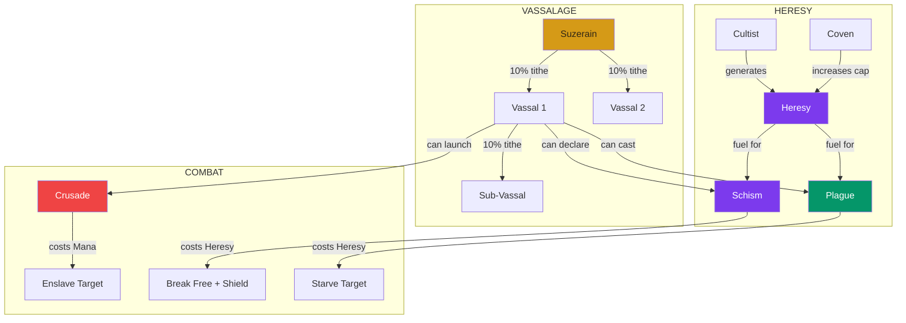
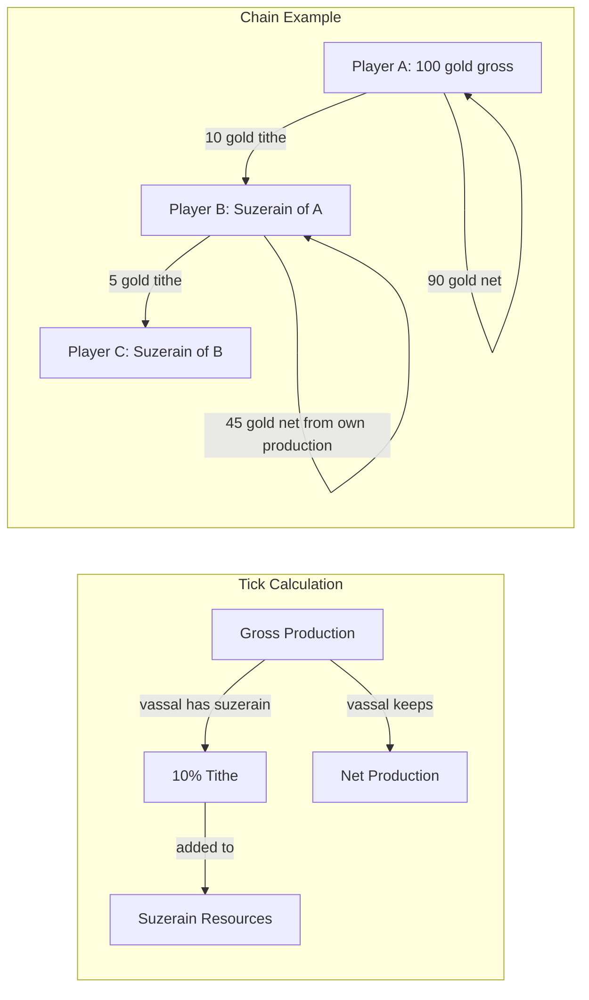

# VASSALAGE & HERESY - ML-MMO of the Soul

**Project:** Electric Monk  
**Date:** 2026-05-17  
**Status:** PLANNING - Awaiting Approval  

---

## 0. Architecture Overview

This expansion adds three interconnected systems to Electric Monk:

1. **Vassalage** - A pyramid-shaped hierarchy where Suzerains extract 10% tithes from Vassals' gross resource generation
2. **Heresy / Catacombs** - A shadow economy with new Heresy resource, Cultist workers, and Coven infrastructure
3. **Asymmetric Combat** - Crusade (conquest), Schism (rebellion), and Plague (sabotage) RPCs with Akashic logging



---

## 1. Database Schema Changes

### 1.1 New Columns on `profiles`

```yaml
profiles_additions:
  suzerain_id:
    type: UUID
    nullable: true
    references: profiles.id
    on_delete: SET NULL
    description: >-
      If not null, this player is a Vassal of the referenced Suzerain.
      Setting to null means the player is free.

  heresy:
    type: INTEGER
    default: 0
    description: Shadow currency for the Catacombs economy

  schism_count:
    type: INTEGER
    default: 0
    description: >-
      Number of times this player has declared schism.
      Used for exponential cost scaling.

  divine_shield_until:
    type: TIMESTAMPTZ
    nullable: true
    description: >-
      If not null and in the future, this player cannot be crusaded.
      Set for 24 hours after a successful Schism.
```

### 1.2 New Table: `akashic_logs`

```yaml
akashic_logs:
  columns:
    id:
      type: UUID
      default: gen_random_uuid
      primary_key: true
    target_id:
      type: UUID
      references: profiles.id
      on_delete: CASCADE
      nullable: false
      description: The player who was the target of the action
    actor_id:
      type: UUID
      references: profiles.id
      on_delete: SET NULL
      nullable: true
      description: >-
        The player who initiated the action. NULL for anonymous actions like Plague.
    action_type:
      type: TEXT
      nullable: false
      description: One of crusade, schism, or plague
    result_data:
      type: JSONB
      default: "'{}'::jsonb"
      description: >-
        Arbitrary result data. Includes attack_power, defense_power,
        winner, heresy_cost, food_destroyed, etc.
    created_at:
      type: TIMESTAMPTZ
      default: now
  indexes:
    - idx_akashic_target: target_id
    - idx_akashic_actor: actor_id
    - idx_akashic_action_type: action_type
    - idx_akashic_created_at: created_at DESC
  rls_policies:
    - name: Akashic logs are publicly readable
      command: FOR SELECT USING - true
    - name: Only service_role can insert
      command: FOR INSERT WITH CHECK - auth.role = service_role_string
```

### 1.3 New `shop_items` Entries - Catacombs Category

```yaml
catacombs_shop_items:
  cultist:
    id: cultist
    category: catacombs
    name: Cultist
    description: A shadow disciple who generates Heresy. Consumes Food like any worker.
    emoji_icon: "\U0001F9DE"
    karma_cost: 0
    gold_cost: 50
    heresy_cost: 0
    effect_type: add_building
    effect_data:
      building_type: cultist
    purchase_limit: null
    requires_building: null
    sort_order: 41
    is_active: true
    cost_scaling: true

  coven:
    id: coven
    category: catacombs
    name: Coven
    description: A hidden gathering place that increases your Heresy capacity. Requires gold upkeep.
    emoji_icon: "\U0001F52E"
    karma_cost: 0
    gold_cost: 200
    heresy_cost: 0
    effect_type: add_building
    effect_data:
      building_type: coven
    purchase_limit: null
    requires_building: cultist
    sort_order: 42
    is_active: true
    cost_scaling: true
```

### 1.4 New `game_config` Entries

```yaml
game_config_additions:
  heresy:
    - key: building.cultist.heresy_per_day
      value: 3
      description: Heresy generated per day by a Cultist
      category: production

    - key: building.cultist.food_consumption_per_day
      value: 2
      description: Food consumed per day by a Cultist
      category: upkeep

    - key: building.coven.heresy_cap_bonus
      value: 50
      description: Additional heresy capacity per Coven owned
      category: caps

    - key: building.coven.gold_upkeep_per_day
      value: 3
      description: Gold upkeep per day for a Coven
      category: upkeep

    - key: cap.heresy_base
      value: 100
      description: Base heresy capacity before Coven bonuses
      category: caps

  vassalage:
    - key: tithe.percentage
      value: 0.10
      description: Fraction of gross production taken as tithe by suzerain
      category: vassalage

  combat:
    - key: crusade.mana_cost
      value: 50
      description: Mana cost to launch a crusade
      category: combat

    - key: crusade.attack_rating_per_cleric
      value: 10
      description: Attack power contributed per Cleric building
      category: combat

    - key: crusade.defense_rating_per_church
      value: 15
      description: Defense power contributed per Church building
      category: combat

    - key: crusade.defense_rating_per_cathedral
      value: 40
      description: Defense power contributed per Cathedral building
      category: combat

    - key: schism.base_cost
      value: 100
      description: Base heresy cost to declare schism
      category: combat

    - key: schism.scaling_factor
      value: 2.0
      description: Cost multiplier per previous schism - cost = base * factor^count
      category: combat

    - key: schism.shield_duration_hours
      value: 24
      description: Hours of Divine Shield granted after successful schism
      category: combat

    - key: plague.heresy_cost
      value: 75
      description: Heresy cost to cast a plague
      category: combat
```

---

## 2. Modified Cron Function: Tithe Math

### 2.1 Tithe Flow Diagram



### 2.2 Tithe Rules

1. **Gross = total production before any deductions** - tithe is calculated on gross, not net
2. **Tithe is NOT recursively tithed** - the 10 gold B receives from A is NOT further tithed to C. Only B's own gross production is tithed.
3. **Tithe applies to Mana, Gold, and Food** - all three resources are subject to the 10% siphon
4. **Karma is NOT tithed** - karma comes from prayer milestones, not building production
5. **Heresy is NOT tithed** - shadow economy is invisible to the suzerain

### 2.3 Deadlock-Safe Implementation Strategy

The current cron uses a row-by-row loop. To add tithes safely:

1. **Phase 1**: Calculate all per-player gross production into a CTE
2. **Phase 2**: Calculate tithe amounts - who owes what to whom
3. **Phase 3**: Aggregate tithes received per suzerain
4. **Phase 4**: Single UPDATE statement applying net production + received tithes to all profiles at once

This avoids the deadlock risk of updating a suzerain row while still iterating through vassals.

---

## 3. RPC Functions

### 3.1 `launch_crusade(target_id UUID)`

```yaml
launch_crusade:
  description: >-
    Attack another player to make them your Vassal. Costs Mana.
    Rolls attacker power vs defender power. If attacker wins,
    target's suzerain_id is set to attacker.
  caller: auth.uid - the attacker
  parameters:
    target_id: UUID of the player to attack
  validation:
    - target_id cannot be the caller
    - target must not have an active divine_shield_until
    - caller must have >= crusade.mana_cost mana
    - target must not already be a vassal of the caller
    - target must not be in the callers upstream chain - no circular vassalage
  combat_math:
    attack_power: >-
      callers current mana + count of cleric buildings * crusade.attack_rating_per_cleric
    defense_power: >-
      count of church buildings * crusade.defense_rating_per_church +
      count of cathedral buildings * crusade.defense_rating_per_cathedral
    roll: >-
      Each side gets random(0.7, 1.3) multiplier.
      If attack_power * attack_roll > defense_power * defense_roll, attacker wins.
  on_success:
    - Deduct crusade.mana_cost from attacker mana
    - Set targets suzerain_id to attacker id
    - Log to akashic_logs with action_type = crusade, result_data = winner + power values
  on_failure:
    - Deduct crusade.mana_cost from attacker mana - still costs mana even on failure
    - Log to akashic_logs with action_type = crusade, result_data = loser + power values
  returns: JSONB with success boolean, attack_power, defense_power, new_suzerain_id
```

### 3.2 `declare_schism()`

```yaml
declare_schism:
  description: >-
    Break free from your Suzerain. Costs exponentially scaling Heresy.
    On success, nullifies suzerain_id and grants 24h Divine Shield.
  caller: auth.uid - the vassal breaking free
  parameters: none
  validation:
    - caller must have a suzerain_id - must be a vassal
    - caller must have >= heresy cost
  cost_math:
    formula: base_cost * scaling_factor ^ schism_count
    example: 100 * 2^0 = 100, 100 * 2^1 = 200, 100 * 2^2 = 400
  on_success:
    - Deduct heresy cost from caller
    - Set callers suzerain_id to NULL
    - Increment callers schism_count by 1
    - Set callers divine_shield_until to now + interval of shield_duration_hours hours
    - Log to akashic_logs with action_type = schism
  returns: JSONB with success boolean, heresy_cost, shield_until
```

### 3.3 `cast_plague(target_id UUID)`

```yaml
cast_plague:
  description: >-
    Anonymous strike that zeroes out a targets Food storage.
    Costs Heresy. Bypasses all defenses. Actor is logged as NULL.
  caller: auth.uid - the plague caster
  parameters:
    target_id: UUID of the player to plague
  validation:
    - target_id cannot be the caller
    - caller must have >= plague.heresy_cost heresy
  on_success:
    - Deduct plague.heresy_cost from caller heresy
    - Set targets food to 0
    - Log to akashic_logs with actor_id = NULL, action_type = plague
  returns: JSONB with success boolean, food_destroyed
```

### 3.4 Modified: `get_player_economy()`

Add to the returned JSONB:
- `heresy` resource value
- `heresy_per_day` production rate
- `heresy_cap` current capacity
- `suzerain_id` and `suzerain_username`
- `divine_shield_until` timestamp
- `schism_count`
- `vassal_count` - number of direct vassals
- `daily_tithes_received` - estimated daily tithe income from vassals

### 3.5 Modified: `purchase_shop_item()`

Add multi-currency support:
- Check `gold_cost` column on shop_items - if > 0, verify and deduct gold
- Check `heresy_cost` column on shop_items - if > 0, verify and deduct heresy
- Karma cost remains as-is for backward compatibility
- A single item can cost a combination of currencies, e.g., 0 karma + 50 gold

### 3.6 New: `get_vassalage_info()`

```yaml
get_vassalage_info:
  description: >-
    Returns the callers vassalage information: suzerain details,
    list of direct vassals, and estimated daily tithes.
  returns: JSONB with:
    - suzerain: id, username, faith or null if free
    - vassals: array of direct vassals with id, username, estimated_daily_tithe
    - total_daily_tithes: sum of estimated tithes from all vassals
    - is_protected: boolean - whether divine shield is active
    - chain_depth: how deep in the vassalage chain 0 = free, 1 = vassal of a free player, etc.
```

### 3.7 New: `get_akashic_logs()`

```yaml
get_akashic_logs:
  description: >-
    Returns akashic log entries where the caller is either the actor or the target.
    Plague entries where the caller is the target are also included.
    Plague entries where the caller is the actor are NOT included - actor_id is NULL.
  parameters:
    p_limit: INT default 50
    p_offset: INT default 0
  returns: JSONB array of log entries with resolved usernames
```

---

## 4. Cron Function Rewrite: Phase-by-Phase

The rewritten `calculate_automated_karma()` will have these phases:

### Phase 1: Prayer Milestones - UNCHANGED
Existing karma milestone logic for active prayers.

### Phase 2: Resource Generation + Upkeep + Heresy + Tithes
Completely rewritten as a single set-based operation:

```yaml
phase_2_steps:
  step_1_cte_production: >-
    Calculate per-player gross production rates for mana, gold, food, heresy
    from active buildings joined with game_config values.
    Also calculate gold upkeep and food consumption per tick.

  step_2_cte_tithes: >-
    For each player with a suzerain_id, calculate 10% of their gross
    mana_per_tick, gold_per_tick, food_per_tick as tithe_amounts.
    Floor each to integer. These amounts are deducted from the vassal
    and credited to the suzerain.

  step_3_cte_tithe_aggregation: >-
    Aggregate all incoming tithes per suzerain_id.
    A suzerain may receive tithes from multiple vassals.
    Sum mana_tithe, gold_tithe, food_tithe per suzerain.

  step_4_cte_heresy_cap: >-
    Calculate heresy cap for each player:
    base_cap + count_of_covens * heresy_cap_bonus.

  step_5_update_profiles: >-
    Single UPDATE profiles SET statement joining with all CTEs.
    For each player:
    - mana = LEAST of mana + net_mana + received_mana_tithe, mana_cap
    - gold = GREATEST of 0, gold + net_gold + received_gold_tithe - gold_upkeep
    - food = GREATEST of 0, food + net_food + received_food_tithe - food_consume
    - heresy = LEAST of heresy + heresy_per_tick, heresy_cap
    Where net_X = gross_X - tithe_X for vassals, or gross_X for free players.
```

---

## 5. Frontend Components

### 5.1 `useVassalage.js` Composable

```yaml
useVassalage:
  state:
    suzerain: ref - object with id, username, faith or null
    vassals: ref - array of vassal objects
    totalDailyTithes: ref - estimated total daily tithe income
    isProtected: ref - boolean, divine shield active
    chainDepth: ref - integer, depth in vassalage chain
    loading: ref - boolean
    error: ref - string or null

  methods:
    fetchVassalageInfo: >-
      Calls get_vassalage_info RPC, populates all state.

    launchCrusade(targetUsername): >-
      Looks up target by username, then calls launch_crusade RPC.
      Returns result with success, attack_power, defense_power.

    declareSchism(): >-
      Calls declare_schism RPC.
      Returns result with success, heresy_cost, shield_until.

    castPlague(targetUsername): >-
      Looks up target by username, then calls cast_plague RPC.
      Returns result with success, food_destroyed.
```

### 5.2 `useCatacombs.js` Composable

```yaml
useCatacombs:
  state:
    heresy: ref - integer, current heresy
    heresyCap: ref - integer, max heresy storage
    heresyPerDay: ref - integer, daily heresy generation
    catacombsItems: ref - array, shop items in catacombs category
    loading: ref - boolean
    error: ref - string or null

  methods:
    fetchCatacombsData: >-
      Fetches heresy data from get_player_economy and
      catacombs shop items from shop_items table.

    purchaseCatacombsItem(itemId): >-
      Calls purchase_shop_item RPC for catacombs items.
      Items cost gold instead of karma.
      Refreshes economy state after purchase.
```

### 5.3 `VaticanView.vue`

```yaml
VaticanView:
  layout: >-
    Full-page view with a religious/imperial aesthetic.
    Gold and crimson accents. Shows hierarchy tree.

  sections:
    suzerain_display:
      condition: player has a suzerain
      content: >-
        You bow before [username] - [faith].
        Your tithe: 10% of daily production flows upward.
        Button: Declare Schism - shows heresy cost, disabled if not enough heresy.

    vassals_panel:
      condition: player has vassals
      content: >-
        Table of vassals showing username, daily production estimate,
        and estimated tithe amount. Total daily tithes received at bottom.

    free_status:
      condition: player has no suzerain and no vassals
      content: >-
        You are a free soul. Neither suzerain nor vassal.

    crusade_panel:
      content: >-
        Input field for target username.
        Shows estimated attack power based on your mana + clerics.
        Button: Launch Crusade - costs mana, shows confirmation.
        Warning: Divine Shield status of target shown if known.

    divine_shield_badge:
      condition: divine_shield_until is in the future
      content: >-
        Badge showing time remaining on Divine Shield.
        Cannot be crusaded while active.

    akashic_feed:
      content: >-
        Recent akashic log entries involving this player.
        Crusade attempts, schism declarations, plagues received.
```

### 5.4 `CatacombsView.vue`

```yaml
CatacombsView:
  layout: >-
    Dark-themed view. Deep purples, dark backgrounds, subtle glow effects.
    Hidden/tab accessible from main navigation.

  sections:
    heresy_display:
      content: >-
        Current Heresy / Heresy Cap.
        Heresy generation rate per day.
        Progress bar showing heresy as fraction of cap.

    cultist_shop:
      content: >-
        Cultist purchase card - shows cost in gold, production rate,
        food consumption, current owned count, scaled next cost.

    coven_shop:
      content: >-
        Coven purchase card - shows cost in gold, cap bonus,
        gold upkeep, current owned count, scaled next cost.

    plague_panel:
      condition: player has enough heresy
      content: >-
        Input for target username.
        Button: Cast Plague - costs heresy, anonymous, zeroes target food.
        Confirmation dialog with cost display.

    schism_panel:
      condition: player is a vassal - has suzerain_id
      content: >-
        Current schism cost based on exponential scaling.
        Button: Declare Schism - breaks vassalage, grants shield.
        Shows what freedom means: no more tithes.

    heresy_economy_summary:
      content: >-
        Net heresy per day after upkeep.
        Heresy cap with Coven breakdown.
```

### 5.5 Modified: `useEconomy.js`

Add to the shared state:
- `heresy` ref
- `heresyCap` computed
- `heresyPerDay` computed
- `suzerainId` ref
- `suzerainUsername` ref
- `divineShieldUntil` ref
- `schismCount` ref

Update `fetchEconomy()` to extract new fields from `get_player_economy` response.

### 5.6 Modified: `App.vue`

Add two new navigation tabs:
- Vatican tab - shows VaticanView
- Catacombs tab - shows CatacombsView

Navigation order: Altar, Akashic, Shop, Vatican, Catacombs, Rankings

---

## 6. Circular Vassalage Prevention

When launching a crusade, we must prevent circular chains:

```yaml
circular_check:
  description: >-
    Before setting target.suzerain_id = attacker.id, walk up the
    attackers chain of suzerains. If we encounter target.id at any
    point, the crusade must be rejected - it would create a cycle.
  implementation: >-
    WITH RECURSIVE chain AS (
      SELECT id, suzerain_id FROM profiles WHERE id = attacker_id
      UNION ALL
      SELECT p.id, p.suzerain_id FROM profiles p
      JOIN chain c ON p.id = c.suzerain_id
    )
    SELECT EXISTS - SELECT 1 FROM chain WHERE id = target_id
  result: >-
    If true, reject crusade with error -
    Cannot vassalize someone in your chain of command
```

---

## 7. Security Considerations

1. **All combat RPCs run as SECURITY DEFINER** - they check `auth.uid()` internally
2. **Plague actor_id is NULL in akashic_logs** - the RPC inserts with actor_id = auth.uid() but immediately sets it to NULL in the log, ensuring anonymity. The function internally knows who cast it for heresy deduction, but the log is anonymous.
3. **Divine Shield check** - both in the RPC and in any subsequent crusade attempts
4. **RLS on akashic_logs** - anyone can read, only service_role or SECURITY DEFINER functions can insert
5. **Heresy transactions** - all heresy deductions happen server-side in SECURITY DEFINER functions, never client-side

---

## 8. Implementation Order

The implementation must follow this sequence to avoid broken references:

1. **SQL Migration** - all schema changes, new tables, new game_config rows, modified functions
2. **useEconomy.js** - add heresy and vassalage state fields
3. **useVassalage.js** - new composable for vassalage RPCs
4. **useCatacombs.js** - new composable for catacombs shop + combat
5. **VaticanView.vue** - new view component
6. **CatacombsView.vue** - new view component
7. **App.vue** - add navigation tabs
8. **useShop.js** - add catacombs category handling
9. **KarmaShopView.vue** - minor update to show heresy in resource bar

---

## 9. File Manifest

```yaml
files_to_create:
  - supabase/migrations/vassalage-and-heresy.sql
  - src/composables/useVassalage.js
  - src/composables/useCatacombs.js
  - src/views/VaticanView.vue
  - src/views/CatacombsView.vue

files_to_modify:
  - src/composables/useEconomy.js - add heresy, suzerain state
  - src/App.vue - add Vatican and Catacombs tabs
  - src/composables/useShop.js - add catacombs category
  - src/views/KarmaShopView.vue - add heresy display in resource bar